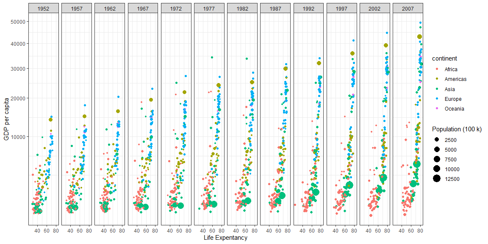

```r
# Use this R-Chunk to import all your datasets!
```

## Background
1. Remove Kuwait from the dataset.  
2. Recreate a graph given from gapminder.  
3. Use ggsave() to save the plot  
4. Push all files to the class repository in github.

## Data Wrangling


```r
# Use this R-Chunk to clean & wrangle your data!

# Removing Kuwait fro the dataset and assigned to a new dataframe. 

gapminder1 <- filter(gapminder, country != "Kuwait")
```

## Data Visualization


```r
# Use this R-Chunk to plot & visualize your data!


# Recreating the graph.

ggplot(gapminder1) + 
  aes(x = lifeExp, y = gdpPercap, color = continent, size = pop / 100000) + 
  geom_point() +
  facet_grid( . ~ year) +
  scale_y_continuous(trans = "sqrt") +
  theme_bw() +
   labs(x= "Life Expentancy",
       y = "GDP per capita",
       size = "Population (100 k)") +
  guides(size = guide_legend(order = 2), color = guide_legend(order = 1))
```

<!-- -->

```r
ggsave("gapminder.png")
```


