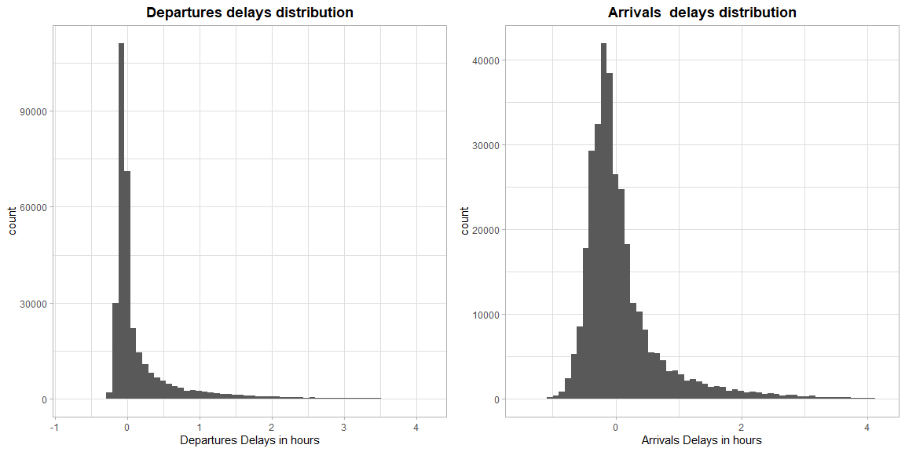
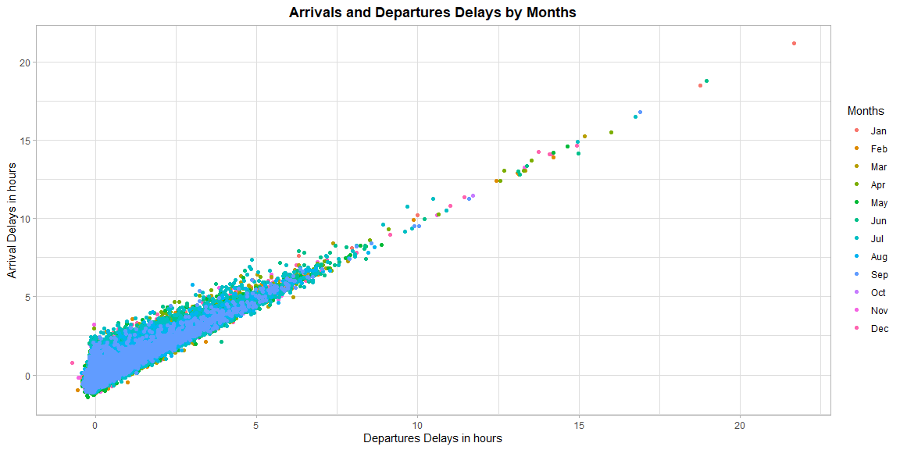

```r
# Use this R-Chunk to import all your datasets!
```

## Background

1. Pick two variables (columns) whose relationship you would like to explore from the dataset flights.
  - Provide a visualization of the univariate distribution of each of the selected variables separately (i.e. 2 plots are needed here, 1 for each variable)  
    - I choose to investigate departures and arrivals delays in the dataset of flights. The data was filtered, and converted into hours.
  - Build bivariate summaries of the variables you have chosen to investigate (1 plot is needed here, the plot should contain both variables in it).  
    - I used the same variables and ploted together to look for covariance and change in the different months of the of the observations.


## Data Wrangling


```r
# Use this R-Chunk to clean & wrangle your data!


small_arrivals <- nycflights13::flights %>% 
  filter(arr_delay < 250)


small_departures <- nycflights13::flights %>% 
  filter(dep_delay < 250)

combined <- nycflights13::flights %>% mutate(months = factor(month.abb[month], levels = month.abb))
```

## Data Visualization


```r
# Use this R-Chunk to plot & visualize your data!
require(gridExtra)

arrivals <- ggplot(data = small_arrivals, mapping = aes(x = arr_delay / 60)) +
  geom_histogram(bins = 60) +
  labs(x= "Arrivals Delays in hours",
       title = "Arrivals  delays distribution") +
  theme_light() +
  theme(plot.title = element_text(face = "bold")) +
  theme(plot.title = element_text(hjust = 0.5))


departures <- ggplot(data = small_departures, mapping = aes(x = dep_delay / 60)) +
  geom_histogram(bins = 60 ) +
  labs(x= "Departures Delays in hours",
       title = "Departures delays distribution") +
  theme_light() +
  theme(plot.title = element_text(face = "bold")) +
  theme(plot.title = element_text(hjust = 0.5))
  

grid.arrange(departures, arrivals, ncol = 2)
```

<!-- -->

```r
ggplot(data = combined ) + 
  geom_point(mapping = aes(x = dep_delay / 60,
                           y = arr_delay / 60,
                           color = months), 
                           na.rm = TRUE) +
  labs(x= "Departures Delays in hours",
       y = "Arrival Delays in hours",
       title = "Arrivals and Departures Delays by Months",
        color = "Months") +
  theme_light() +
  theme(plot.title = element_text(face = "bold")) +
  theme(plot.title = element_text(hjust = 0.5)) 
```

<!-- -->

## Conclusions

1. In the first two plots is possible, at first sight, to see that are kind of similar distribution. However, looking closely, we see that the y axis in the first graph (departures) has a higher count. That is possible since there are different numbers of observations between arrival or departures (must be investigated) or to the shape of the second graph, which is more expanded. We see that is a higher number of negative numbers (early arrivals/departures) in the arrivals graph. It makes sense that there can be earlier arrivals than departures, a further filter excluding negative numbers from this graphs can be a better view of each of them.  
2. In the third graph we can see a linear correlation between the two variables and is possible to see that most of the delays are between 0 to 5 hours, furthermore they look concentrated in summer time. Can that be due to high traffic during vacation?. Still the number of delays decreased but the length increased in January to May, which can be due to weather conditions. This graph is highly overcrowded, it can help to make a faceted chart by month with this correlations to further investigate this.   
