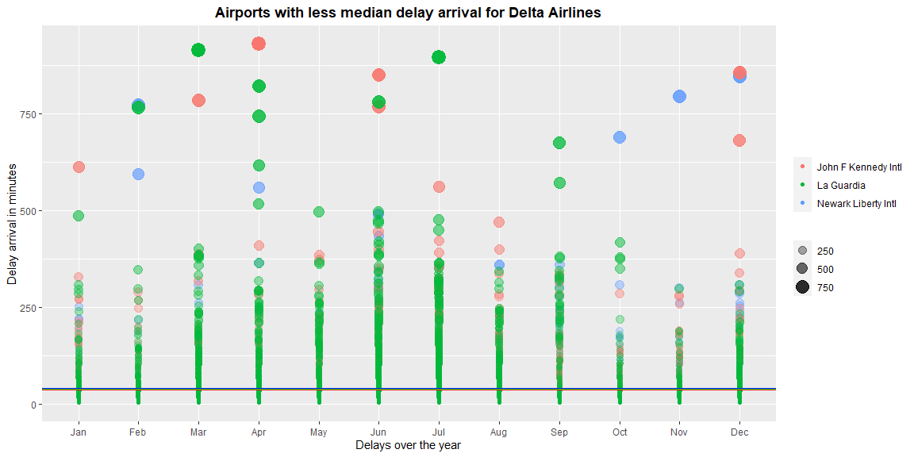

```r
# Use this R-Chunk to import all your datasets!


library(nycflights13)

?flights
?weather
#View(flights)
#glimpse(flights)
summary(flights)
```

```
##       year          month             day           dep_time    sched_dep_time
##  Min.   :2013   Min.   : 1.000   Min.   : 1.00   Min.   :   1   Min.   : 106  
##  1st Qu.:2013   1st Qu.: 4.000   1st Qu.: 8.00   1st Qu.: 907   1st Qu.: 906  
##  Median :2013   Median : 7.000   Median :16.00   Median :1401   Median :1359  
##  Mean   :2013   Mean   : 6.549   Mean   :15.71   Mean   :1349   Mean   :1344  
##  3rd Qu.:2013   3rd Qu.:10.000   3rd Qu.:23.00   3rd Qu.:1744   3rd Qu.:1729  
##  Max.   :2013   Max.   :12.000   Max.   :31.00   Max.   :2400   Max.   :2359  
##                                                  NA's   :8255                 
##    dep_delay          arr_time    sched_arr_time   arr_delay       
##  Min.   : -43.00   Min.   :   1   Min.   :   1   Min.   : -86.000  
##  1st Qu.:  -5.00   1st Qu.:1104   1st Qu.:1124   1st Qu.: -17.000  
##  Median :  -2.00   Median :1535   Median :1556   Median :  -5.000  
##  Mean   :  12.64   Mean   :1502   Mean   :1536   Mean   :   6.895  
##  3rd Qu.:  11.00   3rd Qu.:1940   3rd Qu.:1945   3rd Qu.:  14.000  
##  Max.   :1301.00   Max.   :2400   Max.   :2359   Max.   :1272.000  
##  NA's   :8255      NA's   :8713                  NA's   :9430      
##    carrier              flight       tailnum             origin         
##  Length:336776      Min.   :   1   Length:336776      Length:336776     
##  Class :character   1st Qu.: 553   Class :character   Class :character  
##  Mode  :character   Median :1496   Mode  :character   Mode  :character  
##                     Mean   :1972                                        
##                     3rd Qu.:3465                                        
##                     Max.   :8500                                        
##                                                                         
##      dest              air_time        distance         hour      
##  Length:336776      Min.   : 20.0   Min.   :  17   Min.   : 1.00  
##  Class :character   1st Qu.: 82.0   1st Qu.: 502   1st Qu.: 9.00  
##  Mode  :character   Median :129.0   Median : 872   Median :13.00  
##                     Mean   :150.7   Mean   :1040   Mean   :13.18  
##                     3rd Qu.:192.0   3rd Qu.:1389   3rd Qu.:17.00  
##                     Max.   :695.0   Max.   :4983   Max.   :23.00  
##                     NA's   :9430                                  
##      minute        time_hour                     
##  Min.   : 0.00   Min.   :2013-01-01 05:00:00.00  
##  1st Qu.: 8.00   1st Qu.:2013-04-04 13:00:00.00  
##  Median :29.00   Median :2013-07-03 10:00:00.00  
##  Mean   :26.23   Mean   :2013-07-03 05:22:54.64  
##  3rd Qu.:44.00   3rd Qu.:2013-10-01 07:00:00.00  
##  Max.   :59.00   Max.   :2013-12-31 23:00:00.00  
## 
```

```r
#f <- flights
#unique(f$carrier)
#unique(f$origin)
```


## Background


You just started your internship at a big firm in New York, and your manager gave you an extensive file of flights that departed JFK, LGA, or EWR in 2013. From this data (which you can obtain in R) your manager wants you to answer the following questions:  
1. For each origin airport (JFK, EWR, LGA), which airline has the lowest 75th percentile of delay time for flights scheduled to leave earlier than noon?  
2. Which origin airport is best to minimize my chances of a late arrival when I am using Delta Airlines?  
3. Which destination airport is the worst airport for arrival delays? You decide on the metric for “worst.”

## Data Wrangling question 1.  
1. For each origin airport (JFK, EWR, LGA), which airline has the lowest 75th percentile of delay time for flights scheduled to leave earlier than noon?


```r
# Use this R-Chunk to clean & wrangle your data!
# Use this R-Chunk to clean & wrangle your data!

# 1. For each origin airport (JFK, EWR, LGA), which airline has the lowest 75th percentile of delay time for flights scheduled to leave earlier than noon?

# Assumption : we are interested in real delays, and exclude early departures from the set.

airline <- flights %>% 
  select(origin, dep_delay, carrier, sched_dep_time ) %>%         #Select data necesary
  filter(sched_dep_time < 1200 & dep_delay > 0) %>%               #Filter before noon and just delays
  group_by(origin, carrier) %>%                                   #Group to calculate percentile 
  mutate(percentile_75  = quantile(dep_delay, probs = 0.75)) %>%  #Create a new variable with the percentile 
  distinct(carrier, percentile_75) %>%                            #Eliminate innecesary data and reduce just to what we need
  arrange(origin, percentile_75) %>%                              #Sort the data
  left_join(airlines, by = "carrier")                             #add the names of the airlines
```


## Data Wrangling question 2  
2. Which origin airport is best to minimize my chances of a late arrival when I am using Delta Airlines?


```r
# 2. Which origin airport is best to minimize my chances of a late arrival when I am using Delta Airlines?


# filter  all arrival of delta for each airport
# filter just the delays
# group by airport
# find the mean delay for each airport

airport <- flights %>%                                                 
  select(origin, carrier, arr_delay, , year,month, day) %>%    #Select the columns to work with
  filter(carrier == "DL" & arr_delay > 0) %>%                  #Filter to data from Delta and just delays in arrivals
  group_by(origin) %>%                                         #Group to calculate mean by airport
  mutate(mean_arrivals = mean(arr_delay),
        months = factor(month.abb[month], levels = month.abb)) %>% 
  arrange(origin, arr_delay)                                   
view(airport)

# Get the names of the airports

airports1 <- airports %>% rename(origin = faa)

airport <- airport %>% left_join(airports1, by = "origin")

airport <- airport %>%                                          
  select(1:9) %>%
  rename(name_airport = name)

EWR <- airport %>%
  select(origin, months, mean_arrivals) %>%
  filter(origin == "EWR") 

JFK <- airport %>%
  select(origin, months, mean_arrivals) %>%
  filter(origin == "JFK") 

LGA <- airport %>%
  select(origin, months, mean_arrivals) %>%
  filter(origin == "LGA") 

###################  

#flights_by_month <- airport %>%                                 #Create a tibble with the data and obtain the number of flights
# group_by(origin, month) %>%                                   # by month
# summarise(number_of_flights = n())

#view(flights_by_month)
#############################
#airport <- airport %>% left_join(flights_by_month, by = c("origin","month")) # join the tibbles to get the data together
 

#airports1 <- airports %>% rename(origin = faa)                  #Obtain the name of the airports and rename faa to prepare to join


#airport <- airport %>% left_join(airports1, by = "origin")      #join to get the names of the airports

#airport <- airport %>%                                          
#  select(1:9) %>%
#  rename(name_airport = name)
################################

#mean_delays_by_month <- airport %>% 
#  select(origin, month, mean_arrivals, name_airport) %>%        #create the dataset containing the mean arrivals by month
#         distinct() %>%                                                      #for each airport and reduce duplicates
#          arrange(origin,month)                                 #Sort the data
 
  
 


#delays_and_totals <-  mean_delays_by_month %>%                  #Create the final dataset to graph and sort
#  left_join(flights_by_month, by = c("origin","month")) %>%
#  arrange(month, mean_arrivals)

#view(mean_delays_by_month)
#View(airports1)
#view(airport)
#view(delays_and_totals)
#test <- airport %>%
#  arrange(origin, month)

#view(test)
```


## Data Visualization


```r
# Use this R-Chunk to plot & visualize your data!

# first question:


g1 <- ggplot(data = airline,mapping = aes(reorder_within(name, desc(percentile_75), origin ), y = percentile_75, color = name, fill = name) ) +
  geom_bar( stat = "identity", na.rm = TRUE) +
  facet_wrap(~ origin, nrow = 2, scales = "free") +
  coord_flip() 


g1 <- g1 + guides(fill = "none", color = "none") + 
           theme(axis.ticks.y = element_blank()) +
           theme(axis.ticks.x = element_blank()) +
           scale_x_discrete(labels = airline$name) +
  labs(y = "75 percentile of delay in minutes",
       title = "Ranking of airlines delay for flights scheduled to leave earlier than noon",
       x = "Airlines") +
  theme(plot.title = element_text(face = "bold")) +
  theme(plot.title = element_text(hjust = 0.5))

g1
```

<!-- -->

```r
# Second Question


#ggplot(data = airport, aes(x = day, y = mean_arrivals, color = origin)) +
#  geom_point() +
 
   #scale_y_log10() +
#   facet_wrap(~ month, nrow = 3, scales = "free") 


####################

#g2 <- ggplot(data = delays_and_totals, aes(reorder_within(origin, desc(mean_arrivals), month), y = mean_arrivals,  fill = name_airport)) +
#    geom_col() +
#    scale_x_reordered() +
# geom_line(aes( y = n)) +
   #scale_y_log10() +
#    facet_wrap( ~ month, nrow = 3, scales = "free_x")

#g2 <- g2 + guides(fill = "none", color = "none") 

#g2

#######################


g2 <- ggplot(data = airport, mapping = aes(x = months, y = arr_delay, size = arr_delay, alpha = arr_delay)) + 
  geom_point(mapping = aes(color = name_airport)) +
  geom_hline(yintercept = EWR$mean_arrivals, color = "blue") +
  geom_hline(yintercept = LGA$mean_arrivals, color = "green") +
  geom_hline(yintercept = JFK$mean_arrivals, color = "red")


g2 <- g2 + labs(y = "Delay arrival in minutes",
                title = "Airports with less median delay arrival for Delta Airlines",
                x = "Delays over the year") +
  theme(plot.title = element_text(face = "bold")) +
  theme(plot.title = element_text(hjust = 0.5)) +
  theme(legend.title=element_blank()) 

  
g2
```

<!-- -->

```r
# zoom to see which airport has the best mean score

g2 + ylim(0,50) +
  labs(title = " Zooming we see that JFK is the best minimizing late arrival")
```

<!-- -->

## Conclusions  


1. On the first question we see that in each airport are different airlines that rank best. Envoy Air, Virgin America and Endeavor are in the top. It will be interesting to see that ranking compare to the number of flights of each company to see if that good position is due to less flights than the rest.   
2. In the same first question, we can observe that Alaska Airlines, Southwest and United  have the worst rankings. It will be interesting to search for what reason they are so badly ranked (maybe long distance flights or many more flights than the other airlines).  
3. To see the entire range of flights it looks difficult to differentiate the difference in the mean delay’s arrivals for this airports, then the use of the zoom characteristic of ggplot is useful to look which is best in this rank. I wish I could compare also the 90th percentile to see if there are differences in this ranking, since there are several outliers for JFK.   
4. Measuring then the mean of all flights during the year, JFK is the best ranked being the difference in order of several minutes (less than 40 and not more than 10 minutes difference between them).


