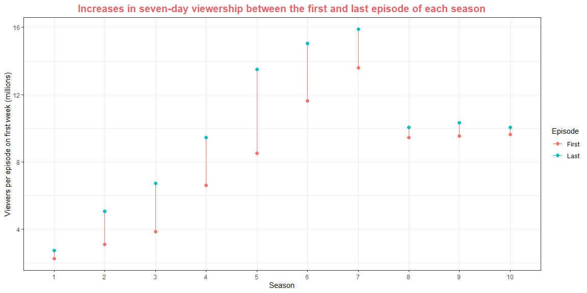
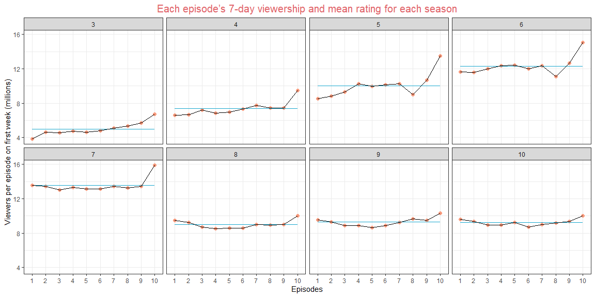

```r
#Use this R-Chunk to import all your datasets!
```

## Background

_Place Task Background Here_

## Data Wrangling


```r
# Use this R-Chunk to clean & wrangle your data!

# Look at the data and his dictionary
#View(ratings)
#?ratings


# First question 
# create a tibble with the first and last week viewers for each season

seasons <- ratings %>% 
  group_by(series) %>%
  summarise(
    First = first(viewers_7day),
    Last = last(viewers_7day))

# Tidy the data for the graph ( each line an observation)
# This can be done in the first pipe creating just one tibble, 
# but I want to look in this occasion to each step of the process. 
# Tibble to use in the graph.

seasons2 <- seasons %>% 
  pivot_longer(c(`First`, `Last`), names_to = "Episode", values_to = "first_last")


# Second Question
# Again step by step to follow the process, this three steps can be done in 2 pipes.

# 1. Obtain the seasons with 10 episodes 

tenEpisodes <- ratings %>% select(series, episode) %>% 
                           filter(episode == 10)


# 2. Isolate the series to compare the vector.

tenSeries <- tenEpisodes %>% select(series)


# 3. Filter from the original to get the tibble to make the graph.

viewers <- ratings %>% filter(series %in% tenSeries$series) %>%
                      select(series, episode, viewers_7day)


# All in 2.
tenSeries2 <- ratings %>% select(series, episode) %>% 
                           filter(episode == 10)

viewers2 <- ratings %>% filter(series %in% tenSeries2$series) %>%
                      select(series, episode, viewers_7day)


# 4 Get the mean rating  of each season with 10 episodes

mean_rating <- viewers2 %>%
          group_by(series) %>%
                summarise(average = mean(viewers_7day,))


# Expand and reorder the tibble to match into the graph.
# Probably is a join that can be done here to the previous tibble, but not yet there. 

mean_rate <- mean_rating %>% slice(rep(row_number(), 10)) %>%
             arrange(series) %>%
             mutate(episode = rep(1:10,8))
```

## Data Visualization


```r
# Use this R-Chunk to plot & visualize your data!

# First graph
ggplot(data = seasons2, aes(x = factor(series), y = first_last, color = Episode )) + 
  geom_line(aes(group = series)) +
  geom_point(size = 2 ) +
# This code add arrows to the lines, but is distracting in this case.    
#  geom_path(arrow = arrow(angle = 30, length=unit(0.1, "in"), type="open"),
#            show.legend = FALSE) +
  theme_bw() +
  labs(x = "Season" ,
      y = "Viewers per episode on first week (millions)",
      title = "Increases in seven-day viewership between the first and last episode of each season") +
  theme(plot.title = element_text(size = 15)) +
  theme(plot.title = element_text(face = "bold")) +
  theme(plot.title = element_text(hjust = 0.5)) +
  theme(plot.title = element_text(color = "#E06469"))
```

<!-- -->

```r
# Second graph

ggplot(data = viewers, mapping = aes(x = episode, y = viewers_7day)) + 
  geom_point(size = 2, color = "#F99B7D") + 
  geom_line(color = "#B04759") + 
  geom_line(data = mean_rate, aes(y = average), color = "#19A7CE") + 
  geom_line() + 
  facet_wrap(~ series, nrow = 2) + 
  theme_bw() +
  scale_x_discrete(name = "Episodes",
                   limits = c("1","2","3","4","5","6","7","8","9","10")) +
  
  labs(x = "Episodes" ,
      y = "Viewers per episode on first week (millions)",
      title = "Each episode’s 7-day viewership and mean rating for each season" ) +
  theme(plot.title = element_text(size = 15)) +
  theme(plot.title = element_text(hjust = 0.5)) +
  theme(plot.title = element_text(color = "#E06469"))
```

<!-- -->

## Conclusions


1. From the first visualization we can see that is a progression in viewers from the first to the seventh season in numbers of viewers, but from season eight and on the viewers decreased.  
2. In the same graph we see that season 5 shows the greater increase in viewers towards the end of the season, and there starts to be a decline in the differences. This may show and increase interest in the show until season 7 that was the peak, and latter people show less interest in the program.  
3. In the second visual we see the variation of viewers on the first week for each season following a pattern of increasing expectation towards the end.   
4. In the same last graph we see that the differences in number of viewers are less pronounced in seasons 8, 9 and 10, that probably follow the pattern of less interest in those last seasons.   
5. We can also compare the difference from the average to see how pronounced the differences towards the end of the season. 
6. I found an article with a possible explanation of this decline in a TIME magazine article among others reasons suggest this :  "Many longtime fans will tell you that TV’s kindest competition (officially titled The Great British Baking Show in the U.S.) has been in decline since 2017’s eighth season, when it jumped from public television to Channel 4 and Netflix, swapped beloved judge Mary Berry for Prue Leith, and lost original hosts Sue Perkins and Mel Giedroyc." More reasons [here](https://time.com/6232819/great-british-bake-off-season-13-backlash/).
