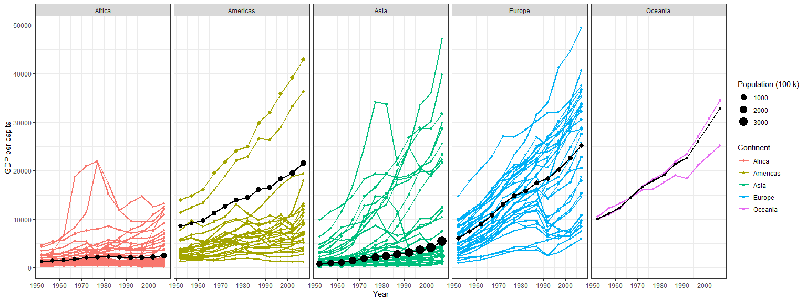

```r
# Use this R-Chunk to import all your datasets!
```

## Background

- Recreate the graphic shown below using gapminder dataset from library(gapminder) (get them to match as closely as you can).   
- Remove Kuwait from the data.  
- Use library(tidyverse) to load ggplot2 and dplyr, and use theme_bw() to duplicate basic plot formatting.  
- Build a weighted average data set using weighted.mean() and GDP with summarise() and group_by().  
- You will need to use the dataset created in the previous step to make the black lines and dots that show the continent weighted average.


## Data Wrangling


```r
# Use this R-Chunk to clean & wrangle your data!

# Removing Kuwait fro the dataset and assigned to a new dataframe. 

gapminder1 <- filter(gapminder, country != "Kuwait")

# creating the weighted average datset
gap_weight <- gapminder1 %>% 
  group_by(continent, year) %>%
  summarise(gdp_wt_mean = weighted.mean(gdpPercap, w = pop),
            gdpPercap,
            country,
            popsum = sum(pop),
            pop)
view(gap_weight)
```

## Data Visualization


```r
# Use this R-Chunk to plot & visualize your data!

ggplot(gap_weight) + 
  aes(x = year, y = gdpPercap, color = continent) + 
  geom_line(aes(group = country), size = 0.9) +
  geom_point(aes (size = pop / 1000000 )) +
  geom_point(aes(x = year,y = gdp_wt_mean, size = popsum/1000000),col = "black") +
  geom_line(aes(x = year, y = gdp_wt_mean),col  = "black", size = 0.9) +
  facet_grid( . ~ continent) +
  theme_bw() +
   labs(x = "Year",
       y = "GDP per capita",
       size = "Population (100 k)",
       color = "Continent") +
   guides(size = guide_legend(order = 1), color = guide_legend(order = 2))
```

<!-- -->

```r
# 
```

## Conclusions

- I manage to replicate the graph, however still looking forward on how to change the order of the legends since couldn’t put Population legend over Continent yet. 
