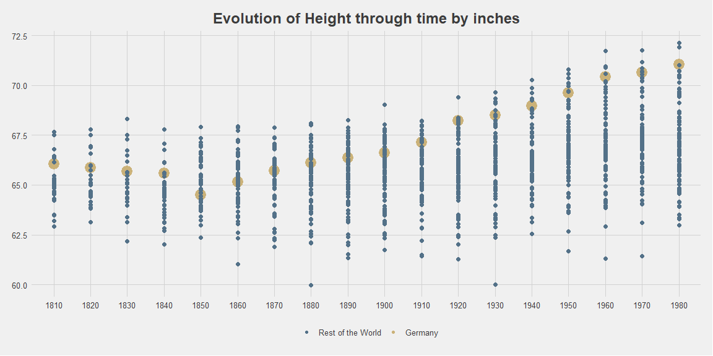
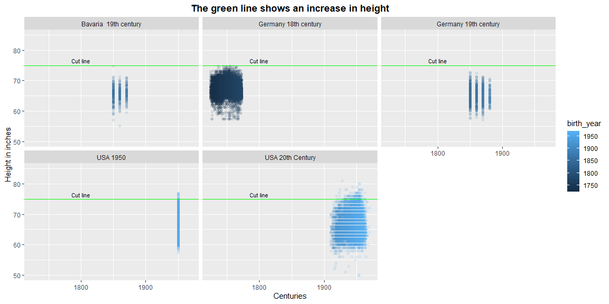

```r
# Use this R-Chunk to import all your datasets!

# Part 1

h1 <- tempfile()

download("https://byuistats.github.io/M335/data/heights/Height.xlsx", 
         dest = h1,
         mode = "wb")
# Reading without the first row

worldp <- read_excel(h1, skip = 1)

 

# Part 2

# First file

b19 <- read_dta("https://byuistats.github.io/M335/data/heights/germanconscr.dta")  
  
     


# Second file

g19 <- read_dta("https://byuistats.github.io/M335/data/heights/germanprison.dta")


# Third file (a zip file)

h2 <- tempfile()
directemp <- tempdir()

download("https://byuistats.github.io/M335/data/heights/Heights_south-east.zip",
         destfile = h2, mode = "wb",show_col_types = FALSE)

unzip(h2, exdir = directemp)

g18 <- read.dbf(paste(directemp,"B6090.DBF", sep = "\\"))


# fourth file

us20 <- read_csv("https://raw.githubusercontent.com/hadley/r4ds/main/data/heights.csv",show_col_types = FALSE)


# fifth .file needs to filter columns to use DOBY for the year of birth and 2 separate columns for feet and inches 


w20 <- read_sav("http://www.ssc.wisc.edu/nsfh/wave3/NSFH3%20Apr%202005%20release/main05022005.sav", col_select = c("DOBY","RT216F","RT216I"))


view(w20)
```

## Background


### Part 1: Heights by Nation  
1. Read in and tidy the Worldwide estimates .xlsx file  
    - Make sure the file is in long format with year as a column. See Example of the Tidy Excel File after formatting  
    - Use the separate() and mutate() functions to create a decade column.
2. Make a plot with decade on the x-axis and and all the countries heights in inches on the y-axis; with the points from Germany highlighted based on the data from the .xlsx file.  

### Part 2: Heights from individuals from different centuries  
1. Now work with datasets where each row represents an individual. Import these five datasets into R and combine them into one tidy dataset.  
    - German male conscripts in Bavaria, 19th century: Stata format.  
    - Heights of bavarian male conscripts, 19th century: Stata format.  
    - Heights of south-east and south-west german soldiers born in the 18th century: DBF format.  
      - This file is zipped. After downloading it with download(), trying using unzip() and read.dbf() to load the data into R.  
      - Can you tell which column is the birth year? HINT: Google translate may be helpful.  
    - Bureau of Labor Statistics Height Data: csv format  
      - Note: There is no birth year, so just assume mid-20th century and use 1950 as birth year  
    - University of Wisconsin National Survey Data: SPSS (.sav) format  
      - You’ll want to look here to understand this dataset and know which columns to use: National Survey Codebook  
2. After your wrangling, each dataset should only contain the following columns:  
    - select(birth_year, height.in, height.cm, study)  
3. Use the following code to combine your five individual dataset into one dataset:  
    - alld <- bind_rows(b19, g18, g19, us20, w20)  
4. Make a small-multiples plot (i.e. facets) of the five studies containing individual heights to examine the question of height distribution across centuries.  

### Part 3: Putting it All Together  
1. Save the two tidy datasets from Part 1 and Part 2 above to your project as R datasets.  
2. Create an .Rmd file for your plots and a sentence or two describing what you see.

## Data Wrangling


```r
# Use this R-Chunk to clean & wrangle your data!

# Part 1

# 1. Eliminate the rows with continents names by code ( follow not a pattern)
# Not necesary after all, keep code for future use

#countrys_code_to_remove <- c(150, 155) here goes the list of codes to remove

#w20 <- w20[!w20$Code %in%  countrys_code_to_remove,]


# 1. generate a sequence of years by decades from 1810 (first registered year) to 1980 (last registered year)

decades <- seq(from = 1810, to = 1980, by = 10)

# 2. Tidy by change names, eliminates na, select the years with data, and pivot longer.
#    use na.omit() to eliminate all rows with na, arrange and create height in cmt. 

worldp <- worldp %>%  
         rename(country = "Continent, Region, Country") %>%
         filter(!is.na(country)) %>%
         select(Code, country, as.character(decades)) %>%
         pivot_longer(cols = `1810`:`1980`,
                      names_to = "year_decade",
                      values_to = "height.cm") %>%
         na.omit(.) %>%
         arrange(year_decade) %>%
         separate(year_decade, into = c("century", "decade", "year"), sep = c(2,-1), remove = FALSE) %>%
         mutate(height.in = height.cm / 2.54)

# Change the order of columns to match the example
      
 worldp <- worldp[, c(1, 2, 4, 5, 6, 7, 3, 8)]
 
 
 
 
 
 
# Part 2
 # 1st file
# 1. Change names and create height and study column
# 2. Select just the columns need it. 
 
b19 <- b19 %>% rename("birth_year" = "bdec",
                      "height.cm" = "height") %>%
               mutate(height.in = height.cm / 2.54,
                      study = "Germany 19th century") %>%
               select(birth_year,height.in, height.cm, study)
 
 
 
# 2nd file
# 1. Change names and create height and study column
# 2. Select just the columns need it. 

g19 <- g19 %>% rename("birth_year" = "bdec",
                       "height.cm" = "height") %>%
               mutate(height.in = height.cm / 2.54,
                      study = "Bavaria  19th century") %>%
               select(birth_year,height.in, height.cm, study)
 
 
# 3rd file
# 1. Change names and create height and study column
# 2. Select just the columns need it.

g18 <-  g18 %>% rename("birth_year" = "GEBJ",
                       "height.cm" = "CMETER") %>%
               mutate(height.in = height.cm / 2.54,
                      study = "Germany 18th century") %>%
               select(birth_year,height.in, height.cm, study)
 
 
 # 4th file
 
 # 1. Change the column name height to height.in 
 # 2. Create the year column with 1950 as the year of birth
 # 3. Create the columns for height.in and study
 


 us20 <- us20 %>% rename("height.in" = height) %>%
               mutate(height.cm = height.in * 2.54,
                      study = "USA 1950",
                      birth_year = 1950) %>%
               select(birth_year,height.in, height.cm, study)

 
 # 5 file
 
 
# 1. Generate birth_year by unite the prefix 19 to each year
# 1.1 found na values in year and the use na.omit to remove it.
# 1.2 found negative values in inches and feet columns, then will be filtered. 
# 2. Create a column with the height in inches
# 3. Create a column with the study name : Wisconsin survey
# 4. Select just the columns need it.
# 5. The first decade is possible to fix but for reasons of time I decide just filtered. 

w20 <- w20 %>% mutate(century = 19)  %>%
        na.omit(.) %>%
        filter((RT216F > 0) & (RT216I >=0 ) & (RT216I < 12) )%>%
        filter(DOBY > 0) %>%
        unite(birth_year, century, DOBY, sep = "") %>%
        mutate(height.in = (RT216F * 12) + RT216I,
               height.cm = height.in * 2.54,
               study = "USA 20th Century",
               birth_year = as.numeric(birth_year)) %>%
        na.omit(.) %>%
        filter(birth_year > 200) %>%
        select(birth_year,height.in, height.cm, study)


# Part 2  putting all together.

alld <- bind_rows(b19, g18, g19, us20, w20)
```

## Data Visualization


```r
# Use this R-Chunk to plot & visualize your data!


ggplot(data = worldp ) + 
  geom_point(mapping = aes(x = year_decade,
                           y = height.in,
                           color = (country == "Germany"),
                           size = (country == "Germany")), 
                           na.rm = TRUE) +
  labs(x= "Decades",
       y = "Height in inches",
       title = "Evolution of Height through time by inches",
        color = "") +
  theme_fivethirtyeight() +
  theme(plot.title = element_text(face = "bold")) +
  theme(plot.title = element_text(hjust = 0.5)) +
  guides(size = "none") +
  scale_color_manual(values = c("#537188", "#CBB279"),labels = c('Rest of the World','Germany'))
```

<!-- -->

```r
# Saving part 1 dataset tidy

write_rds(worldp, "part1.rds")

write_rds(alld, "part2.rds")


# Part 2

 ggplot(data = alld, 
        mapping = aes(x = birth_year, y = height.in, color = birth_year) ) +
        geom_point(alpha = 0.1) +
        scale_y_continuous(limits=c(50, 85))+
        facet_wrap(~ study, nrow = 2) +
   geom_hline(yintercept = 75, color = "green") +
   annotate("text", x = 1800, y = 76.5, label = "Cut line", size = 3) +
   labs(x= "Centuries",
       y = "Height in inches",
       title = "The green line shows an increase in height") +
  theme(plot.title = element_text(face = "bold")) +
  theme(plot.title = element_text(hjust = 0.5)) 
```

<!-- -->

## Conclusions

1. Both graphs show a tendency in higher statures over time. Is interesting the case of the 19th century where height shows a decline from the cut line of 75 inches. More people born in the 20th century reach higher stature, but also lower. This can be caused by the size of the registered populations in those research or particularities of local population. We must remember that we compare populations in different parts of the world (Bavaria, Germany, and USA).  
   
2. The more reliable graph for me is the first since shows comparative data from the same source with global populations. There we can investigate more probably particular countries and continents and see if is a difference between developed and not developed countries, or a geographical pattern.
