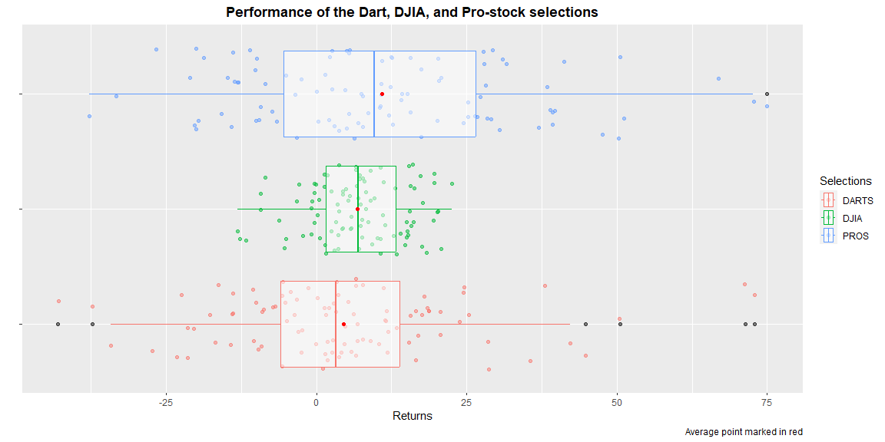

```r
# Use this R-Chunk to import all your datasets!

# The excel version
dartExpert <- tempfile()

download("https://github.com/byuistats/data/raw/master/Dart_Expert_Dow_6month_anova/Dart_Expert_Dow_6month_anova.xlsx", 
         dest = dartExpert,
         mode = "wb")

dart_xlsx <- read_excel(dartExpert)

# The RDS file

dart_rds <- read_rds("https://github.com/byuistats/data/raw/master/Dart_Expert_Dow_6month_anova/Dart_Expert_Dow_6month_anova.RDS")

# The csv file

dart_csv <- read_csv("https://github.com/byuistats/data/raw/master/Dart_Expert_Dow_6month_anova/Dart_Expert_Dow_6month_anova.csv")

# The dta file reading from haven

library(haven)

dart_dta <- read_dta("https://github.com/byuistats/data/raw/master/Dart_Expert_Dow_6month_anova/Dart_Expert_Dow_6month_anova.dta")


# the sav file reading from haven

dart_sav <- read_sav("https://github.com/byuistats/data/raw/master/Dart_Expert_Dow_6month_anova/Dart_Expert_Dow_6month_anova.sav")


# COMPARE THE FILES

all.equal(dart_csv, dart_dta, check.attributes = FALSE)
```

```
## [1] TRUE
```

```r
all.equal(dart_csv, dart_rds, check.attributes = FALSE)
```

```
## [1] TRUE
```

```r
all.equal(dart_csv, dart_sav, check.attributes = FALSE)
```

```
## [1] TRUE
```

```r
all.equal(dart_csv, dart_xlsx, check.attributes = FALSE)
```

```
## [1] TRUE
```

```r
# I can infer that if all are compared equal to dart_csv, then all are equal to each other. 
```

## Background

1. Use the appropriate functions in library(readr), library(haven), library(readxl) to read in the five files found on GitHub  
    - Depending on your computer, you should use read_rds(url("WEBLOCATION.RDS")) or read_rds("WEBLOCATION.RDS") to download and read the .RDS file type. Remember, R is case sensitive.  
    - Use the library(downloader) R package and use the download(mode = "wb") function to download the xlsx data since read_xlsx() cannot read files directly from the web.  
    - Use tempfile() function to download and save the file, as demonstrated in the guided instruction below.
2. Check that all five files you have imported into R are in fact the same with all.equal(). You will need to call all.equal() multiple times to check that each pair of files are the same.  
    - Be sure to set the arguments of the function so that it ignores attributes.  
3. Use one of the files to make a graphic showing the performance of the Dart, DJIA, and Pro-stock selections.  
    - Include a boxplot, the jittered returns, and the average return in your graphic.  
4. Include your plot in an .Rmd file with a sentence or two describing what you see.

## Data Wrangling


```r
# Use this R-Chunk to clean & wrangle your data!
```

## Data Visualization


```r
# Use this R-Chunk to plot & visualize your data!

# generate a column with the average

dart_csv <-  dart_csv %>% group_by(variable) %>%
                            mutate(avrg = mean(value))                          


g <-   ggplot(dart_csv, aes(x = value, y = (group = variable), color = variable)) +
        geom_jitter(alpha = 0.5 ) + 
        geom_boxplot(outlier.color = ("black"), alpha = 0.5) +
        geom_point(x = dart_csv$avrg, color = "red") +
          labs(y = "",
               x = "Returns",
               title = "Performance of the Dart, DJIA, and Pro-stock selections",
               color = "Selections",
               caption = "Average point marked in red") +
        theme(plot.title = element_text(face = "bold", hjust = 0.5)) 

# remove redundant information
g +  theme(axis.text.y = element_blank())
```

<!-- -->

## Conclusions

1. The DJIA or Dow Jones shows to be less spread than the other options and his returns are concentrated close to the average. Surprisingly the PROS are more spread than the DARTS, even that the darts have greater outliers.
