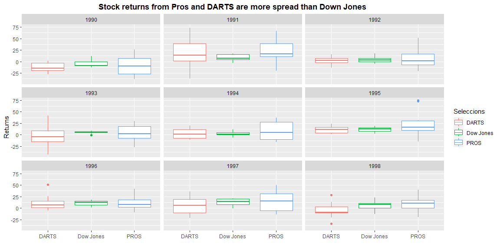

```r
# Use this R-Chunk to import all your datasets!


# A. Download to a temporary file 

rdsfile <- tempfile()

# Create a temporal directory
# rdir <- tempdir()

url = "https://github.com/byuistats/data/raw/master/Dart_Expert_Dow_6month_anova/Dart_Expert_Dow_6month_anova.RDS"

download(url,destfile = rdsfile, mode ="wb")

# B. Read from the temporary file 
myRDS <- readRDS(rdsfile)

# C. Read direct to an object wth readRDS

myRDScopy <- readRDS(url(url))


# D. Save an object to a file
#saveRDS(object, file = "my_data.rds") or use write_rds(object,file)


# E. Read with read_rds
myrds <- read_rds(url)

# Create the table
```

## Background

1. Use the appropriate function in library(readr) to read in the .RDS file found on GitHub  
    - Depending on your computer, you should use read_rds(url("WEBLOCATION.RDS")) or read_rds("WEBLOCATION.RDS") to download and read the .RDS file type. Remember, R is case sensitive.  
    - When using file paths to read files in from Github (and other locations), you must pay attention to ‘raw’ vs. ‘blob’ (seeing the reading below).  
2. The contestant_period column is not “tidy” we want to create a month_end and a year_end column from the information it contains.
Save your “tidy” data as an .rds object.  
3. Create a plot that shows the six-month returns by the year in which the returns are collected.  
4. Include your plot in an .Rmd file with a short paragraph describing your plots. Make sure to display the code in your file (though have it default to hidden).  
5. Use code to create a table of the DJIA returns that matches the table shown below (apply pivot_wider() to the data)

## Data Wrangling


```r
# Use this R-Chunk to clean & wrangle your data!

# 2 The contestant_period column is not “tidy” we want to create a month_end and a year_end column from the information it contains.

# CLEANING

tidy_rds <- myrds %>% separate(contest_period, into = c("start_month", "end_month_year")) %>%
  separate(end_month_year, into = c("month_end", "year_end"), sep = -4) %>%
  mutate(month_end = if_else(year_end == "Dec",
                            NA, month_end)) %>%
  replace_na(list(month_end = "December")) %>%
  mutate(year_end = if_else(year_end == "Dec",
                            NA, year_end)) %>%
  fill(year_end)

# SAVING

write_rds(tidy_rds,"tidy.rds")

#test <- read_rds("tidy.rds")
#test
tidy_rds <- tidy_rds %>% rename(Month = month_end, Year = year_end, Returns = value) %>%
                         mutate(variable = recode(variable, "DJIA"  =  "Dow Jones"))


myTable <- tidy_rds %>%
    mutate(Year = as.character(Year), Returns = as.character(Returns)) %>%
    select(Month, variable, Year, Returns) %>%
    filter(variable == "Dow Jones") %>%
    pivot_wider(names_from = Year, values_from = Returns, values_fill = "-" ) %>%
    mutate(Month = factor(Month, levels = month.name)) %>%
    arrange(Month) %>%
    select( - variable) 


myTable <- head(myTable, -1)


knitr::kable(myTable)  
```


|Month     |1990  |1991 |1992 |1993 |1994 |1995 |1996 |1997 |1998  |
|:---------|:-----|:----|:----|:----|:----|:----|:----|:----|:-----|
|January   |-     |-0.8 |6.5  |-0.8 |11.2 |1.8  |15   |19.6 |-0.3  |
|February  |-     |11   |8.6  |2.5  |5.5  |-    |15.6 |20.1 |10.7  |
|March     |-     |15.8 |7.2  |9    |1.6  |7.3  |18.4 |9.6  |7.6   |
|April     |-     |16.2 |10.6 |5.8  |0.5  |12.8 |14.8 |15.3 |22.5  |
|May       |-     |17.3 |17.6 |6.7  |1.3  |19.5 |9    |13.3 |10.6  |
|June      |2.5   |17.7 |3.6  |7.7  |-6.2 |16   |10.2 |16.2 |15    |
|July      |11.5  |7.6  |4.2  |3.7  |-5.3 |19.6 |1.3  |20.8 |7.1   |
|August    |-2.3  |4.4  |-0.3 |7.3  |1.5  |15.3 |0.6  |8.3  |-13.1 |
|September |-9.2  |3.4  |-0.1 |5.2  |4.4  |14   |5.8  |20.2 |-11.8 |
|October   |-8.5  |4.4  |-5   |5.7  |6.9  |8.2  |7.2  |3    |-     |
|November  |-12.8 |-3.3 |-2.8 |4.9  |-0.3 |13.1 |15.1 |3.8  |-     |
|December  |-9.3  |6.6  |0.2  |8    |3.6  |9.3  |15.5 |-0.7 |-     |

## Data Visualization


```r
# Use this R-Chunk to plot & visualize your data!

 

g <- ggplot(data = tidy_rds) + 
  aes(x = Month, y = Returns, color = variable) + 
  geom_point() +
  facet_wrap( ~ Year, nrow = 3) +
   labs(y= "Returns",
       x = "Months",
       title = "Stock returns from Pros and Darts are more spread than Down Jones",
       color = "Seleccions")
g <- g + theme(axis.text.x = element_text(size = 6, face = "bold", angle = 45))  +   scale_x_discrete(limits = month.name) +
  theme(plot.title = element_text(face = "bold", hjust = 0.5)) 
  

 
 
 
 
 
 
g2 <- ggplot(data = tidy_rds) + 
  aes(x = variable, y = Returns, color = variable) + 
  geom_boxplot() +
  facet_wrap( ~ Year, nrow = 3) +
   labs(y= "Returns",
       x = "",
       title = "Stock returns from Pros and DARTS are more spread than Down Jones",
       color = "Seleccions") +
    theme(plot.title = element_text(face = "bold", hjust = 0.5))
    
g2
```

<!-- -->

## Conclusions
1. The previous graph shows that the DARTS and PROS have similar performances compared to Dow Jones performances.  
2. Dow Jones returns are much less spread that those of DART and PROS. 
