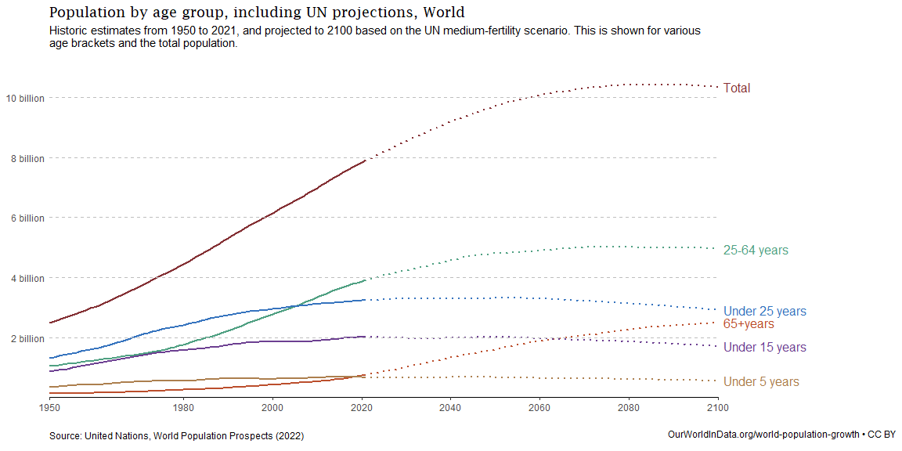

```r
# Use this R-Chunk to import all your datasets!

pop <- read_csv("population_by_age.csv", col_select = c(1:4, 6, 8, 11, 12, 14))


pop2 <- read_csv("population_by_age.csv", col_select = c(1:4, 7, 9, 10, 13, 15))
                

# Rename columns in 2 copies to fix the totals and bind latter                
pop <- pop %>% rename("entity" = "Entity", "code" = "Code", "year" =  "Year" , "Total" =  "Population - Sex: all - Age: all - Variant: estimates", "65+years"= "Population by broad age group - Sex: all - Age: 65+ - Variant: estimates" , "25-64 years" = "Population by broad age group - Sex: all - Age: 25-64 - Variant: estimates" , "Under 25 years" = "Population - Sex: all - Age: 0-24 - Variant: estimates", "Under 15 years" =  "Population - Sex: all - Age: 0-14 - Variant: estimates","Under 5 years" = "Population by broad age group - Sex: all - Age: 0-4 - Variant: estimates")

pop2 <- pop2 %>% rename("entity" = "Entity", "code" = "Code", "year" =  "Year" , "Total" =  "Population - Sex: all - Age: all - Variant: estimates", "65+years"= "Population by broad age group - Sex: all - Age: 65+ - Variant: medium" , "25-64 years" = "Population by broad age group - Sex: all - Age: 25-64 - Variant: medium" , "Under 25 years" = "Population - Sex: all - Age: 0-24 - Variant: medium", "Under 15 years" =  "Population - Sex: all - Age: 0-14 - Variant: medium","Under 5 years" = "Population by broad age group - Sex: all - Age: 0-4 - Variant: medium")
```

## Background

1. Review the Our World in Data webpage and find a graphic that interests you. Recreate that graphic in R as close as possible after downloading the data from their website.  
    - The original graph can be found in : [link.](https://ourworldindata.org/grapher/historic-and-un-pop-projections-by-age)

## Data Wrangling


```r
# Use this R-Chunk to clean & wrangle your data!

# Filter the data world
pop <- pop %>% filter(entity == "World" & year <= 2021)

pop2 <- pop2 %>% filter(entity == "World" & year > 2021)

# Fix the total columns with the toals from the chart

pop2 <- pop2 %>% mutate(Total = `65+years` + `25-64 years` + `Under 25 years`)

# put all data together to start to graph

allpop <- bind_rows(pop,pop2)

allpop <- allpop %>% pivot_longer(cols = c("Total",`65+years`,`25-64 years`, `Under 25 years`, `Under 15 years`, `Under 5 years`),
                        names_to = "cat",
                        values_to = "population")

# to draw 2 diferent types of lines I used 2 set of data separate with the same format. 
pop <- pop %>% pivot_longer(cols = c("Total",`65+years`,`25-64 years`, `Under 25 years`, `Under 15 years`, `Under 5 years`),
                        names_to = "cat",
                        values_to = "population")
pop2 <- pop2 %>% pivot_longer(cols = c("Total",`65+years`,`25-64 years`, `Under 25 years`, `Under 15 years`, `Under 5 years`),
                        names_to = "cat",
                        values_to = "population")
# Create a dataset to put the names at the end of the lines.

lastyear <- pop2 %>% filter(year == 2100)
```

## Data Visualization


```r
# Use this R-Chunk to plot & visualize your data!

p <- ggplot(data = pop,aes( x = year, y = population, group = cat, color = cat)) +
  geom_line(size = 1) +
  geom_line(data = pop2, size = 1, linetype = 3) +
  theme_classic() +
  scale_x_continuous(breaks = c(1950, 1980, 2000, 2020, 2040, 2060, 2080, 2100),
                     expand = expansion(add = c(0,40))) +
  scale_y_continuous(labels = label_number(suffix = " billion", scale = 1e-9),
                     breaks = c( 2e+9,4e+9, 6e+9, 8e+9, 10e+9),
                     expand = expansion(add = c(0,1e+9))) +
  theme(axis.title = element_blank(),
        axis.line = element_blank(),
        axis.ticks.y = element_blank(),
      #  panel.grid.major.y = element_line(color = "gray", linetype = 2),
        legend.position = "none") +
  #geom_text_repel(data = lastyear, aes(label = cat), size = 4, nudge_x = 6)
  geom_dl(data = pop2, aes(label = cat), method = list(dl.trans( x = x + 0.2), "last.bumpup")) +
  geom_segment(aes(x = 1950, xend = 2100, y = 0, yend = 0), col = "black") +
  geom_segment(aes(x = 1950, xend = 2100, y = 2e+9, yend = 2e+9), col = "grey", linetype = 2) +
  geom_segment(aes(x = 1950, xend = 2100, y = 4e+9, yend = 4e+9), col = "grey", linetype = 2) +
  geom_segment(aes(x = 1950, xend = 2100, y = 6e+9, yend = 6e+9), col = "grey", linetype = 2) +
  geom_segment(aes(x = 1950, xend = 2100, y = 8e+9, yend = 8e+9), col = "grey", linetype = 2) +
  geom_segment(aes(x = 1950, xend = 2100, y = 10e+9, yend = 10e+9), col = "grey", linetype = 2)  
p +  labs(
           title = "Population by age group, including UN projections, World",
           subtitle = "Historic estimates from 1950 to 2021, and projected to 2100 based on the UN medium-fertility scenario. This is shown for various
age brackets and the total population. ",
           fill = "",
           caption = c("OurWorldInData.org/world-population-growth • CC BY","Source: United Nations, World Population Prospects (2022)") )+
     theme(plot.caption = element_text(hjust = c(1,0),vjust = c(0.2,0))) +
     theme(plot.title = element_text(family = "Lucida Fax")) +
     scale_color_manual(values = c("#4fa082","#bb4e2c","#843034","#6c3f91", "#3573be","#ac7f4e"))
```

<!-- -->

## Conclusions
