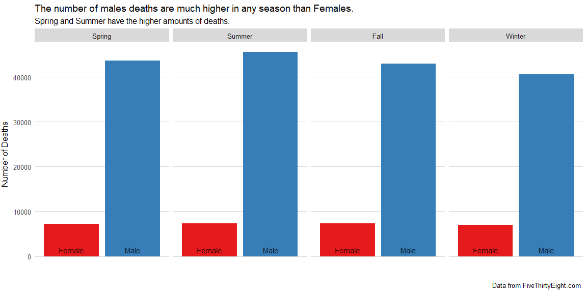
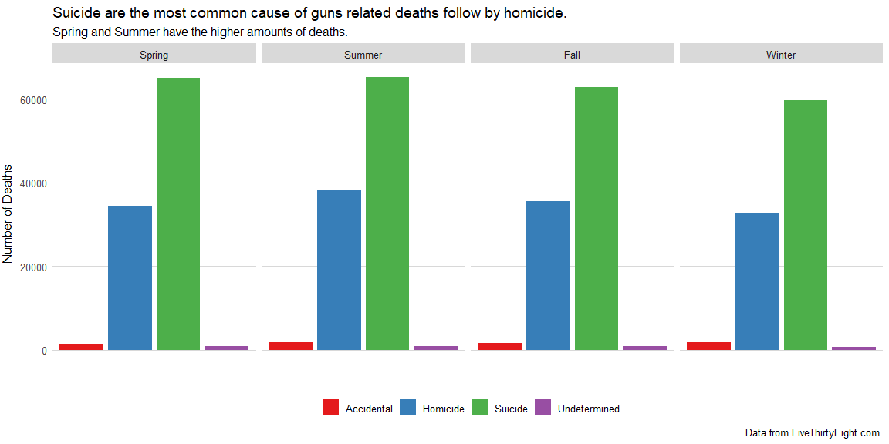
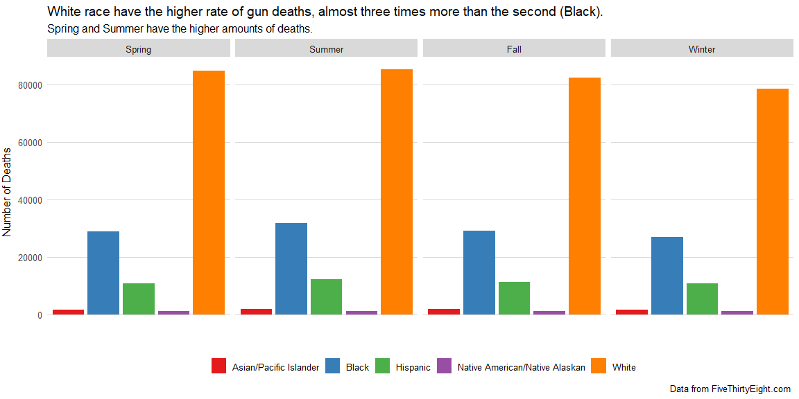
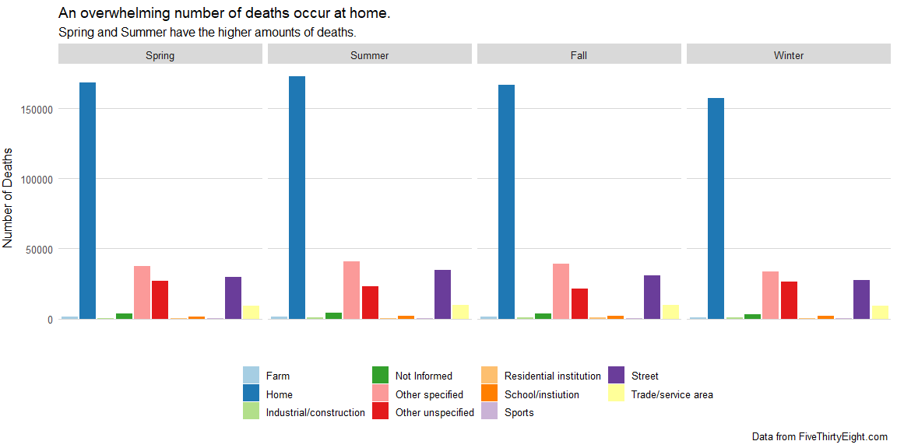
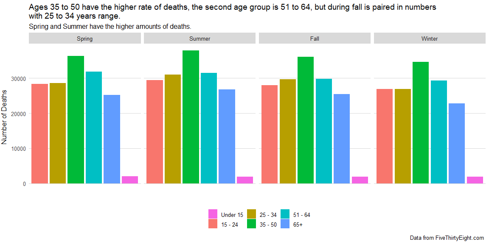

```r
# Use this R-Chunk to import all your datasets!

temporal <- tempfile()
download("https://github.com/fivethirtyeight/guns-data/raw/master/full_data.csv",
         dest = temporal,
         mode = "wb")
guns <- read.csv(temporal)

# Lokking to the data found few nas 
# guns 
#filter(guns, is.na(guns$intent) == TRUE) # 1 na
#filter(guns, is.na(guns$sex) == TRUE)
#filter(guns, is.na(guns$month) == TRUE)
#filter(guns, is.na(guns$race) == TRUE)
#filter(guns, is.na(guns$place) == TRUE)  # 1384 na
#filter(guns, is.na(guns$year) == TRUE)
#filter(guns, is.na(guns$age) == TRUE) # 18 na
#unique(guns$year)
```

## Background

1.  In one or two sentences, state in your own words the thesis of this video, The state of gun violence in the US, explained in 18 charts.\
2.  Provide 2-4 presentation-worthy charts that help your client investigate seasonal trends in their effort to reduce gun deaths.
    -   These charts should demonstrate the ggplot2 skills you've learned thus far, including clear labels, annotations, and customized themes.
3.  Each chart in your report should be accompanied by a written description of how the insights from the chart could benefit the marketing campaign.

## Data Wrangling


```r
# Use this R-Chunk to clean & wrangle your data!

# Eliminate row in intent with missing data, select columns to work I preserve for a while the missing places 

guns <- guns[complete.cases(guns[,c("intent")]),]
guns <- guns[complete.cases(guns[,c("age")]),]
guns <- guns %>% select(year, month, intent, sex, age, race, place)

# Create age_group and season columns


guns <- guns %>% mutate(
                        age_group = case_when(
                                        age %in% as.character(c(0:14)) ~ "Under 15",
                                        age %in% as.character(c(15:24)) ~ "15 - 24",
                                        age %in% as.character(c(25:34)) ~ "25 - 34",
                                        age %in% as.character(c(35:50)) ~ "35 - 50",
                                        age %in% as.character(c(51:64)) ~ "51 - 64",
                                        age %in% as.character(c(65:107)) ~ "65+",
                        ),
                        season = case_when(
                                        month %in% c('12', '1', '2') ~ 'Winter',
                                        month %in% c('3', '4', '5') ~ 'Spring',
                                        month %in% c('6', '7', '8') ~ 'Summer',
                                        month %in% c('9', '10', '11') ~ 'Fall'),
                        sex = case_when(
                                        sex %in% "F" ~ "Female",
                                        sex %in% "M" ~ "Male"
                        ))


sex_total <- guns %>% group_by(sex) %>%
         summarise(sex_totals = n())

guns <- guns %>% left_join(sex_total, by = "sex", keep = FALSE)                 

#guns2 <- guns %>% group_by(quarters)


race_total <- guns %>% group_by(race) %>%
        summarise(race_totals = n())

guns <- guns %>% left_join(race_total, by = "race", keep = FALSE)


guns <- guns %>% mutate(
  place = stringi::stri_replace_na(guns$place, replacement = "Not Informed"))


#guns3 <- guns %>% group_by 

#guns %>% factor(guns$age_group,labels = rep(c("Under 15", "15 - 34", "35 - 64", "65+"),25193))

#guns %>% count(age_group)
```

## Data Visualization


```r
# Use this R-Chunk to plot & visualize your data!

sex_max <- guns %>% 
  group_by(sex, season) %>% 
  filter (row_number(desc(sex)) == 1)


p1 <- ggplot(data = guns, aes(x = sex, y = n_distinct(sex), fill = sex) ) +
        geom_col() +
        facet_grid(~ factor(season, levels = c("Spring", "Summer", "Fall", "Winter"))) +
        labs(x = "",
           y = "Number of Deaths",
           title = "The number of males deaths are much higher in any season than Females.",
           subtitle = "Spring and Summer have the higher amounts of deaths. ",
           fill = "",
           caption = "Data from FiveThirtyEight.com ") + 
       theme_hc() +
       scale_x_discrete(labels = element_blank()) +
       scale_fill_brewer(palette = "Set1")  +
       theme(axis.ticks =  element_blank(),
             axis.title.y = element_text(vjust = 3)) +
       geom_text_repel(aes(label = sex), data = sex_max, nudge_y = 5000, alpha = 0.8, vjust = 4) + 
       guides(fill = "none") 
       
     
p1
```

<!-- -->

 A. In this first visualization the totals of death by season are shown. It can help to direct the efforts to prevent gun deaths among men. Seasonal differences exist but are in the order of 2 to 3 thousand, relatively small considering the total amount for each season.  
I add annotations as required , however, just to show the technique and not to improve the visualization.


```r
#test <- guns %>% group_by(season, intent) %>%  mutate(intentdis = n())

p2 <- ggplot(data = guns, aes(x = intent, y = n_distinct(intent), fill = intent) ) +
  geom_col() +
  facet_grid( ~ factor(season, levels = c("Spring", "Summer", "Fall", "Winter"))) +
        labs(x = "",
           y = "Number of Deaths",
           title = "Suicide are the most common cause of guns related deaths follow by homicide. ",
           subtitle = "Spring and Summer have the higher amounts of deaths. ",
           fill = "",
           caption = "Data from FiveThirtyEight.com ") + 
       theme_hc() +
       scale_x_discrete(labels = element_blank()) +
       scale_fill_brewer(palette = "Set1")  +
       theme(axis.ticks =  element_blank(),
             axis.title.y = element_text(vjust = 3)) 
   
p2
```

<!-- -->
B. This graph can help to identify the cause of most deaths and concentrate on suicides and homicide  to reduce the deaths. Seasonal change follows the pattern of spring and summer highs.


```r
p3 <- ggplot(data = guns, aes(x = race, y = n_distinct(race), fill = race) ) +
  geom_col() +
  facet_grid( ~ factor(season, levels = c("Spring", "Summer", "Fall", "Winter"))) +
        labs(x = "",
           y = "Number of Deaths",
           title = "White race have the higher rate of gun deaths, almost three times more than the second (Black). ",
           subtitle = "Spring and Summer have the higher amounts of deaths. ",
           fill = "",
           caption = "Data from FiveThirtyEight.com ") + 
       theme_hc() +
       scale_x_discrete(labels = element_blank()) +
       scale_fill_brewer(palette = "Set1")  +
       theme(axis.ticks =  element_blank(),
             axis.title.y = element_text(vjust = 3))
p3
```

<!-- -->
C. White people are most prone to be victims of gun deaths along any season, follow by Black, and Hispanic. Concentrating efforts in this 3 groups can be beneficial to campaigns. The seasonal trends follow all the previous patterns.


```r
p4 <- ggplot(data = guns, aes(x = place, y = n_distinct(place), fill = place) ) +
  geom_col() +
  facet_grid( ~ factor(season, levels = c("Spring", "Summer", "Fall", "Winter"))) +
        labs(x = "",
           y = "Number of Deaths",
           title = "An overwhelming number of deaths occur at home. ",
           subtitle = "Spring and Summer have the higher amounts of deaths. ",
           fill = "",
           caption = "Data from FiveThirtyEight.com ") + 
       theme_hc() +
       scale_x_discrete(labels = element_blank()) +
       scale_fill_brewer(palette = "Paired")  +
       theme(axis.ticks =  element_blank(),
             axis.title.y = element_text(vjust = 3)) 
p4
```

<!-- -->

D. Definitively most gun deaths happen at home, further cross analysis with causes, can give more data about if suicides and homicides are as the data shows until now the causes. Seasonal patterns continue being Spring and Summer the higher in rates of gun deaths.

```r
p5 <- ggplot(data = guns, aes(x = age_group, y = n_distinct(age_group), fill = age_group) ) +
  geom_col() +
  facet_grid( ~ factor(season, levels = c("Spring", "Summer", "Fall", "Winter"))) +
        labs(x = "",
           y = "Number of Deaths",
           title = "Ages 35 to 50 have the higher rate of deaths, the second age group is 51 to 64, but during fall is paired in numbers \nwith 25 to 34 years range.  ",
           subtitle = "Spring and Summer have the higher amounts of deaths. ",
           fill = "",
           caption = "Data from FiveThirtyEight.com ") + 
       theme_hc() +
       scale_x_discrete(labels = element_blank()) +
       scale_fill_brewer(palette = "Set1")  +
       scale_fill_discrete(breaks = c("Under 15", "15 - 24", "25 - 34", "35 - 50", "51 - 64", "65+"  )) +
       theme(axis.ticks =  element_blank(),
             axis.title.y = element_text(vjust = 3))
p5
```

<!-- -->

E. By age we can see that 35 to 50 years old are the most prone to this kind of deaths, being followed by related ages, (25 to 34 and 51 to 64). Under 15 has the lowest rate of deaths. Probably campaigns directed to White, Black, or Hispanic males, concentrated in suicides first, and second homicides occurring at home can yield more results preventing this kind of deaths. Campaigns that start early in Spring and along Summer can be more effective.


## Conclusions

1.  The visualization in "The State of Gun Violence in the USA" video, tells a story about the data by guiding the viewer throughout questions and possible answers in an investigative way. Alternates graphs with video insights of persons of relevance for the story and present the data in a very simple and straightforward way. Adding markers along the explanation makes the impact of the explanations very convincing and powerful.  
The conclusion leaves more open questions for further analysis.  


