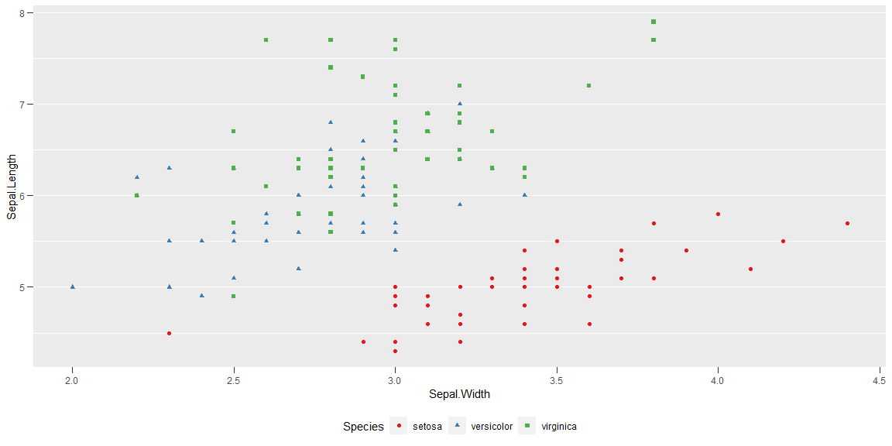
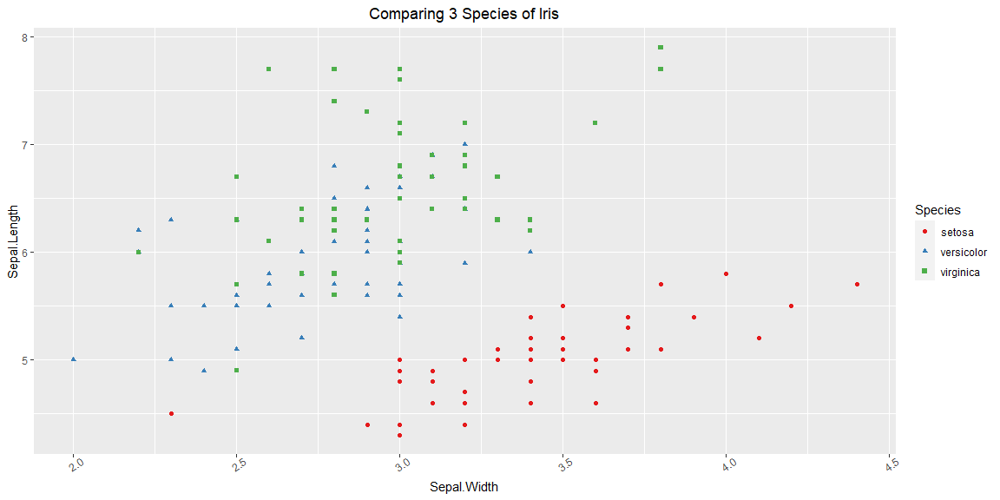
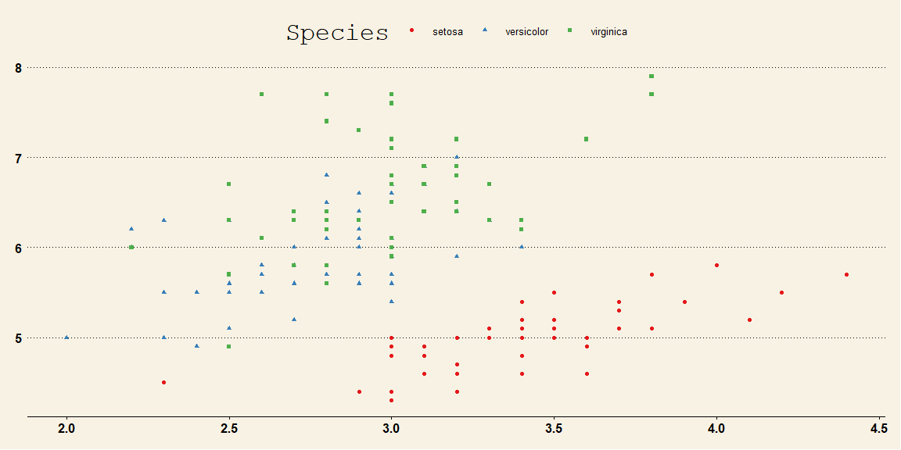
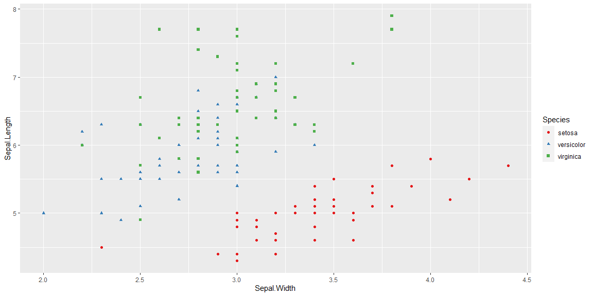
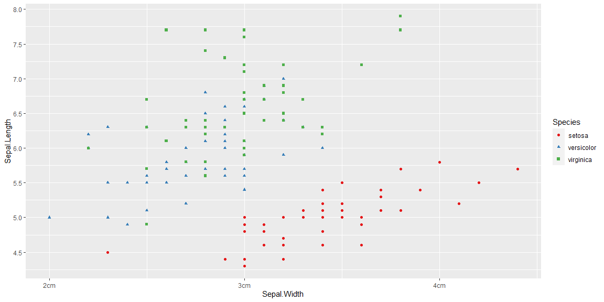
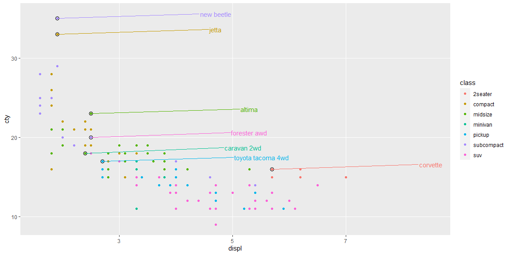

## Background

In this week we will learn about visualization for presentation. We will use the iris dataset that is loaded with the tidyverse package. You can run the following r chunk to learn about the iris dataset and so that you have a baseline plot, `p` to alter in the rest of the activity.


```r
library(tidyverse)
#?iris
p <- ggplot(data = iris, mapping = aes(x=Sepal.Width, 
                                       y = Sepal.Length, 
                                       color = Species,
                                       shape = Species),
            size = 5) +
  geom_point() +
  scale_color_brewer(palette = "Set1")

p
```

<!-- -->

## theme()

With theme() you can change things like axis font and formatting, legends, gridlines, background color, etc. Notice structure of the arguments used in theme: broad.specific.moreSpecific. 

**Spot the Difference!**

Run the following code and then spot the differences between the chart it produces compared to the baseline chart, `p`, created above. 


```r
p + theme(
  legend.position = "bottom",
  panel.grid.major.x = element_blank(),
  panel.grid.minor.x = element_blank(),
  axis.ticks.length = unit(6, "pt"))
```

<!-- -->

In the code above, you may have noticed  some helper functions in theme. Below is a description of four helper functions that are commonly used. You can learn more about them/see their documentation by using the `?` command.


```r
element_text(color, size, face, family, angle, hjust, vjust) #Modify appearance of text
element_line(color, size, linetype) #Modify the appearance of line elements
element_blank() #turns the item off
unit() #Change tick length
```

Now fill in the blanks in the code below so that the orientation of the x-axis text is 35 degrees and the title is centered. Remember to take advantage of the auto fill to help you find the right argument. Use `?` to learn about arguments of the helper functions.


```r
library(ggthemes)
p +
  labs(title = "Comparing 3 Species of Iris") +
  theme(plot.title = element_text(hjust = .5),
        axis.text.x = element_text(angle = 35))
```

<!-- -->

```r
p + theme_wsj()
```

<!-- -->

```r
p
```

<!-- -->

```r
#the solution is at the bottom of this file
```

There are a few theme shortcuts pre-loaded into ggplot2. These will alter lots of aspects of the theme with very little code. With tidyverse loaded, try typing p + theme_ in the console, then select one of the auto fill options. Play around by choosing a different auto fill option and see what changes. 

You can have access to extra themes, scales and geoms by installing and loading the ggthemes library.

## Adjusting scales

We already learned about using the scale layer, scale_*_*(), to adjust aspects of the scale. This is a nice review.

Fill in the blanks in the R chunk below to change our iris plot so that Sepal.Length and Sepal.Width axes look like this:


https://byuistats.github.io/M335/presentations_class_palmer/_site/day_9_files/iris_alt_axis.png


```r
p +
   scale_x_continuous(breaks = c(2, 3, 4), labels = c("2cm", "3cm", "4cm")) +
  scale_y_continuous(breaks = seq(4.5, 8, by = 0.5))
```

<!-- -->

```r
#the solution is at the bottom of this file
```

## Labelling the inside of the chart

### The direcetlables package

You can use the directlabels package in two different ways:

-   geom.dl(), or
-   direct.label()


```r
#install.packages("directlabels")
library(directlabels)
p %>%  direct.label()
# or
p + geom_dl(method = "smart.grid", mapping = aes(label = Species))
```

Note that `direct.label() removes the legend and inserts the labels in the graph. The `geom_dl()` method leaves the legend on the plot.

I find the direct labels package most helpful for line plots, usually using method = "last.qp". The ?geom_dl() examples can be helpful, but in general the documentation can be difficult to decipher.

### Example for direct.label()


```r
library(directlabels)
library(gapminder)
p <- gapminder %>% filter(continent == "Oceania") %>% 
  ggplot(mapping = aes(x = year, y = gdpPercap, color = country)) +
  geom_line()

direct.label(p, list("last.points")) # labels off the edge of the chart
```

<!-- -->


### Move the labels


```r
direct.label(p, list("last.points", dl.trans(x = x-1.5, y = y+.2)))
```

<!-- -->

```r
#OR

direct.label(p, list("last.points", hjust = 1, vjust = .2))
```

<!-- -->

### Example of geom_dl()

The direct labels can be added as a layer instead. See `?geom_dl` or [here](https://tdhock.github.io/directlabels/docs/index.html){preview-link="true"} for more methods and examples


```r
p + geom_dl(aes(label = country), 
            method = list("last.points", hjust = 1, vjust = .1, cex = 1))
```

<!-- -->


### ggrepel()

A technique I use more often is from the package `ggrepel`. The following code uses the mpg dataset and is copied from the book chapter 28.3. Describe out loud what each line of code is doing.


```r
#?mpg
best_in_class <- mpg %>%
  group_by(class) %>%
  filter(row_number(desc(cty)) == 1)
```

Now run the code in the next R chunk and look at the resulting plot. Be sure you understand what each line and each argument is doing.


```r
#install.packages("ggrepel")
library(ggrepel)
ggplot(mpg, aes(displ, cty)) +
  geom_point(aes(colour = class)) +
  geom_point(size = 3, shape = 1, data = best_in_class) +
  ggrepel::geom_label_repel(aes(label = model), data = best_in_class)
```

<!-- -->

In the R chunk below, tweak the above code so that it:
- Removes the border around the car labels (hint: use a different geom)
- Makes the labels color coded, according to the color of the class of car
- Remove minor grid-lines (vertical and horizontal)
- Bonus: move the best in class labels so they don't cover up data points


```r
#a video solution is at the bottom of this file
```


## Solutions

### theme_exercise solution


```r
p +
  labs(title = "Comparing 3 Species of Iris") +
  theme(plot.title = element_text(hjust=.5),
        axis.text.x = element_text(angle = 35))
```

### scale_exercise solution


```r
p +
  scale_x_continuous(breaks = c(2, 3, 4), labels = c("2cm", "3cm", "4cm")) +
  scale_y_continuous(breaks = seq(4.5, 8, by = 0.5))
```

### ggrepel solution

[*video solution*](https://www.loom.com/share/249450f49fe044cfaed8ddb9b225a24f)


```r
library(ggrepel)
ggplot(data = mpg, mapping = aes(x = displ, y = cty)) +
 geom_point(aes(colour = class)) +
 geom_point(size = 3, shape = 1, data = best_in_class) +
 ggrepel::geom_text_repel(data = best_in_class,
                         aes(label = model, colour = class),
                         show.legend = FALSE, nudge_x = 2.8,
                         nudge_y = 0.6) + 
  theme(panel.grid.minor = element_blank())
```

<!-- -->

