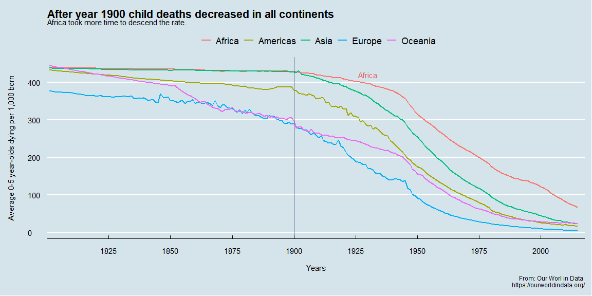

```r
# Use this R-Chunk to import all your datasets!
devtools::install_github("drsimonj/ourworldindata")
data <- ourworldindata::child_mortality %>% select(continent, country, year, child_mort)
#?child_mortality
```

## Background

1. Explore the world data on child_mortality and create an interesting graphic that highlights this dataset.  
    - Use devtools::install_github("drsimonj/ourworldindata") to get a larger dataset on child_mortality. This will require install.packages("devtools").  
    - Create a graphic that you could use in a presentation to summarize world child mortality.


## Data Wrangling


```r
# Use this R-Chunk to clean & wrangle your data!
#glimpse(data)
#summary(data)
# some continents have na values must be remove.
data <- na.omit(data)

# remove date before 1800 to have comparative set
data <- data %>% group_by(continent) %>%
                 filter(year > 1800) 
data <- data %>% group_by(continent, year) %>%
  summarise( child_mort,
             death_avg = mean(child_mort))              
```

## Data Visualization


```r
# Use this R-Chunk to plot & visualize your data!


 p = ggplot(data = data, mapping = aes(x = year, 
                                   y = death_avg, 
                                   color = continent)) +
          geom_line(size = 1)


 p <- p +  labs(x = "Years",
           y = "Average 0-5 year-olds dying per 1,000 born",
           title = "After year 1900 child deaths decreased in all continents ",
           subtitle = "Africa took more time to descend the rate.",
           color = "",
           caption = "From: Our Worl in Data \nhttps://ourworldindata.org/") +
      geom_vline(xintercept = 1900, color = "#537188") +
      theme(plot.title = element_text(face = "bold")) +
      theme(plot.title = element_text(hjust = 0.5)) +
      theme(legend.position = "bottom")
      
 
p <- p +
    theme_economist() +
    theme(axis.title.y = element_text(margin = margin(t = 0, r = 20, b = 0, l = 0))) +
    theme(axis.title.x = element_text(margin = margin(t = 15, r = 0, b = 0, l = 0))) +
    scale_x_continuous(breaks = seq(1800, 2020, by = 25 )) +
    coord_cartesian(xlim = c(1810, 2008)) +
    annotate("text", x = 1930, y = 420, label = "Africa", size = 4, color = "#E76161") 
p
```

<!-- -->

```r
#knitr::kable(data)
```

## Conclusions

I concentrate my efforts in this graph in practice what I read in the beginning of this week; however, I recognize that this data set has much more potential to extract data into graphs. I took this as a first approach to the data set and a good practice on aesthetics.  
I change the way the labels appear and their position and text and a vertical line to show the pattern. Also grid lines and change the aspect by using theme_economist() from ggthemes.
