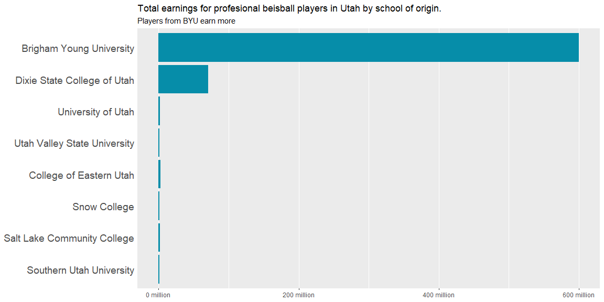
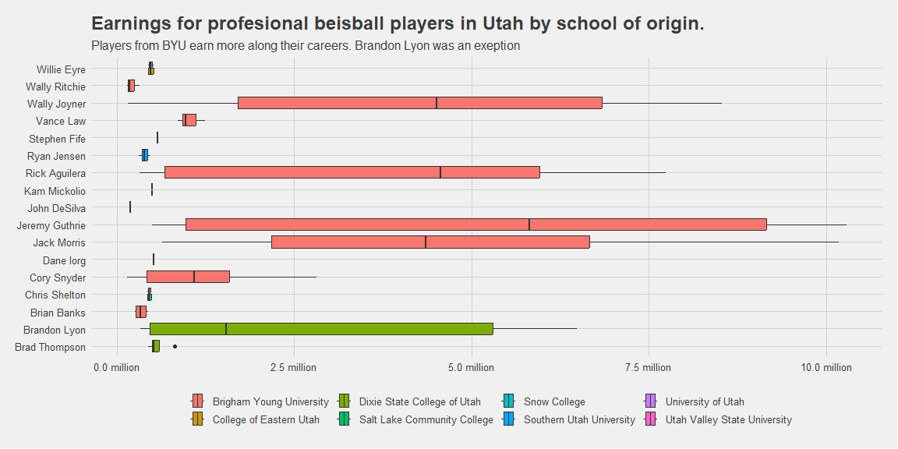

```r
# Use this R-Chunk to import all your datasets!
```

## Background

1. Install the library(Lahman) and examine the available data sets.  
    - Find the four to five different data sets that you will need to show full college name and player first and last names as well as their annual earnings.  
2. Install and load the priceR package, then use the adjust_for_inflation(price = your_earnings_vector, from_date = your_earnings_year_vector, country = "US", to_date = 2021) function to get all earnings in 2021 dollars.  
3. Make a plot showing how professional baseball player earnings who are alum of BYU compare to the professional players who are alum other Utah schools.  
4. Write a paragraph (or two) to summarize your findings and explain what conclusions you can draw from your visualization.

## Data Wrangling


```r
# Use this R-Chunk to clean & wrangle your data!
#?Lahman

#CollegePlaying
#Schools %>% filter(state == "UT")
#CollegePlaying
#Salaries


earnings <- Schools %>% filter(state == "UT") %>% 
            left_join(CollegePlaying, by = "schoolID") %>% 
            left_join(People, by = "playerID") %>% 
            select(schoolID, name_full, city, state, playerID, nameFirst, nameLast, yearID) %>% 
            left_join(Salaries, by = "playerID", suffix = c("_incollege", "_professional")) %>% 
            select(name_full, nameFirst, nameLast, yearID_professional, salary) %>% 
            drop_na(salary) %>% 
            mutate(adjusted_salary = adjust_for_inflation(price = salary, from_date = yearID_professional, country = "US", to_date = 2021 )) %>% 
            arrange(desc(adjusted_salary))
```

```
## Generating URL to request all 297 results
## Retrieving inflation data for US 
## Generating URL to request all 63 results
```

```r
earn_by_school <-  earnings %>% group_by(name_full) %>% 
                                summarise(by_school = sum(salary),
                                          by_school_adj = sum(adjusted_salary)) %>% 
                                arrange(desc(by_school_adj))
```

## Data Visualization


```r
# Use this R-Chunk to plot & visualize your data!


# First plot

ggplot(earnings, aes(x = adjusted_salary, y = reorder(name_full, adjusted_salary, )) ) +
      geom_bar(stat = "identity", fill = "#068DA9") +
      theme_update() +
      scale_x_continuous(labels = label_number(suffix = " million", scale = 1e-6)) +
      theme(axis.title = element_blank(),
        axis.line = element_blank(),
        axis.ticks.y = element_blank(),
        panel.grid.major.y = element_blank()) +
       labs(
           title = "Total earnings for profesional beisball players in Utah by school of origin.",
           subtitle = "Players from BYU earn more") +
  theme(axis.text.y = element_text(size = 14))
```

<!-- -->

```r
# Second plot

 # create a column with the complete names

earnings <-  earnings %>%  mutate(full_name = paste(nameFirst, nameLast, sep = " "))
 

 
 ggplot(earnings, aes(y = full_name, x  = adjusted_salary, fill = name_full)) +
   geom_boxplot() +
   scale_x_continuous(labels = label_number(suffix = " million", scale = 1e-6)) +
   theme(axis.title = element_blank(),
        axis.line = element_blank()) +
       labs(
           title = "Earnings for profesional beisball players in Utah by school of origin.",
           subtitle = "Players from BYU earn more along their careers. Brandon Lyon was an exeption",
           fill = "") +
   theme_fivethirtyeight()
```

<!-- -->

## Conclusions
 The total earnings from professional players from BYU are the higher. Historically, there are more successful players from BYU in the professional leagues. One exemption is Brandon Lyon from Dixie State College.  
 I took the data of the earnings from the Salary table, however I check for the history of some players (like Stephen Fife) and found that they have a career  along several years, but in this table just one entry for 2013. The salary table can have incomplete data, more analysis is necessary to know if the data is dependable.
