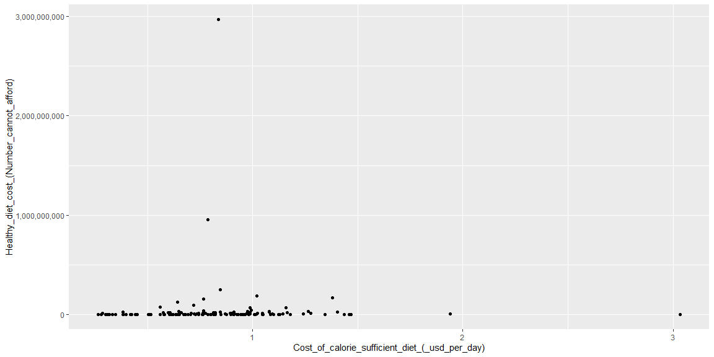
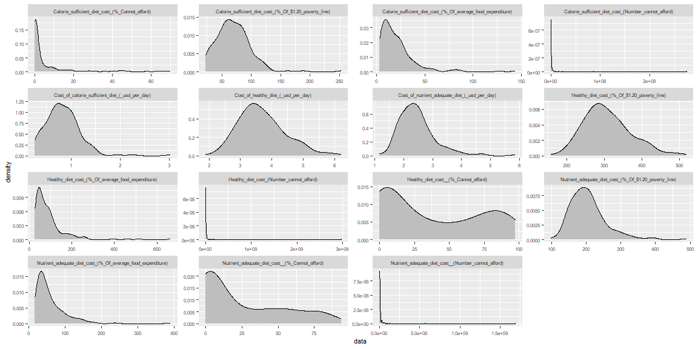
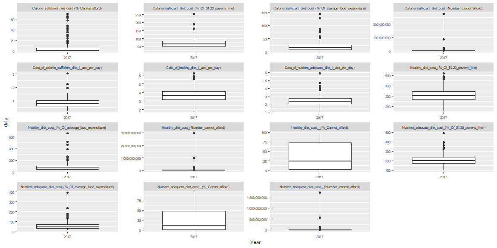

```r
# Use this R-Chunk to import all your datasets!


# This code helps to look into the data.world API ( I don think will use it in this stage)

#devtools::install_github("datadotworld/data.world-r", build_vignettes = TRUE)

# Link to the file I will want to start working (csv file from data.world) https://data.world/ourworldindata/affordability-of-diets

nutrition <- "https://query.data.world/s/vczcvw6w35ex6epncn5y2gzbldml2y?dws=00000"

# Link to a second file from kaggle

#food_p <- "https://www.kaggle.com/datasets/lasaljaywardena/global-food-prices-dataset/download?datasetVersionNumber=1"
          

# Working with temp files to avoid send too much data to github

# Temporal files 
temporal <- tempfile()

download(nutrition, 
         dest = temporal,
         mode = "wb")

nutrition_Afford <- read_csv(temporal)

# Other sorces : From The World Bank https://databank.worldbank.org/source/food-prices-for-nutrition?l=en#
#                https://www.worldbank.org/en/programs/icp/brief/foodpricesfornutrition
#                 From USDA https://www.ers.usda.gov/topics/international-markets-u-s-trade/international-consumer-and-food-industry-trends/#data
#                From the world Health Organization https://www.who.int/data/collections and https://www.who.int/data/gho/data/indicators and https://www.who.int/data/gho/info/gho-odata-api


# Second file NOT WORKING YET
#temporal1 <- tempfile()
#directem <- tempdir()

#download(food_p,
#         destfile = temporal1, mode = "wb")

#unzip(temporal1, exdir = directem)
#temporal1
#test <- read_csv(paste(directem,"file32e8447e5fae", sep = "\\"))
#test
#?unzip()
```

## Background

1. Find two other student’s compiled files in their repository for the previous week’s Case Study and provide feedback using the issues feature in GitHub (If they already have three issues find a different student to critique). You may mention things they could do to improve their visualization, for example.  
    - Tag (aka @mention) your instructor and the owner of the repository in the issue you write.
2. Build an html page (.rmd knitted to .html like you have done in the past) that has links to data sources with a description of the quality of each.
    - Find 3-5 potential data sources (that are free) and document some information about the source. Choose one dataset to focus on for this assignment (later you may bring in the other sources or switch to another source)  
        - Build an R script or markdown file that reads in, formats, and visualizes the data using the principles of exploratory analysis.  
        - CAUTION: You may want to store your data outside of the repository so it doesn’t try to upload to GitHub. There is a space limit on free GitHub and you may not be able to push large datasets there.
    - Write a short summary of the read-in process and some coding secrets you learned.  
    - Include two to three quick visualizations that you used to check the quality of your data.  
    - Summarize the limitations of the compiled data in addressing your original question.  
3. After formatting your data, identify any follow-on or alternate questions that you could use for your project.

## Data Wrangling


```r
# Use this R-Chunk to clean & wrangle your data!

# Exploration of dataset
# I found this library but cannot find yet how to output the results to the rmarkdown, it generate an html page of the results. 
#library(DataExplorer)
#test2 <- DataExplorer::create_report(nutrition_Afford)


# I use a fast way to deal in a first glance with the spaces in the columns titles.
# Not need to reduce the names yet since they bring explanatory information 

nutrition_Afford <- nutrition_Afford |>
  rename_all(~ gsub(" ", "_", .)) |>
  rename_all(stringr::str_to_title)

#glimpse(nutrition_Afford)
#summary(nutrition_Afford)
#testing_nutr <- describe(nutrition_Afford)
#testing_nutr

# Eloiminate the innesessary 2017 in columns names

names(nutrition_Afford) <- 
  gsub("2017","", names(nutrition_Afford))
```

## Data Visualization


```r
# Use this R-Chunk to plot & visualize your data!

# For this visualizations I don't remove the na or outliers since is the first exploration


dens1 <- ggplot(nutrition_Afford, aes(`Cost_of_calorie_sufficient_diet_(_usd_per_day)`)) +
geom_density(fill = "gray") + 
  theme(text = element_text(size = 8))

dens2 <- ggplot(nutrition_Afford, aes(`Cost_of_nutrient_adequate_diet_(_usd_per_day)`)) +
geom_density(fill = "gray")  + 
  theme(text = element_text(size = 8))


dens3 <- ggplot(nutrition_Afford, aes(`Cost_of_healthy_diet_(_usd_per_day)`)) +
geom_density(fill = "gray") + 
  theme(text = element_text(size = 8))


dens4 <- ggplot(nutrition_Afford, aes(`Calorie_sufficient_diet_cost_(%_Of_$1.20_poverty_line)`)) +
geom_density(fill = "gray") + 
  theme(text = element_text(size = 8))


dens5 <- ggplot(nutrition_Afford, aes(`Nutrient_adequate_diet_cost_(%_Of_$1.20_poverty_line)`)) +
geom_density(fill = "gray") + 
  theme(text = element_text(size = 8))

dens6 <- ggplot(nutrition_Afford, aes(`Healthy_diet_cost_(%_Of_$1.20_poverty_line)`)) +
geom_density(fill = "gray") + 
  theme(text = element_text(size = 8))

dens7 <- ggplot(nutrition_Afford, aes(`Calorie_sufficient_diet_cost_(%_Of_average_food_expenditure)`)) +
geom_density(fill = "gray") + 
  theme(text = element_text(size = 8))

dens8 <- ggplot(nutrition_Afford, aes(`Nutrient_adequate_diet_cost_(%_Of_average_food_expenditure)`)) +
geom_density(fill = "gray") + 
  theme(text = element_text(size = 8))

dens9 <- ggplot(nutrition_Afford, aes(`Healthy_diet_cost_(%_Of_average_food_expenditure)`)) +
geom_density(fill = "gray") + 
  theme(text = element_text(size = 8))


dens10 <- ggplot(nutrition_Afford, aes(`Calorie_sufficient_diet_cost_(%_Cannot_afford)`)) +
geom_density(fill = "gray") + 
  theme(text = element_text(size = 8))

dens11 <- ggplot(nutrition_Afford, aes(`Nutrient_adequate_diet_cost__(%_Cannot_afford)`)) +
geom_density(fill = "gray") + 
  theme(text = element_text(size = 8))

dens12 <- ggplot(nutrition_Afford, aes(`Healthy_diet_cost__(%_Cannot_afford)`)) +
geom_density(fill = "gray") + 
  theme(text = element_text(size = 8))

dens13 <- ggplot(nutrition_Afford, aes(`Calorie_sufficient_diet_cost_(Number_cannot_afford)`)) +
geom_density(fill = "gray")  + 
  theme(text = element_text(size = 8))

dens14 <- ggplot(nutrition_Afford, aes(`Nutrient_adequate_diet_cost__(Number_cannot_afford)`)) +
geom_density(fill = "gray") + 
  theme(text = element_text(size = 8))

dens15 <- ggplot(nutrition_Afford, aes(`Healthy_diet_cost_(Number_cannot_afford)`)) +
geom_density(fill = "gray") + 
  theme(text = element_text(size = 8))


 # This solution to grid is kind of messy with the legends, from gridExtra package
#grid.arrange(dens1, dens2, dens3, dens4, dens5, dens6, dens7, dens8, dens9, dens10, dens11, dens12, dens13, dens14, dens15, ncol = 3,heights = c(4,1) )

# This is a better solution in this case, from cowplot  package
# After review how many times I repeat myself in this code I changed to the one at the end that is using pivot and facets (should think on that first)


#plot_grid(dens1, dens2, dens3, dens4, dens5, dens6, dens7, dens8, dens9, dens10, dens11, dens12, dens13, dens14, dens15, align = "v", nrow = 3, rel_heights = c(1/4, 1/4, 1/4))


# Must explore more in the correlations between variables 

p1 <- ggplot(nutrition_Afford, aes(x = `Cost_of_calorie_sufficient_diet_(_usd_per_day)`, y = `Healthy_diet_cost_(Number_cannot_afford)`)) +
  geom_point() +
  scale_y_continuous(label = scales::comma)

p1
```

<!-- -->

```r
# Converting year as a factor for better display in the boxplots 

nutrition_Afford$Year <- nutrition_Afford$Year %>% as.factor()


p1 <- ggplot(nutrition_Afford, aes(y = `Cost_of_calorie_sufficient_diet_(_usd_per_day)`, x = Year)) +
  geom_boxplot() +
   scale_y_continuous(label = scales::comma)


p2 <- ggplot(nutrition_Afford, aes(y = `Cost_of_nutrient_adequate_diet_(_usd_per_day)`, x = Year)) +
  geom_boxplot() +
   scale_y_continuous(label = scales::comma)

p3 <- ggplot(nutrition_Afford, aes(y = `Cost_of_healthy_diet_(_usd_per_day)`, x = Year)) +
  geom_boxplot() +
   scale_y_continuous(label = scales::comma)

p4 <- ggplot(nutrition_Afford, aes(y = `Calorie_sufficient_diet_cost_(%_Of_$1.20_poverty_line)`, x = Year)) +
  geom_boxplot() +
   scale_y_continuous(label = scales::comma)

p5 <- ggplot(nutrition_Afford, aes(y = `Nutrient_adequate_diet_cost_(%_Of_$1.20_poverty_line)`, x = Year)) +
  geom_boxplot() +
   scale_y_continuous(label = scales::comma)

p6 <- ggplot(nutrition_Afford, aes(y = `Healthy_diet_cost_(%_Of_$1.20_poverty_line)`, x = Year)) +
  geom_boxplot() +
   scale_y_continuous(label = scales::comma)

p7 <- ggplot(nutrition_Afford, aes(y = `Calorie_sufficient_diet_cost_(%_Of_average_food_expenditure)`, x = Year)) +
  geom_boxplot() +
   scale_y_continuous(label = scales::comma)

p8 <- ggplot(nutrition_Afford, aes(y = `Nutrient_adequate_diet_cost_(%_Of_average_food_expenditure)`, x = Year)) +
  geom_boxplot() +
   scale_y_continuous(label = scales::comma)

p9 <- ggplot(nutrition_Afford, aes(y = `Healthy_diet_cost_(%_Of_average_food_expenditure)`, x = Year)) +
  geom_boxplot() +
   scale_y_continuous(label = scales::comma)

p10 <- ggplot(nutrition_Afford, aes(y = `Calorie_sufficient_diet_cost_(%_Cannot_afford)`, x = Year)) +
  geom_boxplot() +
   scale_y_continuous(label = scales::comma)

p11 <- ggplot(nutrition_Afford, aes(y = `Nutrient_adequate_diet_cost__(%_Cannot_afford)`, x = Year)) +
  geom_boxplot() +
   scale_y_continuous(label = scales::comma)

p12 <- ggplot(nutrition_Afford, aes(y = `Healthy_diet_cost__(%_Cannot_afford)`, x = Year)) +
  geom_boxplot() +
   scale_y_continuous(label = scales::comma)

p13 <- ggplot(nutrition_Afford, aes(y = `Calorie_sufficient_diet_cost_(Number_cannot_afford)`, x = Year)) +
  geom_boxplot() +
   scale_y_continuous(label = scales::comma)


p14 <- ggplot(nutrition_Afford, aes(y = `Nutrient_adequate_diet_cost__(Number_cannot_afford)`, x = Year)) +
  geom_boxplot() +
   scale_y_continuous(label = scales::comma)


p15 <- ggplot(nutrition_Afford, aes(y = `Healthy_diet_cost_(Number_cannot_afford)`, x = Year)) +
  geom_boxplot() +
   scale_y_continuous(label = scales::comma)


# Pivot longer to prepare the data for facets

test <- nutrition_Afford %>% 
  pivot_longer(c(`Cost_of_calorie_sufficient_diet_(_usd_per_day)`,`Cost_of_nutrient_adequate_diet_(_usd_per_day)`,`Cost_of_healthy_diet_(_usd_per_day)`, `Calorie_sufficient_diet_cost_(%_Of_$1.20_poverty_line)`, `Nutrient_adequate_diet_cost_(%_Of_$1.20_poverty_line)`, `Healthy_diet_cost_(%_Of_$1.20_poverty_line)`,`Calorie_sufficient_diet_cost_(%_Of_average_food_expenditure)`, `Nutrient_adequate_diet_cost_(%_Of_average_food_expenditure)`,   `Healthy_diet_cost_(%_Of_average_food_expenditure)`,`Calorie_sufficient_diet_cost_(%_Cannot_afford)`,  `Nutrient_adequate_diet_cost__(%_Cannot_afford)`, `Healthy_diet_cost__(%_Cannot_afford)`, `Calorie_sufficient_diet_cost_(Number_cannot_afford)` ,  `Nutrient_adequate_diet_cost__(Number_cannot_afford)`, `Healthy_diet_cost_(Number_cannot_afford)`), names_to = "year", values_to = "data")


# Faceted density of the data

ggplot(test, aes(`data`)) +
geom_density(fill = "gray") + 
  theme(text = element_text(size = 8)) +
  facet_wrap( ~ year, scales = "free") +
  theme(text = element_text(size = 7.9))
```

<!-- -->

```r
ggplot(test, aes(y = data, x = Year)) +
  geom_boxplot() +
   scale_y_continuous(label = scales::comma) +
  facet_wrap( ~ year, scales = "free") +
  theme(text = element_text(size = 7.9))
```

<!-- -->

```r
# Heat map to find patterns
# Not yet complete


#test2 <- melt(nutrition_Afford)
#test2
#ggplot(test2, aes(x = variable,
#                  y = variable,
#                  fill = value)) + 
#  geom_tile() + 
#  theme(axis.text.x = element_text(angle = 45, hjust = 1))
```

## Conclusions
1. I decided after a long search to work with a dataset from data.world.
This is the [Link](https://data.world/ourworldindata/affordability-of-diets) to the file I will want to start working (csv file from data.world) . I found that this file was easy to download and work with. The other sources offer more information but will probably require more work to tidy and format the files to work with.  
2. Other sources :  
    - From The [World Bank](https://databank.worldbank.org/source/food-prices-for-nutrition?l=en#)  
    - [Also, from the World Bank](https://www.worldbank.org/en/programs/icp/brief/foodpricesfornutrition).
    - [From USDA](https://www.ers.usda.gov/topics/international-markets-u-s-trade/international-consumer-and-food-industry-trends/#data)
    - [From the world Health Organization](https://www.who.int/data/collections)
    - [Also, from  the World health Organization](https://www.who.int/data/gho/data/indicators)  
    - [Another from the same source](https://www.who.int/data/gho/info/gho-odata-api)  
    - All this sources offers zip files to download or APIs for access the data. To learn how to access from an API can be the next challenge on some of them. I try to download some of the zip files and encounter issues when trying to access the temp files. Probably I will has to downloaded to my computer and from there access the files outside of the repository environment. 
    
3. Summary:   
    a. I read to a temporal file and format the names of the columns trying to keep the long names as possible since they were self-descriptive of the data. That took me a load of work to write or copy and paste later the names. I learn that I must use short descriptive names and filter my data to the essential to work more orderly.
    b. I learned a lot about how to change names of columns using gsub() and string_to_title(). Also, in the hard way I learn of the power of pivoting my data to make facets.   
    c. This data is just from the year 2017, I realize that if I want to measure change in time I will need furthermore data from different years ( my original questions were around the change in nutrition in populations due the price change of food)  
4. Alternate questions can be how price is related to access to a healthy diet in different countries.

    

