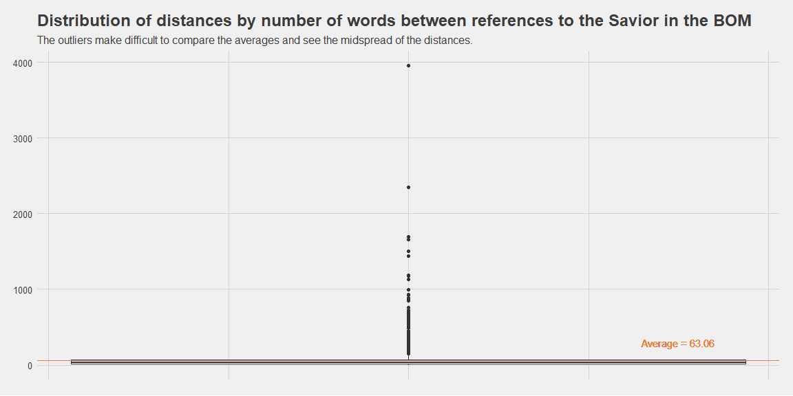
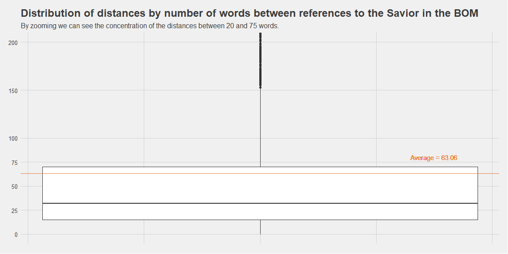
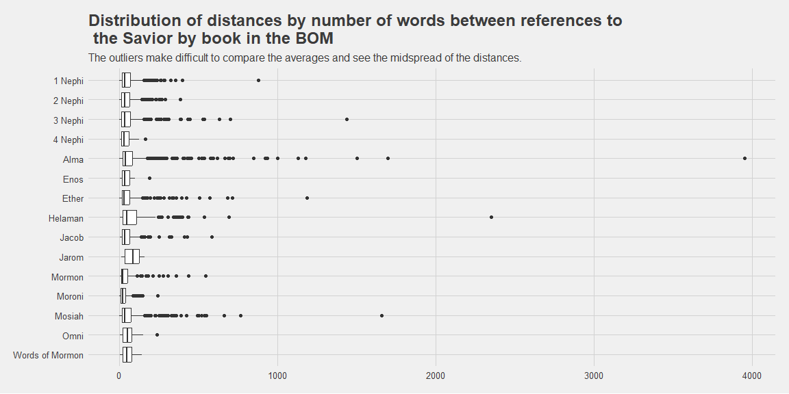
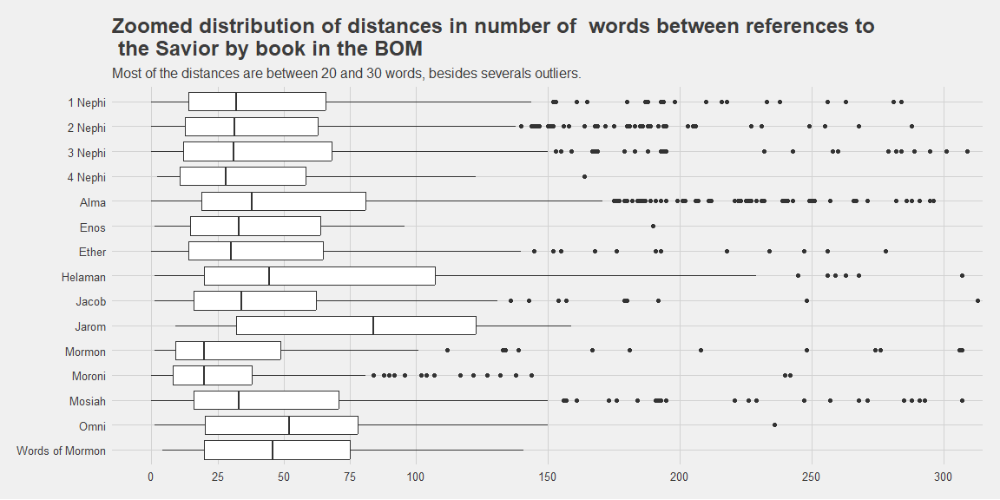

```r
# Use this R-Chunk to import all your datasets!

savior_names <- rio::import("https://byuistats.github.io/M335/data/BoM_SaviorNames.rds") %>% 
  as_tibble()


scriptures_data <- rio::import("http://scriptures.nephi.org/downloads/lds-scriptures.csv.zip") %>% 
  as_tibble()
```

## Background

1. Get the scripture and savior name data into R.  
    - Scripture Text: Use the same data from the previous task. You don’t have to download it again if you stored it on your computer.  
    - Savior Names: Use read_rds(url("https://byuistats.github.io/M335/data/BoM_SaviorNames.rds")) or read_rds("https://byuistats.github.io/M335/data/BoM_SaviorNames.rds") to download and load the Savior names table into R. (Or try experimenting with rio::import() to read in the data)
2. Use the list of Savior names and the Book of Mormon text to find the distribution of number of words between references to the Savior.  
    - Find each instance of a Savior name in the Book of Mormon.  
    - Split on those instances and then count the number of words between each instance.
    - Use the example code below for some hints on how to tackle this task.  
3. Report the average number of words between each Savior name and visualize the distribution. (The plot should display the average in some way).  
4. Create an .Rmd file with one to two paragraphs summarizing your graphic that shows how the distance between Savior names.

## Data Wrangling


```r
# Use this R-Chunk to clean & wrangle your data!

#------------------------------------------- First work with a reduced set ------------------------------------------------------


bom <-  scriptures_data %>% filter(volume_title == "Book of Mormon" & book_title == "2 Nephi" & chapter_number == 25 & verse_number == 19) %>% 
                                   select(volume_title, book_title, volume_long_title, book_long_title, chapter_number, verse_number, scripture_text)


# head(scriptures_data)
#bom
# Get the patten to search for the references and split the data

# pattern <- savior_names$name   -- don't work --


pattern_names <- str_c(savior_names$name, collapse = "|")


# Prepare the Book converting it to a single string for search for the references and split the data.

bom_str <-  str_flatten(bom$scripture_text)


test <- bom_str %>% str_split(pattern = pattern_names) %>% unlist() %>% enframe()


#length(test)


#test %>% rename("savior_name_ocurrence" = "name",
#               "text_between_ocurrences" = "value") %>% 
#         mutate(word_count = stri_count_words(text_between_ocurrences),
#                word_average =  mean(word_count))


# ------------------------------------- Solution-----------------------------------------------------------------------------------

# convert the Saviors names referance to a regex

pattern_names <- str_c(savior_names$name, collapse = "|")


# Prepare the Book of Mormon converting it to a single string for search for the references split the data and create a table with the information.

bom <-  scriptures_data %>%  filter(volume_title == "Book of Mormon") %>% 
                             select(volume_title, book_title, volume_long_title, book_long_title, chapter_number, verse_number, scripture_text)


bom_str <-  str_flatten(bom$scripture_text)

bom_str <- bom_str %>% str_split(pattern = pattern_names) %>% unlist() %>% enframe()

bom_str <- bom_str %>% rename("savior_name_ocurrence" = "name",
               "text_between_ocurrences" = "value") %>% 
         mutate(word_count = stri_count_words(text_between_ocurrences),
                word_average =  mean(word_count))


# try to get the data by book with a function

# This function get the BOM and filtering by book calculate the distances of the Savior references by a pattern
# Then make a string for each book and find the distances and average by book.
# Finally bind the results in a dataframe and return the results . 

books_table <- scriptures_data %>%  filter(volume_title == "Book of Mormon") %>% distinct(book_title)


get_distances <- function(bom, pattern_names, books_table){
  bom_str_by_book_final = data.frame() 
  for (i in books_table$book_title) {
   
    bom2 <- bom %>%  filter(bom$book_title ==  i) 
    bom_str_by_book <- str_flatten(bom2$scripture_text) 
    bom_str_by_book <- bom_str_by_book %>% str_split(pattern = pattern_names) %>% unlist() %>% enframe()
    bom_str_by_book <- bom_str_by_book %>% 
                       rename("savior_name_ocurrence" = "name",
                              "text_between_ocurrences" = "value") %>% 
                       mutate(word_count = stri_count_words(text_between_ocurrences),
                              word_average =  mean(word_count),
                              book_name = i)
    bom_str_by_book_final <- bind_rows(bom_str_by_book_final, bom_str_by_book)
    
  }
  return(bom_str_by_book_final)}


distances <-  get_distances(bom, pattern_names, books_table )
```

## Data Visualization


```r
# Use this R-Chunk to plot & visualize your data!


pa <- ggplot(bom_str, aes( y = word_count)) +
   geom_boxplot() +
   theme(axis.x.title = element_blank(),
        axis.x.line = element_blank()) +
       labs(
           title = "Distribution of distances by number of words between references to the Savior in the BOM",
           subtitle = "The outliers make difficult to compare the averages and see the midspread of the distances.") +
   theme_fivethirtyeight() +
   theme(axis.ticks.x = element_blank(),
        axis.text.x = element_blank()) +
  geom_hline(yintercept = bom_str$word_average, color = "#ec7c3d") +
  geom_text(label = "Average = 63.06" , x = 0.3, y = 300, color = "#ec7c3d")


pa
```

<!-- -->

```r
pb <- ggplot(bom_str, aes( y = word_count)) +
   geom_boxplot() +
   theme(axis.x.title = element_blank(),
        axis.line = element_blank()) +
       labs(
           title = "Distribution of distances by number of words between references to the Savior in the BOM",
           subtitle = "By zooming we can see the concentration of the distances between 20 and 75 words.") +
   theme_fivethirtyeight() +
   coord_cartesian(ylim = c(0,200)) +
   scale_y_continuous(breaks = c(0, 25,50, 75, 100, 150, 200,250, 300)) +
   theme(axis.ticks.x = element_blank(),
        axis.text.x = element_blank()) +
  geom_hline(yintercept = bom_str$word_average, color = "#ec7c3d") +
  geom_text(label = "Average = 63.06" , x = 0.3, y = 80, color = "#ec7c3d")
 

pb
```

<!-- -->

```r
p1 <- ggplot(distances, aes( x = word_count, y = fct_rev(book_name))) +
   geom_boxplot() +
   theme(axis.title = element_blank(),
        axis.line = element_blank()) +
       labs(
           title = "Distribution of distances by number of words between references to\n the Savior by book in the BOM",
           subtitle = "The outliers make difficult to compare the averages and see the midspread of the distances.") +
   theme_fivethirtyeight() 
  
   

p1
```

<!-- -->

```r
p2 <- ggplot(distances, aes( x = word_count, y =  fct_rev(book_name))) +
   geom_boxplot() +
   theme(axis.title = element_blank(),
        axis.line = element_blank()) +
       labs(
           title = "Zoomed distribution of distances in number of  words between references to\n the Savior by book in the BOM",
           subtitle = "Most of the distances are between 20 and 30 words, besides severals outliers.") +
   theme_fivethirtyeight() +
   scale_x_continuous(breaks = c(0, 25,50, 75, 100, 150, 200,250, 300)) +
   coord_cartesian(xlim = c(0,300))
    
p2
```

<!-- -->

## Conclusions
1. I found that just looking at the average of words distances between the Savior name in the Book of Mormon, can give limited information about the distribution into the whole book due to great outliers. When I found the distributions into each book I get a more detailed information about how often the Savior is referenced in the Book of Mormon. A further analysis will investigate the detailed averages by book since I graph just boxplots for that data that can show the median but not the average. 
