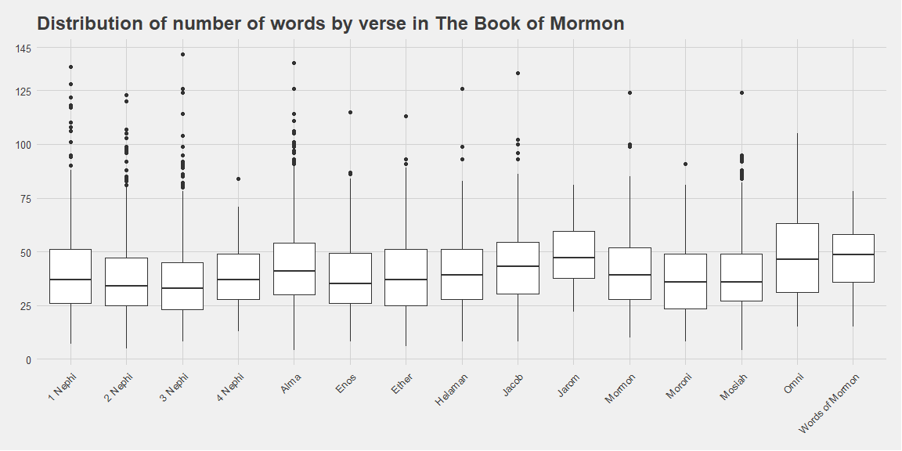

```r
# Use this R-Chunk to import all your datasets!

scriptures_data <- rio::import("http://scriptures.nephi.org/downloads/lds-scriptures.csv.zip") %>% 
  as_tibble()
```

## Background


1. Calculate the average verse length (number of words) in the New Testament compared to the Book of Mormon.  
2. Count how often the word “Jesus” is used in the New Testament compared to the Book of Mormon.  
3. Create a visualization to show the distribution of word count by verse for each book in the Book of Mormon.


## Data Wrangling


```r
# Use this R-Chunk to clean & wrangle your data!


####################################################### working with a smaller data to test #############################

# Filter the data

#nephi1 <- scriptures_data %>% filter(book_title == "1 Nephi" | book_title == "2 Nephi") 

# Factor book title
    
#nephi1$book_title <-  as.factor(nephi1$book_title)

# Calculate number of words and average lenght in words

#nephi1 %>% mutate(counter1 =  stri_count_words(scripture_text),
#                  average = mean(counter1))

#nephi1 %>% group_by(book_title) %>% 
#           mutate(jesus = sum(str_count(scripture_text, "Jesus")))

#test <- nephi1 %>% group_by(verse_number) %>% 
 #          mutate(jesus = str_count(scripture_text, "Jesus"))
#tail(test, 20)

#nephi1
#colnames(scriptures_data)

####################################################### Start to work in the big dataset ###############################

# Filter the  final data

testaments <-  scriptures_data %>% filter(volume_title == "Book of Mormon" | volume_title == "New Testament") %>% 
                                   select(volume_title, book_title, volume_long_title, book_long_title, chapter_number, verse_number, scripture_text)


#################################################### SOLUTION ###########################################################


testaments <- testaments %>% mutate(by_verse_words =  stri_count_words(scripture_text)) %>% 
                              group_by(volume_title) %>% 
                              mutate(average_word = mean(by_verse_words),
                                     jesus_by_verse = str_count(scripture_text, "Jesus"),
                                     jesus_by_book = sum(jesus_by_verse))


testaments$book_title <-  as.factor(testaments$book_title)
```

## Data Visualization


```r
# Use this R-Chunk to plot & visualize your data!


#################################################### Table presentation #############################################


# Create a table to show results

table <- testaments %>% 
        select(volume_title, average_word, jesus_by_book ) %>% 
        distinct(average_word, jesus_by_book) %>% 
        rename("Average word by verse" = "average_word",
               "References to the word Jesus by Book" = jesus_by_book, 
               "Scripture" = "volume_title")


# One of many ways to change how to show digits
      
options(digits = 4)


knitr::kable(table)
```


|Scripture      | Average word by verse| References to the word Jesus by Book|
|:--------------|---------------------:|------------------------------------:|
|New Testament  |                 22.67|                                  976|
|Book of Mormon |                 40.50|                                  184|

```r
# create datset to extract averages lengths and references to the word Jesus

book_of_Mormon <- testaments %>% 
                  group_by(book_title) %>% 
                  filter(volume_title == "Book of Mormon")


ggplot(book_of_Mormon, aes(x = book_title, y = by_verse_words )) +
   geom_boxplot() +
   theme(axis.title = element_blank(),
        axis.line = element_blank()) +
       labs(
           title = "Distribution of number of words by verse in The Book of Mormon") +
   theme_fivethirtyeight() +
   scale_y_continuous(breaks = c(0, 25,50, 75, 100, 125, 145)) +
   theme(axis.text.x = element_text(angle = 45, hjust = 1))
```

<!-- -->

## Conclusions
