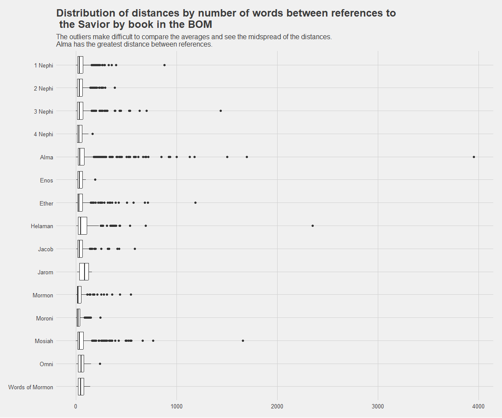
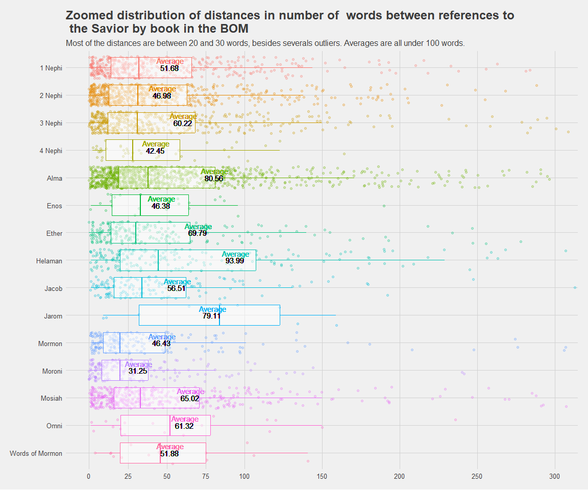
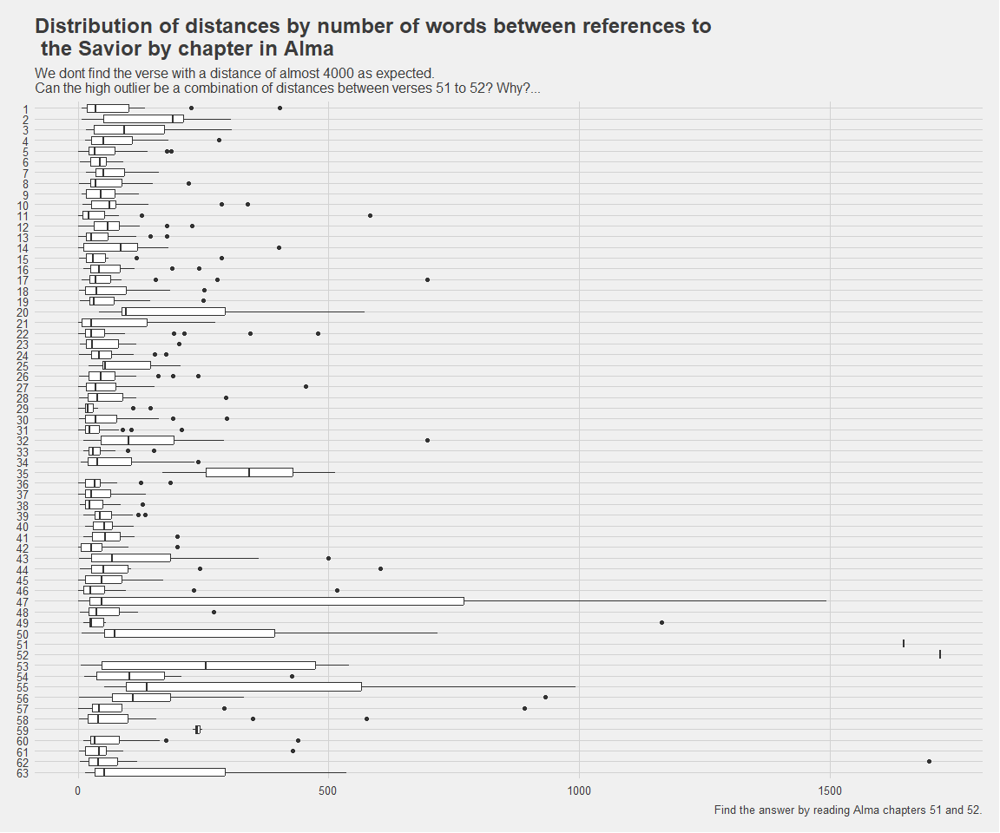

```r
# Use this R-Chunk to import all your datasets!


# This the list of names of the Savior 

savior_names <- rio::import("https://byuistats.github.io/M335/data/BoM_SaviorNames.rds") %>% 
  as_tibble()

# These are the Scriptures


scriptures_data <- rio::import("http://scriptures.nephi.org/downloads/lds-scriptures.csv.zip") %>% 
  as_tibble()
```

## Background

1. Get the scripture text and savior name data into R. This is the exact same same scripture and Savior name data as the previous week’s case study.  
2. Use the list of Savior names and the Book of Mormon text to find the distribution of words between references to the Savior for each book in the Book of Mormon.  
    - Find each instance of a Savior name in the Book of Mormon.  
    - Split on those instances and then count the number of words between each instance.  
    - You can use the purrr package to do this efficiently while still keeping track of the book it belongs to - which is needed for the visualizations requested below.  
3. Create a plot that visualizes the distribution of words between references to the Savior for each book in the Book of Mormon. Ideally the plot should facilitate easy comparison between the distributions.  
4. Create an .Rmd file with one to two paragraphs summarizing your graphic that shows how the distance between Savior names is distributed across the Book of Mormon.

## Data Wrangling


```r
# Use this R-Chunk to clean & wrangle your data!


# Get the pattern to search for the references and split the data


pattern_names <- str_c(savior_names$name, collapse = "|")


# Prepare the Book filtering and selecting some columns

bom <-  scriptures_data %>%  filter(volume_title == "Book of Mormon") %>% 
                             select(volume_title, book_title, volume_long_title, book_long_title, chapter_number, verse_number, scripture_text)


# Get the data by book with a function in  the traditional functional way (not purr yet)

# This function get the BOM and filtering by book calculate the distances of the Savior references by a pattern
# Then make a string for each book and find the distances and average by book.
# Finally bind the results in a dataframe and return the results . 


# Generate a list for iteration in each Book of the BOM
books_table <- scriptures_data %>%  filter(volume_title == "Book of Mormon") %>% distinct(book_title)


# With the Scriptures reduced to BOM, and the pattern to search, iterate each book in the list

get_distances <- function(bom, pattern_names, books_table){
  bom_str_by_book_final = data.frame() 
  for (i in books_table$book_title) {
   
    bom2 <- bom %>%  filter(bom$book_title ==  i) 
    bom_str_by_book <- str_flatten(bom2$scripture_text) 
    bom_str_by_book <- bom_str_by_book %>% str_split(pattern = pattern_names) %>% unlist() %>% enframe()
    bom_str_by_book <- bom_str_by_book %>% 
                       rename("savior_name_ocurrence" = "name",
                              "text_between_ocurrences" = "value") %>% 
                       mutate(word_count = stri_count_words(text_between_ocurrences),
                              word_average =  mean(word_count),
                              book_name = i)
    bom_str_by_book_final <- bind_rows(bom_str_by_book_final, bom_str_by_book)
    
  }
  bom_str_by_book_final}

# Apply the function to our data and get the distances by book and  their average in a tibble 

distances <-  get_distances(bom, pattern_names, books_table )

#distances

#--------------------------- Now with purr --------------------------------


get_distances_purr <- function(bom,pattern_names){
   bom_str_by_book <- str_flatten(bom$scripture_text) 
   bom_str_by_book <- bom_str_by_book %>% str_split(pattern = pattern_names) %>% unlist() %>% enframe()
   bom_str_by_book <- bom_str_by_book %>% 
                       rename("savior_name_ocurrence" = "name",
                              "text_between_ocurrences" = "value") %>% 
                       mutate(word_count = stri_count_words(text_between_ocurrences),
                              word_average =  mean(word_count),
                              book_name = bom$book_title)
}

distances2 <- bom %>% group_by(book_title) %>% nest() %>% 
                       mutate(dist_str_by_book = map(data, get_distances_purr, pattern_names)) %>% 
                       unnest(dist_str_by_book) %>% select(-data)
#distances2

#-----------------------------------A variation to analize books by verse ------------------------

# Looking at the first graphs the longest distance without any reference of the Savior is in Alma,
# (almost 4000) however, the general average is consistent with the trend in all the BOM. 
# To further investigate these we can change the function a bit to get the distances by verse in Alma, and also on any book. 

get_distances_purr_by_chapter <- function(bom_book,pattern_names){
   bom_str_by_book <- str_flatten(bom_book$scripture_text) 
   bom_str_by_book <- bom_str_by_book %>% str_split(pattern = pattern_names) %>% unlist() %>% enframe()
   bom_str_by_book <- bom_str_by_book %>% 
                       rename("savior_name_ocurrence" = "name",
                              "text_between_ocurrences" = "value") %>% 
                       mutate(word_count = stri_count_words(text_between_ocurrences),
                              word_average =  mean(word_count),
                              chapter_number = bom_book$chapter_number)
}


alma <-  scriptures_data %>%  filter(book_title == "Alma") %>% 
                             select(volume_title, book_title, volume_long_title, book_long_title, chapter_number, verse_number, scripture_text)

distances3 <- alma %>% group_by(chapter_number) %>% nest() %>% 
                       mutate(dist_str_by_book = map(data, get_distances_purr_by_chapter, pattern_names)) %>% 
                       unnest(dist_str_by_book) %>% select(-data)


# resume: Distances is a tible with the distances along the BOM obtained by traditional function means

#         Distances2 is the same but obtained using map

#         Distances3 is a variation using map to extract distances by chapter.
```

## Data Visualization


```r
# Use this R-Chunk to plot & visualize your data!

p1 <- ggplot(distances2, aes( x = word_count, y = fct_rev(book_title))) +
   geom_boxplot() +
   theme(axis.title = element_blank(),
        axis.line = element_blank()) +
       labs(
           title = "Distribution of distances by number of words between references to\n the Savior by book in the BOM",
           subtitle = "The outliers make difficult to compare the averages and see the midspread of the distances.\nAlma has the greatest distance between references.") +
   theme_fivethirtyeight() 

p1
```

<!-- -->

```r
# p2 graph is keek just for comarison between both obtained datasets


p2 <- ggplot(distances, aes( x = word_count, y =  fct_rev(book_name))) +
   geom_boxplot() +
   theme(axis.title = element_blank(),
        axis.line = element_blank()) +
       labs(
           title = "Zoomed distribution of distances in number of  words between references to\n the Savior by book in the BOM",
           subtitle = "Alma doesnt have the higher average expected having a so high outlier (almost 4000 in graph 1)") +
   theme_fivethirtyeight() +
   scale_x_continuous(breaks = c(0, 25,50, 75, 100, 150, 200,250, 300)) +
   coord_cartesian(xlim = c(0,300))
    
#p2


p3 <- ggplot(distances2, aes( x = word_count, y =  fct_rev(book_title), color = book_title)) +
   geom_jitter(alpha = 0.25)+
   geom_boxplot(alpha = 0.5, outlier.colour = NA) +
   guides(color="none") +
   theme(axis.title = element_blank(),
        axis.line = element_blank()) +
       labs(
           title = "Zoomed distribution of distances in number of  words between references to\n the Savior by book in the BOM",
           subtitle = "Most of the distances are between 20 and 30 words, besides severals outliers. Averages are all under 100 words.") +
   theme_fivethirtyeight() +
   scale_x_continuous(breaks = c(0, 25,50, 75, 100, 150, 200,250, 300)) +
   coord_cartesian(xlim = c(0,300))
    
p3 + geom_text(x = distances2$word_average , label = round(distances2$word_average,2), color = "black") +
     geom_text(x = distances2$word_average, label = " Average", nudge_y = 0.25)
```

<!-- -->

```r
p4 <- ggplot(distances3, aes( x = word_count, y = fct_rev(factor(chapter_number)))) +
   geom_boxplot() +
   theme(axis.title = element_blank(),
        axis.line = element_blank()) +
       labs(
           title = "Distribution of distances by number of words between references to\n the Savior by chapter in Alma",
           subtitle = "We dont find the verse with a distance of almost 4000 as expected.\nCan the high outlier be a combination of distances between verses 51 to 52? Why?...",
           caption = "Find the answer by reading Alma chapters 51 and 52.") +
   theme_fivethirtyeight() 

p4
```

<!-- -->

## Conclusions
1. I found that due to high outliers in the general graph of the BOM, the first graph needs to be zoomed to get a better picture of averages and distributions of distances.  
2. After zooming into the data and comparing averages, I question why alma seems so different than the other distributions, but still have a consistent  average compared to the rest of the books.  
3. Upon investigation in the third graph we can see that the higher distance is probably a combination of distances between 2 chapters (51 and 52), that lead me to read those chapters that describe a turbulent time in the history of the people in the Americas with detailed descriptions of wars. That detailed description of success and the predominant figure of Moroni, which lead to fewer mentions of the Savior.
