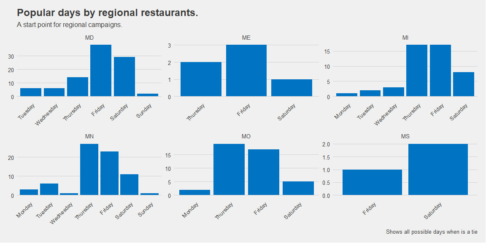
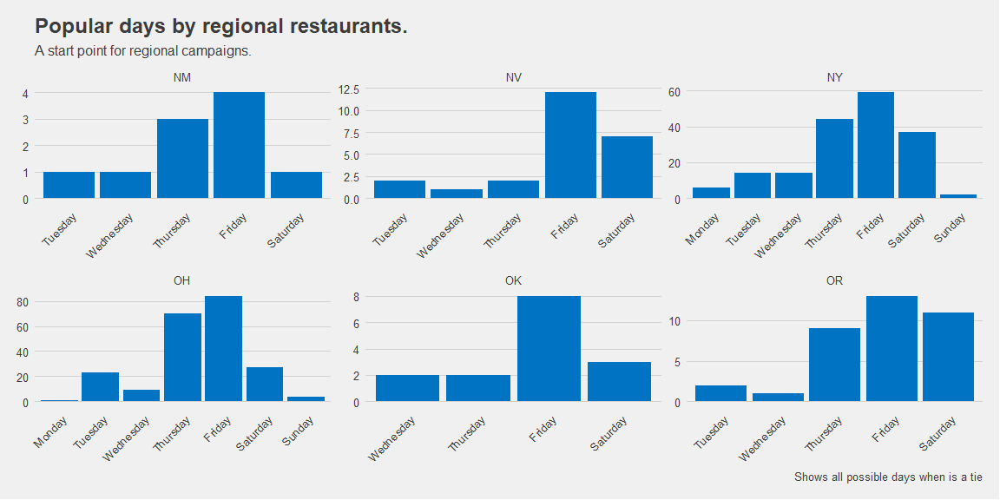

```r
# Use this R-Chunk to import all your datasets!

chiplotle_base <-  read_csv("https://byuistats.github.io/M335/data/chipotle_reduced.csv", col_select = c("region","placekey", "popularity_by_day"))


#view(chiplotle_base)
#chiplotle_base %>% filter(placekey == "22r-222@5z4-zwb-q4v")
```

## Background
You got your dream job working as a data analyst for one of your favorite restaurants, Chipotle! Chipotle is planning to run a large 1 or 2 day promotion. They would like the promotion to take place when the restaurant is busiest. They have gathered restaurant level data that you can use to answer the question, “what is the busiest day in the restaurant?”

This task asks you to conduct the analysis/visualization using two different units of measure. The decision about what unit of measure to use can mask or reveal key insights.

## Tasks
1. Read in the restaurant level data: https://byuistats.github.io/M335/data/chipotle_reduced.csv
    - Here is a data dictionary  
2. Use Function 2 from the previous assignment to tally across the restaurants how often each day of the week is selected as the most popular day. Then visualize the results: one chart for overall and another chart that facets by region.  
    - Note that the unit of observation in this plot/analysis is restaurants. In other words, we are showing a count of the number of restaurants in the plot.  
3. Use Function 1 from the previous assignment to combine the popularity_by_day data across all restaurants. Then visualize the frequency distribution of visits by day of the week regardless of restaurant. This visualization should be done overall and another chart that facets by region.  
    - Note that the unit of observation in this plot/analysis is an individual visit. In other words, we are counting how may individual visits occurred.  
4. Ensure your visualizations above are presentation worthy.  
5. Based on your above visualizations,  
    - Make a recommendation regarding which day(s) of the week Chipotle’s big promotion should run  
    - Explain which visualization was most influential in your decision. In other words, which unit of measure (store count of busiest day, or count of inidividual visits) is most useful. If you think both are valuable, explain why.  
    - Mention any other worthy insights.  
6. Save your dataset as a .rds file. This dataset should have each restaurant as a row and a list column of nested tibbles containing the visit counts for day of the week.

## Data Wrangling


```r
# Use this R-Chunk to clean & wrangle your data!

# omit all nas rows

chiplotle_base <- na.omit(chiplotle_base)
#sum(is.na(chiplotle_base))

#-------------------------------------- Functions from previous task ------------------------------

get_days <- function(chiplotle_base, placekeyn){
               pop_day <- chiplotle_base %>%  filter(placekey == placekeyn) %>% 
                                           select(popularity_by_day)
               pop_day <- pop_day[[1]] %>% parse_json() %>% unlist() %>% enframe()
               pop_day <- pop_day %>% mutate(restaurant_placement_key = placekeyn)
               pop_day
}

get_max_days <- function(result_get_days){
      max_names <- ""
      flag <- ""
      maxim <- which(result_get_days$value == max(result_get_days$value))
      for (i in maxim) {
        if (length(maxim) == 1) {
          max_names <- paste(result_get_days$name[[i]])
        } else{
        max_names <- paste(max_names,result_get_days$name[[i]], sep = ", ")
        }
      }
      if (length(maxim) > 1 & flag != "done") {
        max_names <- sub(".","",max_names) %>% trimws()
      
        }
      max_names
}

#----------------------- new map tailored functions --------------------------------

get_max_days_new <- function(popularity_by_day) {
  pop_day <- popularity_by_day[[1]] %>% parse_json() %>% unlist() %>% enframe()
  max_names <- ""
  maxim <- which(pop_day$value == max(pop_day$value))
      for (i in maxim) {
        if (length(maxim) == 1) {
          max_names <- paste(pop_day$name[[i]])
        } else{
        max_names <- paste(max_names,pop_day$name[[i]], sep = ", ")
        }
      }  
      if (length(maxim) > 1) {
        max_names <- sub(".","",max_names) %>% trimws()
          }
      
  max_names
}

get_visitors_by_day <- function(popularity_by_day){
  pop_day <- popularity_by_day[[1]] %>% parse_json() %>% unlist() %>% enframe()
}

# Use map with the 2 functions to get the popular days and the number of visitors by day. in a function with my functions.

get_all_days <- function(chiplotle_base){
  result <- chiplotle_base %>% group_by(region, placekey) %>% nest() %>% 
                               mutate(popular_day = map(data,get_max_days_new),
                                      visitors_by_day = map(data, get_visitors_by_day)) %>% unnest(popular_day) %>% 
                               select(-data)
  }

chiplotle_popularity <- get_all_days(chiplotle_base)

# --------------------  Separate the column of days to get an observation by row and trim spaces and factor ---------------
#                         the week days for the plot

chiplotle_popularity <- separate_rows(chiplotle_popularity,popular_day, sep = ",") 


chiplotle_popularity$popular_day <- chiplotle_popularity$popular_day %>% trimws() %>% factor(levels = c("Monday", "Tuesday", "Wednesday", "Thursday", "Friday", "Saturday", "Sunday"))

#---------------------------------------------------------SAVING the .rds file -----------------------------------------

write_rds(chiplotle_popularity,"chiplotle_popularity.rds")


#result %>% unnest(visitors_by_day)


# ----------------------- Start to work with the nested column of visitors by day in a separate dataset to avoid confusion ------------------------------
#                        Later can be done in the same unested dataset

chiplotle_popularity_by_day <-  chiplotle_popularity %>% unnest(visitors_by_day)
chiplotle_popularity_by_day$name <- chiplotle_popularity_by_day$name  %>% factor(levels = c("Monday", "Tuesday", "Wednesday", "Thursday", "Friday", "Saturday", "Sunday"))
# How to check how many unique regions we have to know how many facets we will have
#length(unique(chiplotle_popularity_by_day$region))
#length(unique(chiplotle_popularity$placekey))
```

## Data Visualization


```r
# Use this R-Chunk to plot & visualize your data!

popular_day_g <- ggplot(chiplotle_popularity, aes(x = popular_day)) +
  geom_bar(fill = "#0073C2FF")   + 
  theme_fivethirtyeight() +
  theme(axis.text.x = element_text(angle = 45, hjust = 1)) +
  theme(panel.grid.major.x = element_blank())

popular_day_g + labs(
           title = "Most popular day by number of restaurants",
           subtitle = "Most of our restaurants rank higher on visit close to the weekend.",
           caption = "Shows all possible days when is a tie") 
```

<!-- -->

```r
# This loop helps to make the graphs of a size in which can be visible. With some extra time should be a function.
# I found that the facets were very small, and increase the size and arrangement with facet_wrap_paginate,
# that generate pages with the facet output arrange in custom columns and rows.


for (i in 1:9){
     print( popular_day_g + 
              labs(
                    title = "Popular days by regional restaurants.",
                    subtitle = "A start point for regional campaigns.",
                    caption = "Shows all possible days when is a tie") +
              facet_wrap_paginate( ~ region, ncol = 3, nrow = 2,
                        scales = "free", strip.position = "top", page = i))
}
```

<!-- --><!-- --><!-- --><!-- --><!-- --><!-- --><!-- --><!-- --><!-- -->

```r
# 


visits_by_day_g <- ggplot(chiplotle_popularity_by_day, aes( x = name, y = value )) +
  geom_bar(fill = "#0073C2FF", stat = "identity") + 
  theme_fivethirtyeight()  +
  theme(axis.text.x = element_text(angle = 45, hjust = 1)) +
  theme(panel.grid.major.x = element_blank())


visits_by_day_g + labs(
           title = "Visits by day in all the restaurants",
           subtitle = "The tendency of the 3 more important days of the week continue,\n but Tuesday is also relevant here.\n The differences are less significatives.",
           caption = "Shows number of visitors in all regions")
```

<!-- -->

```r
#chiplotle_popularity_by_day

#friday <- chiplotle_popularity_by_day %>% filter(name == "Friday") 
#sum(friday$value)

#p4 <- p3 + facet_wrap( ~ region)

# This loop helps to make the graphs of a size in which can be visible. With some extra time should be a function.
# I found that the facets were very small, and increase the size and arrangement with facet_wrap_paginate,
# that generate pages with the facet output arrange in custom columns and rows.

for (i in 1:9){
     print( visits_by_day_g +
              labs(
                    title = "Visits by day in all the restaurants.",
                    subtitle = "A start point for regional campaigns.",
                    caption = "Shows number of visitors by regions") +
              facet_wrap_paginate( ~ region, ncol = 3, nrow = 2,
                        scales = "free", strip.position = "top", page = i))
} 
```

<!-- --><!-- --><!-- --><!-- --><!-- --><!-- --><!-- --><!-- --><!-- -->

## Conclusions
1. My recommendation is that,  as we see our customers came most of the time on Thursday, Friday, and Saturday, being seconded in some cases by Tuesday, we have potential to increase sales on Wednesday with a big promotion that can make Wednesday a link between those 2 blocks of high visits. That can consolidate a tendency in our customers to come to our restaurants during the week, and not only at the weekends.  
2. Both units of measure lead to the same conclusion about our best selling days, but the second (sales by day) brings a more precise measure of the number of differences in visits by days. The first shows the main tendencies but is not that accurate.   
3. The differences between regions are worth considering investigating deeply. We have states with many restaurants, and others with a few. Perhaps we can consider differentiated campaigns accordingly.
 
