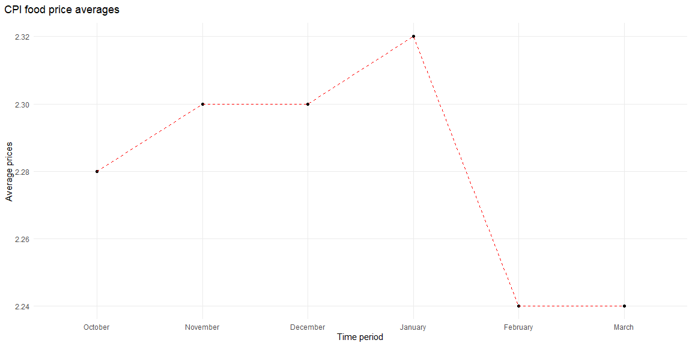

```r
# Use this R-Chunk to import all your datasets!
october <- import("https://byuistats.github.io/M335/data/cpi_food_uk/cpiaverageprices201910.xlsx", skip = 1) 
november <- import("https://byuistats.github.io/M335/data/cpi_food_uk/cpiaverageprices201911.xlsx", skip = 1)
december <- import("https://byuistats.github.io/M335/data/cpi_food_uk/cpiaverageprices201912.xlsx", skip = 1)
january <- import("https://byuistats.github.io/M335/data/cpi_food_uk/cpiaverageprices202001.xlsx", skip = 1)
february <- import("https://byuistats.github.io/M335/data/cpi_food_uk/cpiaverageprices202002.xlsx", skip = 1)
mars <- import("https://byuistats.github.io/M335/data/cpi_food_uk/cpiaverageprices202003.xlsx", skip = 1)

colnames(mars) <- c("name", "values")
colnames(february) <- c("name", "values")
colnames(january) <- c("code", "name", "values")
colnames(december) <- c("code", "name", "values")
colnames(november) <- c("code", "name", "values")
colnames(october) <- c("code", "name", "values")


october <- october %>% select(name,values)
november <- november %>% select(name, values)
december <- december %>% select(name, values)
january <-  january %>% select(name, values)
february <- february %>% select(name, values)
mars <- mars %>% select(name, values)


october <- october %>% mutate(
  average = round(mean(values), digits = 2),
  month = "October"
)

november <- november %>% mutate(
  average = round(mean(values), digits = 2),
  month = "November"
)

december <- december %>% mutate(
  average = round(mean(values), digits = 2),
  month = "December"
)

january <- january %>% mutate(
  average = round(mean(values), digits = 2),
  month = "January"
)

february <- february %>% mutate(
  average = round(mean(values),digits = 2),
  month = "February"
)

mars <- mars %>% mutate(
  average = round(mean(values), digits = 2),
  month = "March"
)
```

## Background

_Place Task Background Here_

## Data Wrangling


```r
# Use this R-Chunk to clean & wrangle your data!
# combine all months


all_months <- rbind(october, november, december, january, february, mars)
all_months <- all_months %>%  mutate(
  month_number = as.integer(factor(month, levels = month.name))
 
)
```

## Data Visualization


```r
# Use this R-Chunk to plot & visualize your data!
# cant find the cause that the line dont show yet.


ggplot(data = all_months, mapping = aes(x = fct_inorder(month), y = average, group = 1)) +
     geom_point() + 
     geom_line(linetype = 2, color = "red") +
  theme_minimal() +
     labs(
    y = "Average prices",
    x = "Time period",
    title = "CPI food price averages"
  ) +
  theme(
    plot.title.position = "plot",
    plot.title = element_textbox_simple(margin = margin(b = 10))
  ) +
  theme(panel.grid.minor = element_blank()) +
  theme(panel.grid.major = element_line(linetype = 1)) 
```

<!-- -->

## Conclusions
