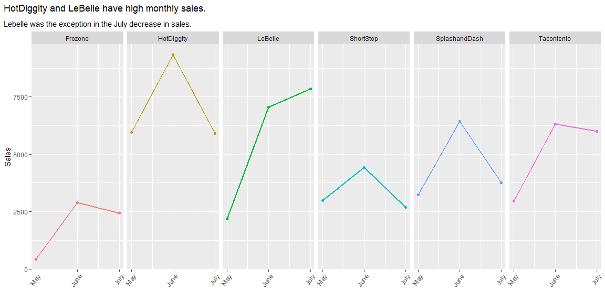
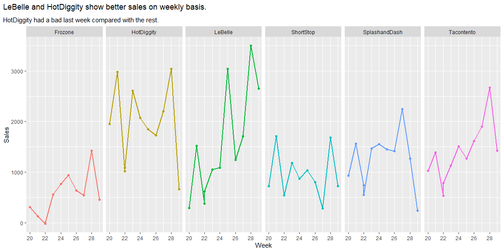
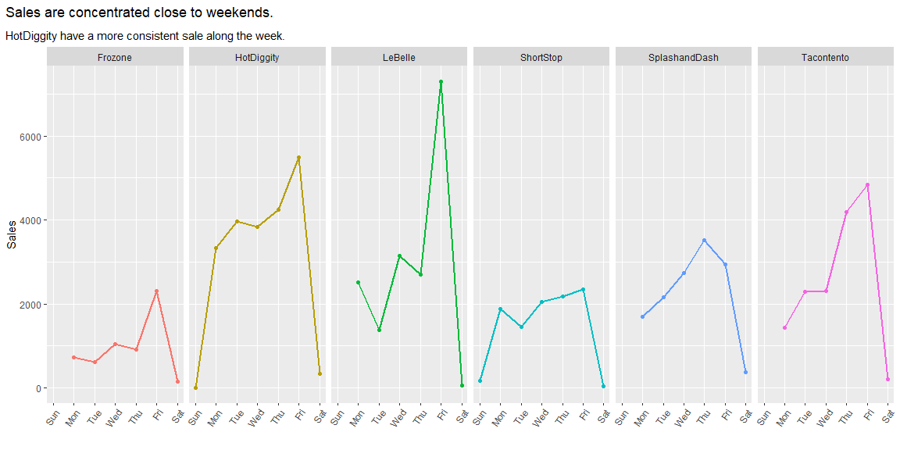
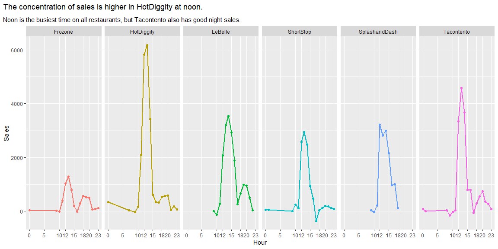
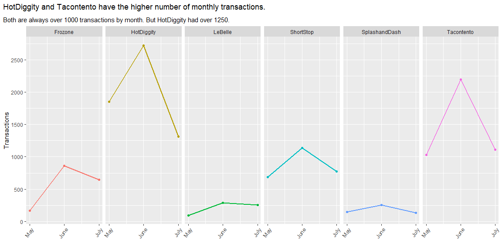
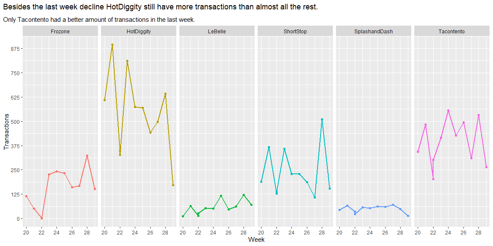
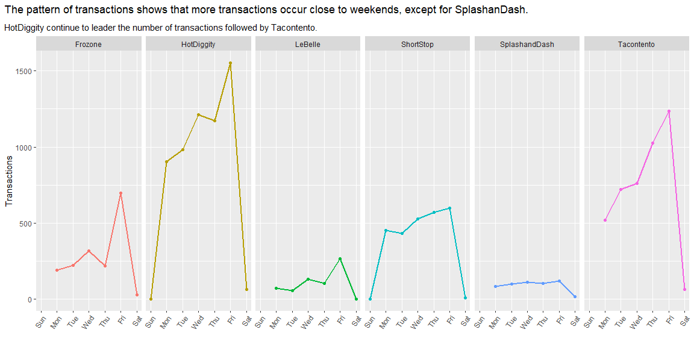
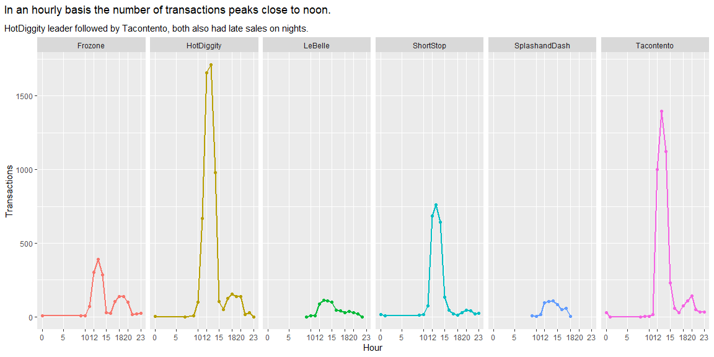

```r
# Use this R-Chunk to import all your datasets!

sales <- read_csv("https://byuistats.github.io/M335/data/sales.csv")
```

## Background

1. Read in the data from https://byuistats.github.io/M335/data/sales.csv and format it for visualization and analysis.  
    - The data has time recorded in UTC, but come from businesses in the mountain time zone. Make sure to convert!  
    - This is point of sale (pos) data, so you will need to use library(lubridate) to create the correct time aggregations.  
    - Check the data for any inaccuracies and use your best judgment in how to deal with them.  
2. Help your boss understand which business is the best investment through visualizations.  
    - Provide visualizations that show gross revenue over time for each company (Consider whether to aggregate at the daily, the weekly, or monthly level - or all 3).  
    - A strong customer base is preferred over companies whose revenue comes from just a few big purchases/customers. Thus, customer traffic (number of transactions) will be helpful in deciding which company to choose. Provide a visualization that shows customer traffic for each company.  
    - Provide a visualization that gives insight into hours of operation for each company.  
3. Write a short paragraph with your final recommendation. Which company do you think performed the best over the three months? Why?

## Data Wrangling


```r
# Use this R-Chunk to clean & wrangle your data!

#sales

#class(sales$Time)
#unique(sales$Name)
#view(sales)

# Eliminate  row with Name = to Missing 

sales <- sales %>% filter(Name != "Missing" )

# There are negatives and 0s in the amount column. I decide that those should be refunds, then must take into consideration and not exclude in this case. When the case is concluded we can run the script with and without them to see differences if necessary. 


#sales %>% filter(Amount < 0) %>% group_by(Name) %>% summarise(n = n())
#min(sales$Amount)

# time is recorded in UTC time , we must first  convert to mountain time.
#sales$Time[[1]]
#class(sales$Time)

sales <- sales %>% mutate(
                          mountain_time = with_tz(Time, "America/Boise"),
                          by_hour = ceiling_date(mountain_time, unit = "hour"))

                                                  

# check for nas
# sum(is.na(sales))

#names(which(colSums(is.na(sales))>0))
# ---------------------- Aggregate data --------------------------------------------

# Generate columns for agregate  data

sales <- sales %>% mutate(
              month = month(by_hour),
              week = week(by_hour),
              day = wday(by_hour),
              hour = hour(by_hour),
              day_of_week = wday(by_hour, label = TRUE)
)

# filtering  week 16  that is bad data

sales <-  sales %>% filter(week != 16 )

#combined
# totals by month day and week in columns

sales <- sales %>% group_by(Name, day) %>% 
             mutate(
              by_day_sales = sum(Amount),
              by_day_transc = n()
             ) %>% 
             ungroup() %>% 
             group_by(Name, month, week) %>% 
             mutate(
               by_week_sales = sum(Amount),
               by_week_transc = n()
             ) %>% 
             ungroup() %>% 
             group_by(Name,month) %>% 
             mutate(
               by_month_sales = sum(Amount),
               by_month_transc = n()
             ) %>% 
             ungroup() %>% 
             group_by(Name,hour) %>% 
             mutate(
               by_hour_sales = sum(Amount),
               by_hour_transc = n()
             )


#------------------------------ Start to experiment with time series  -----------------------


#unique(sales$week) %>% sort()

#sales2 <- sales %>% select(Name,by_month_sales, month,day,hour)


#sales.ts <- ts(sales2["by_month_sales"], start = 4, frequency = 4)
#sales.ts
#autoplot(sales.ts, facets = TRUE)
```

## Data Visualization


```r
# Use this R-Chunk to plot & visualize your data!

#------------------ sales by month ----------------------------

sales_month <- ggplot(sales, aes(x = month, y = by_month_sales, color = Name)) + 
  geom_point() +
  geom_line(size = 1) +
  facet_grid(~ Name)

sales_month +
  scale_x_continuous(
    breaks = seq_along(month.name), 
    labels = month.name
  ) +
  theme(
    axis.text.x = element_text(angle = 55, hjust = 1)
  ) +
  guides(color = FALSE) +
  labs(
    y = "Sales",
    x = "",
    title = "HotDiggity and LeBelle have high monthly sales.",
    subtitle = "Lebelle was the exception in the July decrease in sales."
  ) +
  theme(
    plot.title.position = "plot",
    plot.title = element_textbox_simple(margin = margin(b = 10))
  )
```

<!-- -->

```r
#------------------ sales by week ----------------------------

sales_week <- ggplot(sales, aes(x = week, y = by_week_sales, color = Name)) + 
  geom_point() +
  geom_line(size = 1) +
  facet_grid(~ Name)

sales_week +
  scale_x_continuous(breaks = c(20,22,24,26,28)) +
  guides(color = FALSE) +
  labs(
    y = "Sales",
    x = "Week",
    title = "LeBelle and HotDiggity show better sales on weekly basis.",
    subtitle = "HotDiggity had a bad last week compared with the rest."
  ) +
  theme(
    plot.title.position = "plot",
    plot.title = element_textbox_simple(margin = margin(b = 10))
  ) 
```

<!-- -->

```r
#------------------ sales by day ----------------------------

# Implementation requieres a vector of week days because was not possible to 
# graph lines between the points using week days from lubridate.

vec1 <- 1:7
vec2 <- c("Sun","Mon","Tue","Wed","Thu","Fri","Sat")
weekdays <- set_names(vec1,vec2)

sales_day <-  ggplot(sales, aes(x = day, y = by_day_sales, color = Name)) + 
  geom_point() +
  facet_grid(~ Name) + 
  geom_line(size = 1) 

sales_day +
  scale_x_continuous(breaks = c(weekdays)) +
  theme(
    axis.text.x = element_text(angle = 55, hjust = 1)
  ) + 
  guides(color = FALSE) +
  labs(
    y = "Sales",
    x = "",
    title = "Sales are concentrated close to weekends.",
    subtitle = "HotDiggity have a more consistent sale along the week."
  ) +
  theme(
    plot.title.position = "plot",
    plot.title = element_textbox_simple(margin = margin(b = 10)),
     panel.grid.minor.x = element_blank()
  )
```

<!-- -->

```r
#unique(sales$day)
#------------------ sales by hour ----------------------------

sales_hour <- ggplot(sales, aes(x = hour, y = by_hour_sales, color = Name)) + 
  geom_point() +
  geom_line(size = 1) +
  facet_grid(~ Name)

sales_hour +
  scale_x_continuous(breaks = c(0,5,10,12,15,18,20,23)) +
  guides(color = FALSE) +
  labs(
    y = "Sales",
    x = "Hour",
    title = "The concentration of sales is higher in HotDiggity at noon.",
    subtitle = "Noon is the busiest time on all restaurants, but Tacontento also has good night sales."
  ) +
  theme(
    plot.title.position = "plot",
    plot.title = element_textbox_simple(margin = margin(b = 10)),
    panel.grid.minor.x = element_blank()
  )
```

<!-- -->

```r
#------------------ transactions by month ----------------------------


transc_month <- ggplot(sales, aes(x = month, y = by_month_transc, color = Name)) + 
  geom_point() +
  geom_line(size = 1) +
  facet_grid(~ Name)


transc_month +
  scale_x_continuous(
    breaks = seq_along(month.name), 
    labels = month.name
  ) +
  scale_y_continuous(breaks = c(0,500,1000,1500,2000,2500,3000)) +
  theme(
    axis.text.x = element_text(angle = 55, hjust = 1)
  ) +
  guides(color = FALSE) +
  labs(
    y = "Transactions",
    x = "",
    title = "HotDiggity and Tacontento have the higher number of monthly transactions.",
    subtitle = "Both are always over 1000 transactions by month. But HotDiggity had over 1250."
  ) +
  theme(
    plot.title.position = "plot",
    plot.title = element_textbox_simple(margin = margin(b = 10))
  )
```

<!-- -->

```r
#------------------ transactions by week ----------------------------

transc_week <- ggplot(sales, aes(x = week, y = by_week_transc, color = Name)) + 
  geom_point() +
  geom_line(size = 1) +
  facet_grid(~ Name)

transc_week +
  scale_x_continuous(breaks = c(20,22,24,26,28)) +
  scale_y_continuous(breaks = c(0,125,250,375,500,625,750,875,1000)) +
  guides(color = FALSE) +
  labs(
    y = "Transactions",
    x = "Week",
    title = "Besides the last week decline HotDiggity still have more transactions than almost all the rest. ",
    subtitle = "Only Tacontento had a better amount of transactions in the last week."
  ) +
  theme(
    plot.title.position = "plot",
    plot.title = element_textbox_simple(margin = margin(b = 10))
  ) 
```

<!-- -->

```r
#------------------ transactions by day ----------------------------

transc_day <- ggplot(sales, aes(x = day, y = by_day_transc, color = Name)) +
  geom_point() +
  geom_line(size = 1) +
  facet_grid(~ Name)

transc_day +
  scale_x_continuous(breaks = c(weekdays)) +
  theme(
    axis.text.x = element_text(angle = 55, hjust = 1)
  )  + 
  guides(color = FALSE) +
  labs(
    y = "Transactions",
    x = "",
    title = "The pattern of transactions shows that more transactions occur close to weekends, except for SplashanDash.",
    subtitle = "HotDiggity continue to leader the number of transactions followed by Tacontento."
  ) +
  theme(
    plot.title.position = "plot",
    plot.title = element_textbox_simple(margin = margin(b = 10)),
    panel.grid.minor.x = element_blank()
  )
```

<!-- -->

```r
#------------------ transactions by hour ----------------------------

transc_hour <- ggplot(sales, aes(x = hour, y = by_hour_transc, color = Name)) + 
  geom_point() +
  geom_line(size = 1) +
  facet_grid(~ Name)

transc_hour +
  scale_x_continuous(breaks = c(0,5,10,12,15,18,20,23)) +
  guides(color = FALSE) +
  labs(
    y = "Transactions",
    x = "Hour",
    title = "In an hourly basis the number of transactions peaks close to noon.",
    subtitle = "HotDiggity leader followed by Tacontento, both also had late sales on nights."
  ) +
  theme(
    plot.title.position = "plot",
    plot.title = element_textbox_simple(margin = margin(b = 10)),
     panel.grid.minor.x = element_blank()
  ) 
```

<!-- -->

## Conclusions
1.HotDiggity was the best performance along these 3 months. Had higher monthly sales besides the decline that all restaurants experienced in the last week measured, and the higher number of transactions. I will recommend HotDiggity as a first option, but also Tacontento as second since it has also good figures both in sales and in number of transactions.  LaBelle had very good sales, but few transactions, probably due to a concentration of sales in fewer customers.
