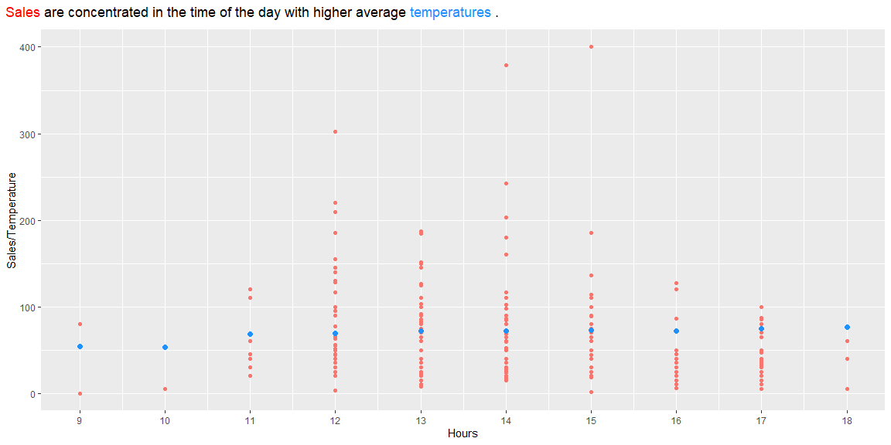
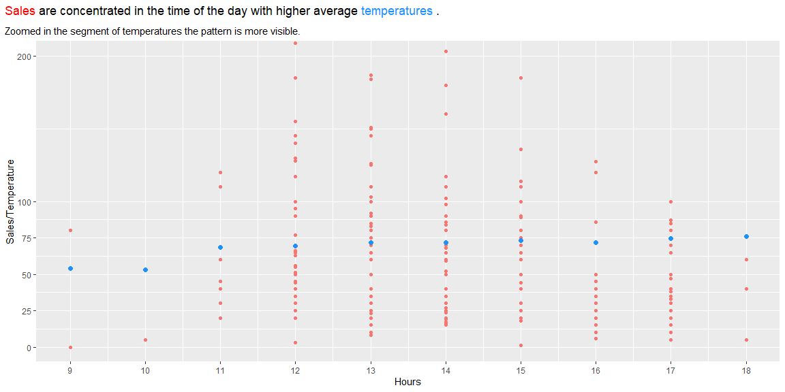
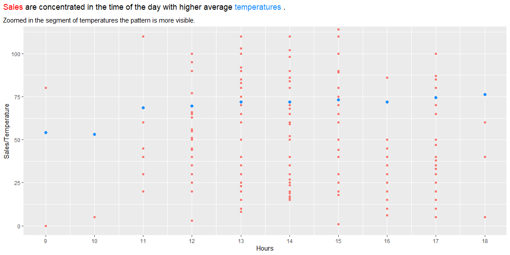

```r
# Use this R-Chunk to import all your datasets!


carwash <- read_csv("https://byuistats.github.io/M335/data/carwash.csv")

#carwash 
```

## Background
1. In a R markdown file, read in the car wash data https://byuistats.github.io/M335/data/carwash.csv and format it for the needs of this task.  
    - Convert the times from UTC time to the business’ local time using the right function out of library(lubridate).  
    - Create a new hourly grouping variable using ceiling_date() from library(lubridate).  
    - Aggregate the point of sale data into hour sales totals.  
2. Use riem_measures(station = "RXE", date_start = , date_end = ) for station RXE from library(riem) to get the Rexburg temperatures for the relevant dates.  
    - Create a new hourly variable that matches your car wash hourly variable.  
3. Merge the two datasets together.  
4. Create a visualization (or two) that provides insight into the relationship between sales and temperature by hour of the day.  
5. In a few sentences explain a couple of the key take-aways about the relationship between sales and temperature by hour of the day.

## Data Wrangling


```r
# Use this R-Chunk to clean & wrangle your data!
# Filter out negatives sales values

carwash <-  carwash %>% filter(amount >= 0)


#----------------------------------------- Convert the time to mountain time ------------------------------

# with_tz convert the time representation to the same time in the region specified That is why test is equal to start in the check

carwash <- carwash %>% mutate(
              mountain_time = with_tz(time, "America/Boise")
)

# ---------------Create a new hourly grouping variable using ceiling_date() from library(lubridate)-------------


carwash <- carwash %>% mutate(
              by_hour = ceiling_date(mountain_time, unit = "hour")
)

#----------------- Aggregate the point of sale data into hour sales totals.------------------------------------------
carwash <- carwash %>% group_by(by_hour) %>% 
            mutate(by_hour_sales = sum(amount)) %>% 
            ungroup()


#start <- min(carwash$time)

#test <- min(carwash$mountain_time)

#test
#start
#test == start


#-------------------------------------------Read weather data for that time -----------------------------------------------------------------

# Need the format yyyy mm dd for the function riem_measures()
# tmpf is air temperature in Farenheit. 

start <- min(carwash$mountain_time)
end <- max(carwash$mountain_time)
#day(end)

start <- ymd(paste(year(start),month(start), day(start), sep = "-"))
end <-  ymd(paste(year(end),month(end), day(end), sep = "-"))
#end

# Get the temperatures

temperatures <- riem_measures(station = "RXE", date_start = start, date_end = end)


# --------- Filter just the rows with temperatures and the timestamp for each observation ---------

temperatures <- temperatures %>% select(valid,tmpf) %>% 
                 filter(!is.na(tmpf))
 

#---------------------------- Create a new hourly variable that matches your car wash hourly variable.--------------

#first be sure that are in the rexbourg time zone

#temperatures


temperatures <- temperatures %>%  mutate(
                                    mountain_time = with_tz(valid, "America/Boise"),
                                    by_hour = ceiling_date(mountain_time, unit = "hour"))


#--------------------- Merge the two datasets together.-------------------------------------

combined <- carwash %>% left_join(temperatures, by = "by_hour")
#view(combined)
#view(carwash)
#view(temperatures)


# I found several hours without temperature data and used this function from zoo to fill with interpolations to make the transition of temperatures smooth. 

combined$tmpf <- zoo::na.fill(combined$tmpf, "extend")

combined <- combined %>% select(name,by_hour, by_hour_sales, tmpf, amount)

#combined

# Generate columns for agregate  data

combined <- combined %>% mutate(
              month = month(by_hour),
              week = week(by_hour),
              day = mday(by_hour),
              hour = hour(by_hour)
)
#combined
# totals by month day and week in columns

combined <- combined %>% group_by(month, week, day) %>% 
             mutate(
              by_day_sales = sum(amount)
             ) %>% 
             ungroup() %>% 
             group_by(month, week) %>% 
             mutate(
               by_week_sales = sum(amount)
             ) %>% 
             ungroup() %>% 
             group_by(month) %>% 
             mutate(
               by_month_sales = sum(amount)
             ) %>% 
             ungroup()

#combined
# temperatures by hour will be average by hour

combined <- combined %>% group_by(hour) %>% 
             mutate(
               by_hour_temp = mean(tmpf)
             )
```

## Data Visualization


```r
# Use this R-Chunk to plot & visualize your data!

p1 <- ggplot(combined, aes(x = hour, y = by_hour_sales, color = "red")) + 
  geom_point() +
  geom_point(y = combined$by_hour_temp, color = "dodgerblue", size = 2) +
  scale_x_continuous(breaks = c(9,10,11,12,13,14,15,16,17,18)) + 
 # theme_fivethirtyeight() +
  guides(color = FALSE) +
  labs(
    y = "Sales/Temperature",
    x = "Hours",
    title = "<span style = 'color: red'>Sales</span> are concentrated in the time of the day\n with higher average<span style = 'color: dodgerblue'> temperatures </span>."
  ) +
  theme(
    plot.title.position = "plot",
    plot.title = element_textbox_simple(margin = margin(b = 10))
  )


p1
```

<!-- -->

```r
p2 <-  p1 + coord_cartesian(ylim = c(0,200)) +
  scale_y_continuous(breaks = c(0,25,50,75, 100, 200)) +
  labs(subtitle = "Zoomed in the segment of temperatures the pattern is more visible.")


p2
```

<!-- -->

```r
p3 <- p2 +  coord_cartesian(ylim = c(0,110))
p3
```

<!-- -->

```r
#ggplot(data = test_temp, aes(x = hour, y = tmpf, group = day,color = day)) + 
 # geom_point() 

# Create a table that shows totals sales 

#view(combined)
# Create a table to show results

 
table <- combined %>% ungroup() %>%  select(month, week, by_month_sales, by_week_sales)  %>% 
   distinct(month(month, label = TRUE), week, by_month_sales, by_week_sales) %>% 
  arrange(week) %>% 
  rename(	"Sales By Month" = by_month_sales,
          "Sales by week" = by_week_sales ,
          "Month" = "month(month, label = TRUE)",
          "Week" = week)
        


# One of many ways to change how to show digits
      
options(digits = 4)


knitr::kable(table)
```


|Month | Week| Sales By Month| Sales by week|
|:-----|----:|--------------:|-------------:|
|May   |   20|           3874|           935|
|May   |   21|           3874|          1858|
|May   |   22|           3874|          1081|
|Jun   |   22|           6805|           588|
|Jun   |   23|           6805|          1546|
|Jun   |   24|           6805|          1611|
|Jun   |   25|           6805|          1573|
|Jun   |   26|           6805|          1487|
|Jul   |   27|           3980|          2308|
|Jul   |   28|           3980|          1317|
|Jul   |   29|           3980|           355|

## Conclusions


1. The hours of the day with the higher average temperatures are the ones that had the higher sales during the months of May, June and July. 
