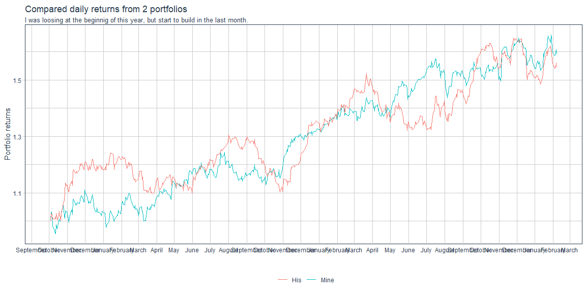
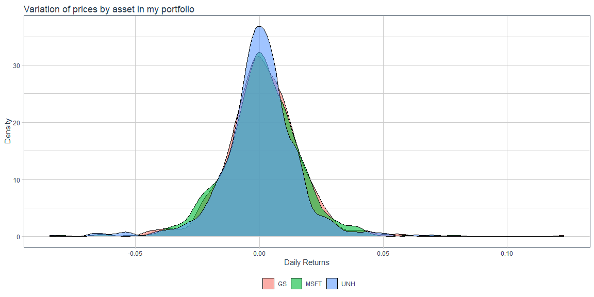
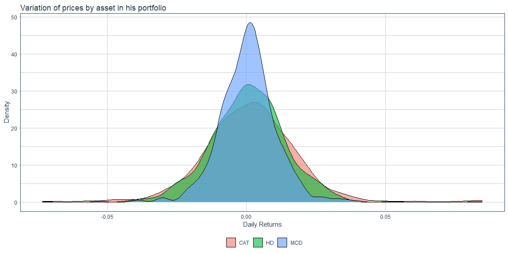
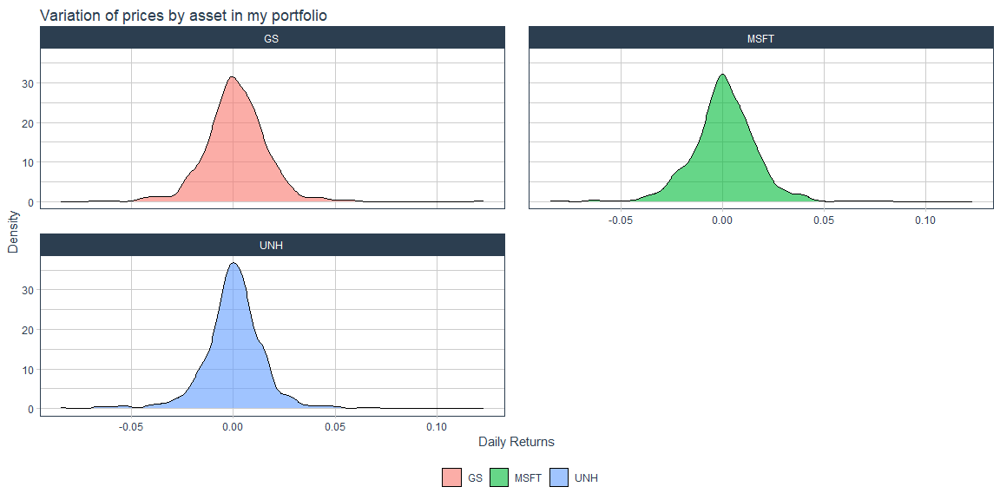
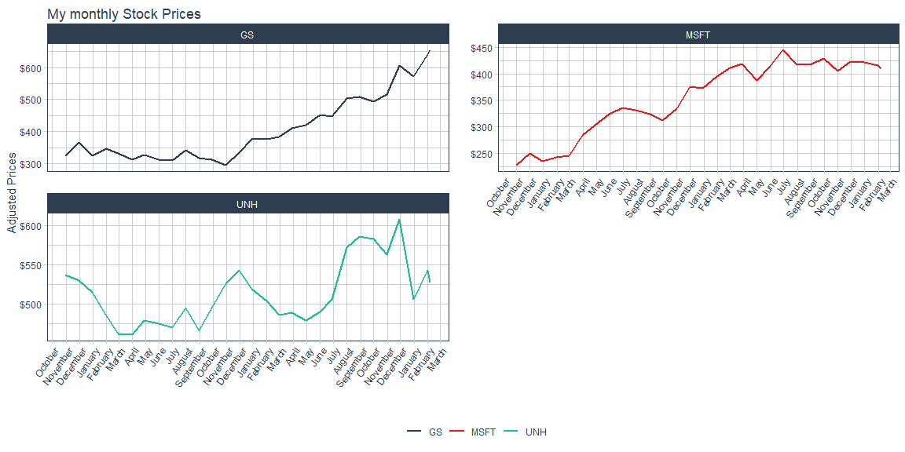
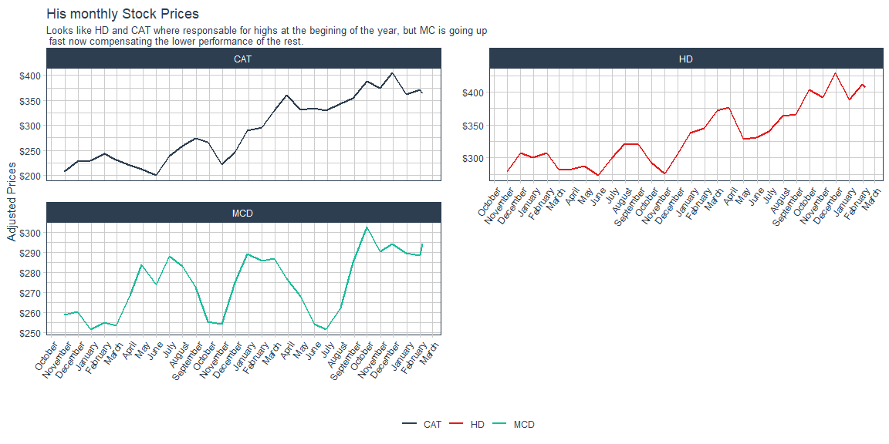
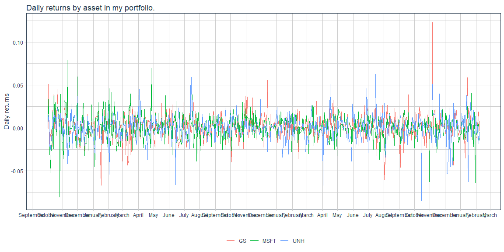
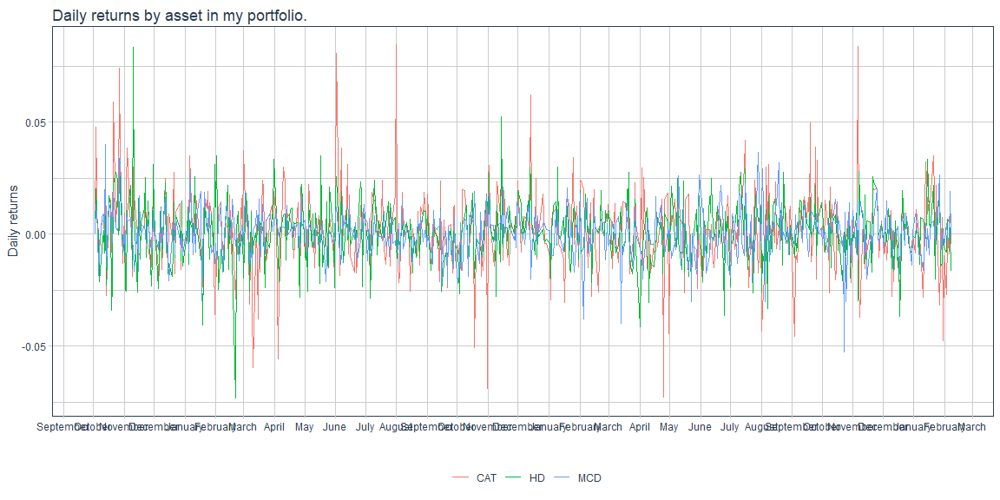

```r
# Use this R-Chunk to import all your datasets!

# ---------------- first get the 3 stocks -----------------------------
#tq_index_options()

#tq_index("SP400")
#tq_index("DOW")

my_stock <- tq_get(c("UNH", "MSFT", "GS"),
       get = "stock.prices",
       from = "2022-10-01")

friend_stock <- tq_get(c("HD", "MCD", "CAT"),
       get = "stock.prices",
       from = "2022-10-01")


# -------------------------- Get the returns daily ----------------------

return_my <- my_stock %>% 
            group_by(symbol) %>% 
            tq_transmute(select = adjusted,
                         mutate_fun = periodReturn,
                         period = "daily",
                         type = "log")

return_his <- friend_stock %>% 
              group_by(symbol) %>% 
              tq_transmute(select = adjusted,
                           mutate_fun = periodReturn,
                           period = "daily",
                           type = "log")


# ------------------------- Get portfolio returns --------------------

return_port_my <-  return_my %>%
  tq_portfolio(assets_col=symbol,
               returns_col=daily.returns,
               weights = tibble(asset.names = c("UNH", "MSFT", "GS"), 
                                weight = c(0.250,.500,.250)),
               wealth.index = T) 


return_port_his <-  return_his %>%
  tq_portfolio(assets_col=symbol,
               returns_col=daily.returns,
               weights = tibble(asset.names = c("HD", "MCD", "CAT"), 
                                weight = c(0.500,.250,.250)),
               wealth.index = T)

view(return_port_his)
view(return_port_my)
```

## Background
Imagine that you and a friend each purchased about $1,000 of stock in three different stocks at the start of October last year, and you want to compare your performance up to this week. Use the stock shares purchased and share prices to demonstrate how each of you fared over the period you were competing (assuming that you did not change your allocations).  
  
  
  1. List the three stocks that your friend picks and the three that you pick.  
  2. Pull the price performance data using library(tidyquant) or library(quantmod).  
  3. Build a visualization that shows who is winning each day of the competition.  
  4. In the previous visualization or with another visualization show which stock is helping the winner of the competition.  
  5. Create an .Rmd file with one or two paragraphs summarizing your graphics and the choices you made in the data presentation.  
  a. This are my stocks : 
        - UNH	UNITED HEALTH GROUP INC  
        - MSFT	MICROSOFT CORP  
        - GS	GOLDMAN SACHS GROUP INC  
  b. This are my friend's:  
        - HD	HOME DEPOT INC  
        - MCD	MCDONALD S CORP  
        - CAT	CATERPILLAR INC
       


## Data Wrangling


```r
# Use this R-Chunk to clean & wrangle your data!
```

## Data Visualization


```r
# Use this R-Chunk to plot & visualize your data!

p1 <- ggplot(data = return_port_my, aes(x = date, y = portfolio.wealthindex , color = "red")) +
    geom_line() +
    geom_line(data = return_port_his, aes(x = date, y = portfolio.wealthindex , color = "blue")) +
    labs(title = "Compared daily returns from 2 portfolios",
         subtitle = "I was loosing at the beginnig of this year, but start to build in the last month.",
         y = "Portfolio returns", 
         x = "") + 
    theme_tq() +
  scale_x_date(date_breaks = "1 month", date_labels = "%B")

p1 + scale_color_discrete(name = "",
                            breaks = c("blue", "red"),
                            labels = c("His", "Mine"))
```

<!-- -->

```r
# ---------------------  show which stock is helping the winner of the competition.---------------

p2 <- return_my %>%
    ggplot(aes(x = daily.returns, fill = symbol)) +
    geom_density(alpha = 0.6) +
    labs(title = "Variation of prices by asset in my portfolio",
         x = "Daily Returns", y = "Density") +
    theme_tq() +
    scale_fill_tq() +
    scale_fill_discrete(name = "")
p2
```

<!-- -->

```r
p2 <- return_his %>%
    ggplot(aes(x = daily.returns, fill = symbol)) +
    geom_density(alpha = 0.6) +
    labs(title = "Variation of prices by asset in his portfolio",
         x = "Daily Returns", y = "Density") +
    theme_tq() +
    scale_fill_tq() +
    scale_fill_discrete(name = "")


p2
```

<!-- -->

```r
p3 <- return_his %>%
    ggplot(aes(x = daily.returns, fill = symbol)) +
    geom_density(alpha = 0.6) +
    labs(title = "Variation of prices by asset in his portfolio",
         x = "Daily Returns", y = "Density") +
    theme_tq() +
    scale_fill_tq() + 
    facet_wrap(~ symbol, ncol = 2) +
    scale_fill_discrete(name = "")

p3
```

<!-- -->

```r
p4 <- return_my %>%
    ggplot(aes(x = daily.returns, fill = symbol)) +
    geom_density(alpha = 0.6) +
    labs(title = "Variation of prices by asset in my portfolio",
         x = "Daily Returns", y = "Density") +
    theme_tq() +
    scale_fill_tq() +
    facet_wrap(~ symbol, ncol = 2) +
    scale_fill_discrete(name = "")
    

p4
```

<!-- -->

```r
#--------------- Looking at the prices by month -----------------


price_monthly_my <- my_stock %>%
    group_by(symbol) %>%
    tq_transmute(select     = adjusted, 
                 mutate_fun = to.period, 
                 period     = "months")

price_monthly_his <- friend_stock %>%
    group_by(symbol) %>%
    tq_transmute(select     = adjusted, 
                 mutate_fun = to.period, 
                 period     = "months")


p44 <- price_monthly_my %>%
    ggplot(aes(x = date, y = adjusted, color = symbol)) +
    geom_line(size = 1) +
    labs(title = "My monthly Stock Prices",
         x = "", y = "Adjusted Prices", color = "") +
    facet_wrap(~ symbol, ncol = 2, scales = "free_y") +
    scale_y_continuous(labels = scales::dollar) +
    theme_tq() + 
    scale_color_tq() +
    scale_x_date(date_breaks = "1 month", date_labels = "%B") +
  theme(axis.text.x = element_text(angle = 55, hjust = 1))
  
p44
```

<!-- -->

```r
p45 <- price_monthly_his %>%
    ggplot(aes(x = date, y = adjusted, color = symbol)) +
    geom_line(size = 1) +
    labs(title = "His monthly Stock Prices",
         subtitle = "Looks like HD and CAT where responsable for highs at the begining of the year, but MC is going up\n fast now compensating the lower performance of the rest. ",
         x = "", y = "Adjusted Prices", color = "") +
    facet_wrap(~ symbol, ncol = 2, scales = "free_y") +
    scale_y_continuous(labels = scales::dollar) +
    theme_tq() + 
    scale_color_tq() +
    scale_x_date(date_breaks = "1 month", date_labels = "%B") +
  theme(axis.text.x = element_text(angle = 55, hjust = 1))
  
p45
```

<!-- -->

```r
# ---------------------- daily returns by assets -------------


p5 <- ggplot(data = return_my, aes(x = date, y = daily.returns , color = symbol)) +
    geom_line() +
    labs(title = "Daily returns by asset in my portfolio.",
         y = "Daily returns", 
         x = "") + 
    theme_tq() +
  scale_x_date(date_breaks = "1 month", date_labels = "%B") +
    scale_color_discrete(name = "")

p5
```

<!-- -->

```r
p6 <-  ggplot(data = return_his, aes(x = date, y = daily.returns , color = symbol)) +
    geom_line() +
    labs(title = "Daily returns by asset in my portfolio.",
         y = "Daily returns", 
         x = "") + 
    theme_tq() +
  scale_x_date(date_breaks = "1 month", date_labels = "%B")  +
    scale_color_discrete(name = "")

p6
```

<!-- -->

```r
#ggplot(data = return_his, aes(x = date, y = daily.returns , color = symbol )) +
# geom_line()
```

## Conclusions
I choose first to show the line chart to show comparative evolution of the returns. Then I explore multiple charts to get an idea of which was the responsible for the better performance of my friend portfolio. I found looking at the evolution of prices by month and by looking at the results by day variation throughout the period, that in different periods some of the assets were the more influential. However, HD because of the high price of the assets and the peaks at 320 dollars in December and February, looks like the one with more pull up to his portfolio. In my case looks like is Microsoft who is pulling up my portfolio after a very bad performance of the other assets in the beginning of the period. I added a graph of the daily returns just as practice but found them of little help in this situation. It can be of use if zoomed to look for more particular variations, like weekly. 
