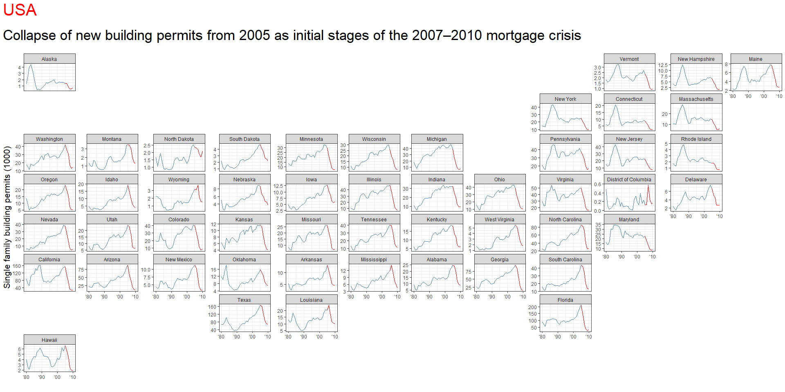
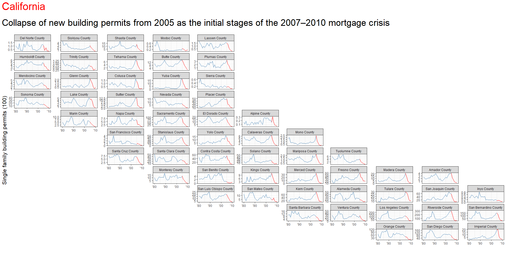

```r
# Use this R-Chunk to import all your datasets!

########################## The states base geometry #######################

states_48 <-  us_states()

# This is to facilitate the join since is a character type in states_48 

states_48 <- states_48 %>% mutate(
  state = as.integer(statefp)
)


# the buildings permits information

buildings_p_state <- buildings::permits 

# join the information by state with the maps

buildings_p_stater <- buildings_p_state %>% full_join(states_48, by = c("state" = "state") )

#buildings_p_stater

######################################### Now California ######################
# the California object has columns names repeated that has to exclude
california <- us_counties(states = "CA")

# names(california)

position <- which(duplicated(names(california)))

california <- california[,-13] 

# Same as with states to facilitate the join must be converted

california <- california %>% mutate(
  county = as.integer(countyfp)
)

        
         
buildings_p_california <- buildings::permits %>% 
  filter(StateAbbr == "CA")
         
#  join the information by county  with the county maps


buildings_p_county <- buildings_p_california %>% full_join(california, by = c("county" = "county") )


#buildings_p_county


##################################### 
```

## Background

You have been asked to support a story for the local paper (that has a web presence) that looks back on the housing collapse and the early effects of residential construction. You have data on residential building permits from 1980 through 2010 for each county in the United States. Your colleague that is writing the article would like a few maps and graphics that highlight the single family building permit patterns across your state as well as the patterns in the US.  

Remember the big story is the collapse of new building permits at the initial stages of the 2007–2010 mortgage crisis. Make sure your graphics highlight the collapse in a clear and honest manner.  


## Tasks  
1. Use the library(USAboundaries) package to get two spatial data sets. One for all US states, and the other for counties of a state of your choice (for example, counties of Idaho).  
    - Look through your state data and county data and see if you can identify the columns containing the FIPS numbers. You will need these columns to merge this spatial data to our building permit data.  
2. Read in the permits data from the devtools::install_github("hathawayj/buildings") package. Wrangle the data into two separate data sets. One data set should look at single family permits at the state level for all US states. The other should look at single family permits at the county level for the state of your choice. -Look through your permit data and identify the FIPS columns.  
3. Use the FIPS number columns to join the state and country permit data to the state and county spatial data.  
4. Create at least one chart that shows, for each US state, the trend in single family building permits over time.  
5. Create another chart(s) that shows, for each county in your chosen state, the trend in single family building over time.  
6. Make sure at least one (if not all) of your charts displays the data using some sort of spatial/geographical representation (so geofacets, a chloropleth map, etc.). Also, consider how you can effectively deal with the disparities of scale between geographies. (For example, the number of permits in California in a bad year are much higher than the highest year for North Dakota.)  
7. Create an .Rmd file with a couple of paragraphs summarizing your graphics and the choices you made in your visualization to address the reporter’s needs.  
8. Knit your .Rmd and push all knitted files for this case study to your class GitHub repository.


## Data Wrangling


```r
# Use this R-Chunk to clean & wrangle your data!


# We need to chart just Single Family data from buildings_p_county and buildings_p_stater

single_fam_state <- buildings_p_stater %>% filter(
  variable == "Single Family"
) %>%
  group_by(state_name, year) %>% 
  mutate(
    single_fam_total = sum(value)
  )

single_fam_county <- buildings_p_county %>% filter(
  variable == "Single Family"
)

# Create a dataset for annotate the crisis. I asume by the decreases a date in 2005
single_fam_county_crisis <-  single_fam_county %>% 
                                     filter(year %in% 2005:2010)
#single_fam_county_crisis


single_fam_state_crisis <- single_fam_state %>% 
                                     filter(year %in% 2005:2010)
#single_fam_state_crisis
```

## Data Visualization


```r
# Use this R-Chunk to plot & visualize your data!

#ggplot(data = states_48) +
#          geom_sf(alpha = 0) +
#          theme_bw() +
#          geom_sf(data = california, alpha = 0)


p1 <- ggplot(single_fam_state, aes(year, single_fam_total / 1000)) +
  geom_line(color = "steelblue") +
  geom_line(data = single_fam_state_crisis, aes(year, single_fam_total / 1000), color = "red" ) +
  facet_geo(~ state_name, grid = "us_state_grid2", scales = "free_y") +
  scale_x_continuous(labels = function(x) paste0("'", substr(x, 3, 4))) +
  ylab("Single family building permits (1000)") + 
  xlab("") +
  labs(
    title = "USA",
    subtitle = "Collapse of new building permits from 2005 as initial stages of the 2007–2010 mortgage crisis"
  ) +
  theme_bw()

# review the list of grids and create my own grid for California

# get_grid_names()

my_grid <- grid_auto(california)

p2 <- ggplot(single_fam_county, aes(year, value / 100)) +
  geom_line(color = "steelblue") +
  geom_line(data = single_fam_county_crisis, aes(year, value / 100), color = "red" ) +
  facet_geo(~ countyname, grid = my_grid ,  scales = "free_y") +
  scale_x_continuous(labels = function(x) paste0("'", substr(x, 3, 4))) +
  ylab("Single family building permits (100)") +
  xlab("") +
  labs(
    title = "California",
    subtitle = "Collapse of new building permits from 2005 as the initial stages of the 2007–2010 mortgage crisis"
  ) +
  theme_bw()

library(ggtext)


p1 <- p1 + theme(axis.title = element_text(size = 16),
           plot.title.position = "plot",
           plot.title = element_text(size = 30, color = "red",margin = margin(b = 20)),
           plot.subtitle = element_text(size = 26,margin = margin(b = 20))) 
     
  
p1
```

<!-- -->

```r
p2 <- p2 + theme(axis.title = element_text(size = 16),
           plot.title.position = "plot",
           plot.title = element_text(size = 30, color = "red",margin = margin(b = 20)),
           plot.subtitle = element_text(size = 26,margin = margin(b = 20))) 


p2
```

<!-- -->

```r
# I save the graphs with a better size for the purposes of using it in a web site.

ggsave("states.png", plot = p1, scale = 1.5, width = 12, height = 7)
ggsave("california.png", plot = p2, scale = 1.5, width = 12, height = 7)  
```

## Conclusions
I use geofacets from geoface library to depict the trends both in states and in counties. For Counties I had to create a custom grid from the data of us_counties filtering first California and then using grid_auto(). I found that the dimensions vary a lot when rendering in RStudio, GitHub or the output generated png file. I finally decided to adapt the dimensions for rendering in GitHub, but with a better output in the png files, which should be used for publications in the exercise.
To deal with the differences in scale, I set scales free in the facets, and divided the figures by a number that make it easier to read and compare between entities. In the case of state figures, I summed the amounts of each county in the state for the purpose of summarizing the data.  

Finally, to show the trend of the years before the crisis, I filter the original data in a new object that graphs over the blue line in the graph as a red line.
 
