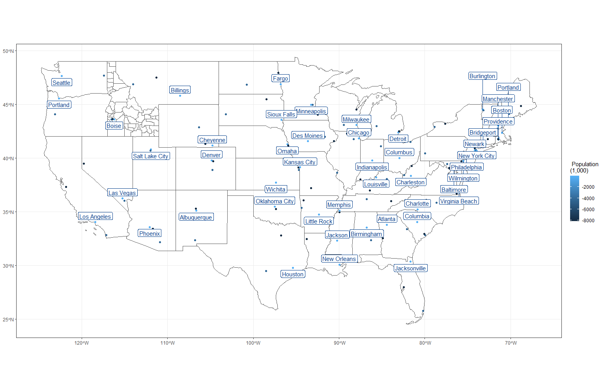

```r
# Use this R-Chunk to import all your datasets!

pop <-  read_csv("https://github.com/cestastanford/historical-us-city-populations/raw/master/data/1790-2010_MASTER.csv")


# filter just the population and data from 2010 census.
pop_filtered <-  pop %>% select("ST","City",`2010`, "LAT", "LON", "LAT_BING", "LON_BING" )


# get the first 3 most populated cities from the 2010 census filter out Alaska and Hawaii

most_pop <- pop_filtered %>% group_by(ST) %>% 
  rename("population_2010" = `2010`) %>% 
  arrange(ST, desc(population_2010)) %>% 
  slice(1:3) %>% 
  filter(ST %in% state.abb,
         ST != "AK",
         ST != "HI") %>% 
   mutate(population_rank = rank(population_2010))


# get the states data from USAboundaries package filtering out Hawaii and Alaska


states_48 <-  us_states() %>% 
  filter(state_name %in% state.name,
          state_name != "Alaska",
          state_name != "Hawaii")

######################################## didnt work as thought ##################################

#get the coordinate system of states_48

st_crs(states_48)
```

```
## Coordinate Reference System:
##   User input: EPSG:4326 
##   wkt:
## GEOGCRS["WGS 84",
##     DATUM["World Geodetic System 1984",
##         ELLIPSOID["WGS 84",6378137,298.257223563,
##             LENGTHUNIT["metre",1]]],
##     PRIMEM["Greenwich",0,
##         ANGLEUNIT["degree",0.0174532925199433]],
##     CS[ellipsoidal,2],
##         AXIS["geodetic latitude (Lat)",north,
##             ORDER[1],
##             ANGLEUNIT["degree",0.0174532925199433]],
##         AXIS["geodetic longitude (Lon)",east,
##             ORDER[2],
##             ANGLEUNIT["degree",0.0174532925199433]],
##     USAGE[
##         SCOPE["Horizontal component of 3D system."],
##         AREA["World."],
##         BBOX[-90,-180,90,180]],
##     ID["EPSG",4326]]
```

```r
# convert a foreign object to a sf object to get the column with the geometry

pop_cities_sf <- st_as_sf(most_pop, coords = c("LAT","LON"), crs = 4326 )


#inner_join(states_48, pop_cities_sf, by = c("state_abbr" = "ST"))

########################################### A new direction ##############################
```

## Background
1. Create a .png image that closely matches the example.  
    - The city labels do NOT need to match precisely with those in the example.  
    - You should notice that the color of the points does not map to population size, rather it indicates the city’s population rank (1st, 2nd or 3rd) within the state.  
    - Note that fill = NA in geom_sf() will not fill the polygons with a grey color, rather it makes the fill transparent.  
    - Note that library(USAboundaries) has three useful functions - us_cities(), us_states(), and us_counties().  
    - Notice that Idaho has counties outlined in the image.  
2. To add the labels to the image consider using library(ggrepel).  
3. Push your .png,, .Rmd, .md, and .html to your GitHub repository.


## Data Wrangling


```r
############# get cities from USAboundaries #############################################


cities <- us_cities()

cities <- cities %>% group_by(state_abbr) %>% 
  select("city", "state_abbr", "year", "population", "geometry") %>%  
  arrange(state_abbr, desc(population)) %>% 
  slice(1:3) %>% 
  filter( state_abbr %in% state.abb,
        state_abbr != "AK",
        state_abbr != "HI") %>% 
  mutate(population_rank = rank(population))


#inner_join(states_48, cities, by = state_abbr)


############################# get Idaho counties ###############################

id <- us_counties(states = "ID")


############################### filter the most populated for the labs repel ###########


rank <-  cities %>% filter(population_rank == 3)
```

## Data Visualization


```r
# Use this R-Chunk to plot & visualize your data!


my_base_plot <- ggplot(data = states_48) +
          geom_sf( fill = NA) +
  theme_bw() +
  labs(fill = "",
       title = "") +
#       subtitle = paste("as of  presented " ,today())) +
#  scale_fill_continuous(labels = scales::comma) +
  theme(axis.title = element_blank())


# Add the cities to the map and Idaho

p1 <- my_base_plot + geom_sf(data = id, alpha = 0) +
               geom_sf(data = cities, aes(fill = desc(population / 1000), color = population_rank)) +
               labs(fill = " Population \n(1,000)") +
               guides(color = "none")
  
                    


 p2 <- p1 + geom_label_repel(data = rank, mapping = aes(label = city,
                                        geometry = geometry), 
                          stat = "sf_coordinates",
                          direction = "y",
                          label.padding = unit(0.22,"char"),
                          size = 4,
                          hjust = 0.5, 
                          force = 1, 
                          color = "#023e8a") 
 
 
p2
```

<!-- -->

```r
ggsave("p2.png", plot = p2)
# coord_sf(xlim = c(-140,40), ylim = c(10, 60))

 
 #pop_cities_sf$geometry
 #states_48$geometry
#st_crop(pop_cities_sf, ymin = 10, ymax = 60, xmin = -140, xmax = -50)
```

## Conclusions
