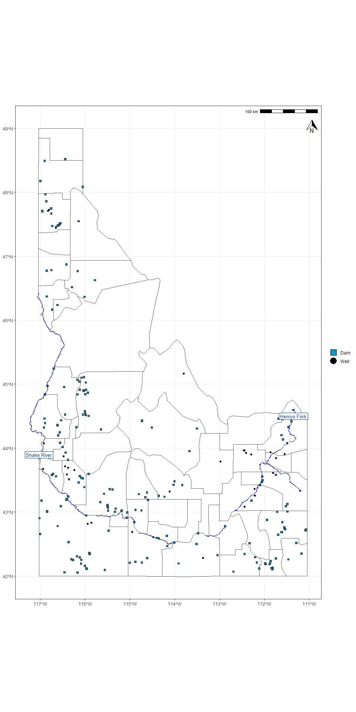

```r
# Use this R-Chunk to import all your datasets!


wells_path <- "https://byuistats.github.io/M335/data/Wells.zip"
dams_path <- "https://byuistats.github.io/M335/data/Idaho_Dams.zip"
water_path <- "https://byuistats.github.io/M335/data/water.zip"
state_shape <- "https://byuistats.github.io/M335/data/shp.zip"


# ####################################### Create a function to extract the zip files to objects in r ################

my_xtract_zip_sf <-  function(path){
  df <- tempfile(); uf <- tempfile()
  download(path, df, mode = "wb")
  unzip(df, exdir = uf)
  x <- read_sf(uf)
  file_delete(df); dir_delete(uf)
  return(x)
}

###################################### Get the files ##########################################


wells <- my_xtract_zip_sf(wells_path)

dams <- my_xtract_zip_sf(dams_path)

rivers <- my_xtract_zip_sf(water_path)

state_shape <- my_xtract_zip_sf(state_shape)


state_shape <- state_shape %>% filter(StateName == "Idaho")
```

## Background
1. Read in all four of the necessary SHP file datasets (see links in “background” above).
2. Filter the data so that  
    - Only well locations with a production of more than 5000 gallons are included  
    - Only large dams (surface area larger than 50 acres) are included  
    - The Snake River and Henrys Fork rivers are the only bodies of water that are included.
3. Create a map of Idaho showing these key water system features. Save a .png image that plots the required information.  
4. Push your .png,, .Rmd, .md, and .html to your GitHub repository.

## Data Wrangling


```r
# Use this R-Chunk to clean & wrangle your data!


# Filter well locations with a production of more than 5000 gallons

wells <- wells %>%  filter(Production > 5000)

# Filter large dams (surface area larger than 50 acres) 

dams <- dams %>% filter(SurfaceAre > 50)

# Filter The Snake River and Henrys Fork rivers.

rivers <- rivers %>% filter(FEAT_NAME == "Snake River" |  FEAT_NAME == "Henrys Fork") 

# Create labels for the rivers

rivers_labels <-  rbind(head(rivers, n = 1),tail(rivers, n = 1))


# Get which coordinate system have each sf file

# st_crs(wells)
# EPSG 4326

# st_crs(dams)
# EPSG 4326

# st_crs(rivers)
# EPSG 8826

# st_crs(state_shape)
# EPSG 9001

##################### experiment with rbind to get a dataset to graph in sf ##################

# both have the same coordinate system, if not, a conversion will be need it.

wells2 <- wells %>% select(geometry) %>% 
  mutate(type = "Well")

dams2 <- dams %>% select(geometry) %>% 
  mutate(type = "Dam")

# waters will be used for graphical purposes, it may include more information if need it, like names, etc 

waters <-  rbind(wells2,dams2) 
```

## Data Visualization


```r
# Use this R-Chunk to plot & visualize your data!

################## Make a base map with the features ###########################
base_map <- ggplot() + 
  geom_sf(data = state_shape, alpha = 0) + 
  theme_bw() + 
  geom_sf(data = waters, aes( shape = type, fill = type)) +
  geom_sf(data = rivers, color = "blue") +
  coord_sf(crs = st_crs(4326)) 

######################### Change a bit how titles, colors and shapes are shown #################

p1 <- base_map + 
  scale_shape_manual(values = c(22,16)) +
  scale_fill_manual(values = c("#0096c7","black")) +
  labs(
    fill = "",
    shape = ""
  ) +
  theme(axis.title = element_blank()) +
  guides(shape = guide_legend(override.aes = list(size = 6)))

# the last line increased the size of the legends 

######################## Add annotations ############################################

p2 <- p1 + 
  annotation_scale(location = "tr", width_hint = 0.3) +
     annotation_north_arrow(location = "tr", which_north = "true", pad_y = unit(1, "cm"), height = unit(0.8, "cm"),
  width = unit(0.8, "cm"),) +
     geom_label_repel(data = rivers_labels, mapping = aes(label = FEAT_NAME,
                                        geometry = geometry), 
                          stat = "sf_coordinates",
                          direction = "y",
                          label.padding = unit(0.22,"char"),
                          size = 3.5,
                          hjust = 0.5, 
                          force = 1, 
                          color = "#023e8a")
p2
```

<!-- -->

```r
# Save the map


   
ggsave("Idaho_waters.png", plot = p2)
```

## Conclusions
