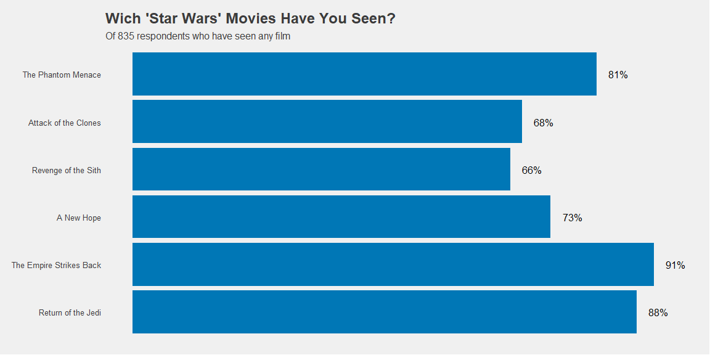

```r
# Use this R-Chunk to import all your datasets!
```

## Background

_Place Task Background Here_

## Data Wrangling


```r
# Use this R-Chunk to clean & wrangle your data!

respondants <- dat_multi %>% filter(question == "which_seen") %>% na.omit  
respondants$answer <-  gsub("Star Wars: Episode ", "", respondants$answer) 

respondants %>%  mutate(answer = factor(answer, level = c("I The Phantom Menace", "II Attack of the Clones","III Revenge of the Sith", "IV A New Hope", "V The Empire Strikes Back","VI Return of the Jedi")))
```

```
## # A tibble: 3,897 × 4
##    respondentid question   choice                                answer         
##           <dbl> <chr>      <chr>                                 <fct>          
##  1   3292879998 which_seen StarWars:EpisodeIThePhantomMenace     <NA>           
##  2   3292879998 which_seen StarWars:EpisodeIIAttackoftheClones   <NA>           
##  3   3292879998 which_seen StarWars:EpisodeIIIRevengeoftheSith   <NA>           
##  4   3292879998 which_seen StarWars:EpisodeIVANewHope            <NA>           
##  5   3292879998 which_seen StarWars:EpisodeVTheEmpireStrikesBack V The Empire S…
##  6   3292879998 which_seen StarWars:EpisodeVIReturnoftheJedi     VI Return of t…
##  7   3292765271 which_seen StarWars:EpisodeIThePhantomMenace     <NA>           
##  8   3292765271 which_seen StarWars:EpisodeIIAttackoftheClones   <NA>           
##  9   3292765271 which_seen StarWars:EpisodeIIIRevengeoftheSith   <NA>           
## 10   3292763116 which_seen StarWars:EpisodeIThePhantomMenace     <NA>           
## # ℹ 3,887 more rows
```

```r
 #respondants <- respondants %>% group_by(choice) %>%
#   mutate( counted = sum(n_distinct(choice))) %>%    
#  mutate(perct = (n()/ counted ) / 10)

 # This code gets the number of individuals that answer
 library(plyr)
 number_of <- length(unique(as.character(respondants$respondentid)))
 
 
#count(unique((respondants$respondentid)))


# This code get the number of views of films as freq, and then calculate the percent dividing frequency by the number of individuals

 graph_me <- count(respondants$answer) %>% mutate ( percent = round((freq/number_of)* 100))
 
 
 
 
 
graph_me <- graph_me %>% mutate(x = factor(recode(x,
                               "I  The Phantom Menace" = "The Phantom Menace",
                               "II  Attack of the Clones" = "Attack of the Clones",
                               "III  Revenge of the Sith" = "Revenge of the Sith",
                               "IV  A New Hope" = "A New Hope",
                               "V The Empire Strikes Back" = "The Empire Strikes Back",
                               "VI Return of the Jedi" = "Return of the Jedi" ))) 
  

graph_me
```

```
##                         x freq percent
## 1      The Phantom Menace  673      81
## 2    Attack of the Clones  571      68
## 3     Revenge of the Sith  550      66
## 4              A New Hope  607      73
## 5 The Empire Strikes Back  758      91
## 6      Return of the Jedi  738      88
```

## Data Visualization


```r
# Use this R-Chunk to plot & visualize your data!


p <- ggplot(data = graph_me, aes(x = x, y = percent)) +
  geom_bar( stat = "identity",na.rm = TRUE, fill = "#0077b6" ) +
  coord_flip() +
  theme_fivethirtyeight() + 
  theme( panel.grid.major = element_blank()) +
  labs(x = "",
       y = "",
       color = "",
       fill = "",
       title = "Wich 'Star Wars' Movies Have You Seen?",         # LABS TITLES; AND LEGENDS TITLES #008fd5 color = "#0077b6", fill = "#0077b6"
       subtitle = "Of 835 respondents who have seen any film") +
# scale_color_manual(values = "#0077b6") +
  theme(axis.text.x = element_blank()) +
  scale_fill_discrete(guide = "none") +
  guides(color = "none")  

 p + geom_dl(aes(label = paste0(percent, "%")), 
            method = list("last.points", hjust = -0.6, vjust = .5, cex = 1)) +  expand_limits(y = c(0,94)) +
  
   scale_x_discrete(limits = c("Return of the Jedi","The Empire Strikes Back","A New Hope","Revenge of the Sith","Attack of the Clones","The Phantom Menace"))
```

<!-- -->

```r
 # scale_y_continuous(breaks = c("I The Phantom Menace", "II Attack of the Clones","III Revenge of the Sith", "IV A New Hope", "V The Empire Strikes Back","VI Return of the Jedi"))
```

## Conclusions
